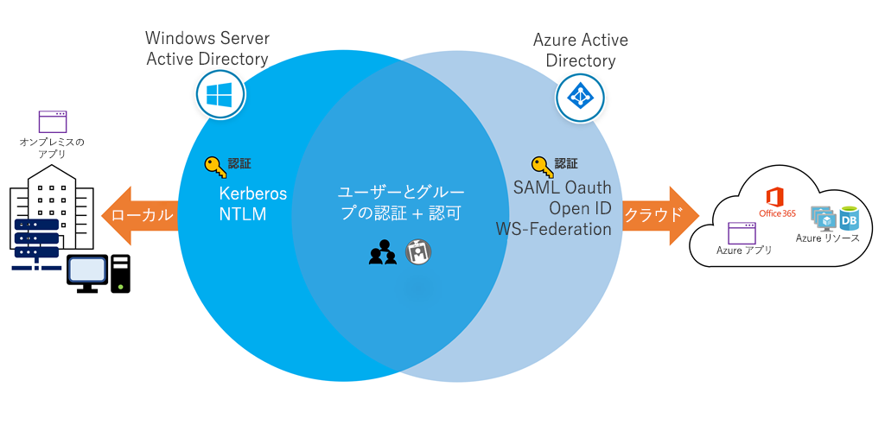
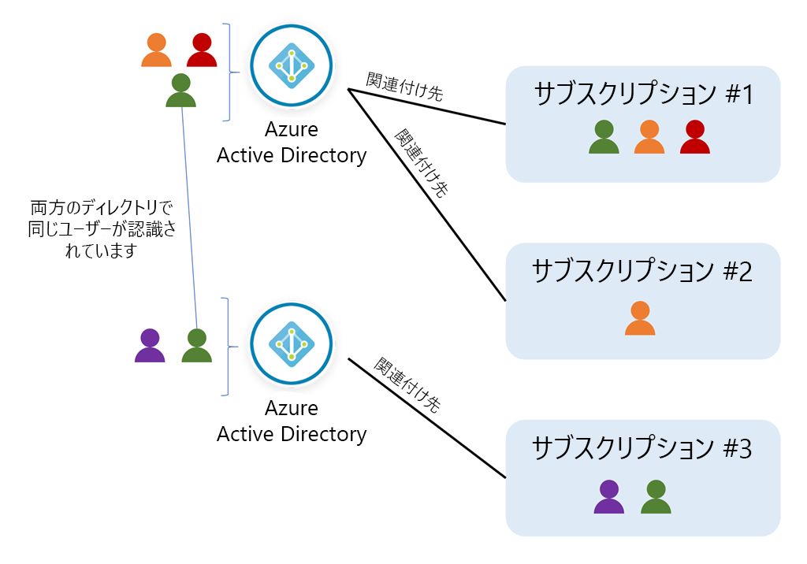

# Azure Active Directoryを知る

## 概要

- 名前は似ていますが、Azure AD は、Windows Server Active Directory のクラウド バージョンでは "ありません"。 また、オンプレミスの Active Directory を完全に置き換えることを目的としたものでもありません。 
- 代わりに、Windows AD サーバーを既に使用している場合は、それを Azure AD に接続して、ディレクトリを Azure に拡張できます。
- この方法により、ユーザーは同じ資格情報を使用して、ローカル リソースとクラウドベースのリソースにアクセスできます。

  

- 以下のすべてでAzure ADによる管理が可能
  - Microsoft Azure
  - Microsoft Office 365
  - Microsoft Intune
  - Microsoft Dynamics 365
- 企業または組織が、これらのサービスの 1 つを使用するためにサインアップすると、既定の **"ディレクトリ"="テナント"** が割り当てられ、Azure AD のインスタンスになる
- このディレクトリには、会社がサインアップした各サービスにアクセスできる**ユーザー**と**グループ**が保持される
- Azure の **"サブスクリプション"** は、課金エンティティおよびセキュリティ境界の両方です。 仮想マシン、Web サイト、データベースなどのリソースは、常に 1 つのサブスクリプションに関連付けられています。
  - また、各サブスクリプションには、**アカウント "所有者" が 1 人**おり、そのサブスクリプションのリソースで課されるすべての料金に対して責任があります。
  - 組織でサブスクリプションの料金を別のアカウントに対して請求する場合は、サブスクリプションの所有権を譲渡することができます。
  - また、所定のサブスクリプションは、**単一の Azure AD ディレクトリに関連付け**られます。 **複数のサブスクリプションが同じディレクトリを信頼**できますが、**1 つのサブスクリプションは 1 つのディレクトリだけ**を信頼できます。

  

## ユーザーの作成と管理

- ユーザー アカウントには、サインオン プロセス中にユーザーを認証するために必要なすべての情報が含まれる
- 認証が完了すると、Azure AD では、アクセス トークンを構築してユーザーを承認し、ユーザーがアクセスできるリソースとそれらのリソースに対して実行できる操作を決定
  
### ユーザーの定義  

- **クラウド ID**
  - これらのユーザーは **Azure AD にのみ存在**します。 例として、自分で管理する管理者アカウントとユーザーがあります。 別の Azure AD インスタンスで定義されているユーザーが、このディレクトリによって制御されるサブスクリプション リソースにアクセスする必要がある場合、そのソースは **Azure Active Directory** または **External Azure Active Directory** です。 これらのアカウントは、プライマリ ディレクトリからなくなると、削除されます。
- **ディレクトリ同期 ID**
  - これらのユーザーは**オンプレミスの Active Directory に存在**します。 **Azure AD Connect を介して実行される同期アクティビティ**により、これらのユーザーは Azure に提供されます。 そのソースは、Windows Server AD です。
- **Guest ユーザー**
  - これらのユーザーは Azure の外部に存在します。 例として、他のクラウド プロバイダーのアカウント、Xbox LIVE アカウントなどの Microsoft アカウントがあります。 そのソースは、**招待されたユーザー**です。 この種類のアカウントは、外部ベンダーや請負業者が Azure リソースへのアクセスを必要とする場合に便利です。 ヘルプが不要になったら、アカウントとすべてのアクセス権を削除できます。

### Azure ADへのユーザー追加の方法

#### 同期して追加

- オンプレミスのWindows Server Active Directoryと、Azure AD Connectを使用して同期する

#### Azure Portalを使用して追加する

- 通常のメンバーおよびゲストユーザーとして追加
- 招待された、特定のメール アドレスが関連付けられていない場合は、関連付けられた Microsoft アカウント (MSA) を作成する必要がある

#### Powershell

- `New-AzureADUser`コマンドを使用

```sh
# Create a password object
$PasswordProfile = New-Object -TypeName Microsoft.Open.AzureAD.Model.PasswordProfile

# Assign the password
$PasswordProfile.Password = "<Password>"

# Create the new user
New-AzureADUser -AccountEnabled $True -DisplayName "Abby Brown" -PasswordProfile $PasswordProfile -MailNickName "AbbyB" -UserPrincipalName "AbbyB@contoso.com"
```

#### Azure CLI

- `az ad user create`を使用して追加

```sh
az ad user create \
    --display-name "Abby Brown" \
    --password "<password>" \
    --user-principal-name "AbbyB@contoso.com" \
    --force-change-password-next-login true \
    --mail-nickname "AbbyB"
```

#### CSVでインポート

CSV の使用を計画している場合は、次の点を考慮する必要があります。

- 名前付け規則。 ユーザー名、表示名、別名の名前付け規則を制定または実装します。 たとえば、ユーザー名は、姓、ピリオド (.)、名の順に連結して構成します (Smith.John@contoso.com など)。
- パスワード。 新しく作成されたユーザーの初期パスワードの規則を実装します。 新しいユーザーがセキュリティが強化された方法でパスワードを受信する方法を決定します。 一般的に使用される方法は、ランダムなパスワードを生成し、新しいユーザーまたはその管理者にメールで送信します。

Azure PowerShell で CSV を使用するには、次のようにします。

1. `Connect-AzureAD` を使用して、ディレクトリへの Azure PowerShell 接続を作成します。 ディレクトリに対する権限を持つ管理者アカウントを使用して接続します。
2. 新しいユーザーの新しいパスワード プロファイルを作成します。 新しいユーザーのパスワードは、ディレクトリに設定したパスワードの複雑性の規則に準拠する必要があります。
3. `Import-CSV` を使用して、CSV をインポートします。 CSV のパスとファイル名を指定する必要があります。
4. ファイル内のユーザーをループし、各ユーザーに必要なユーザー パラメーターを構築します。 パラメーターの例としては、ユーザー プリンシパル名、表示名、名、部署、役職などがあります。
5. `New-ADUser` を使用して、各ユーザーを作成します。 各アカウントは必ず有効にしてください。

#### その他のオプション

プログラムで Azure AD Graph API を使用する、または同じディレクトリを共有している場合は Office 365 管理センターと Microsoft Intune 管理コンソールを使用して、Azure AD にユーザーを追加することも可能

## グループの作成と管理

異なる2つの種類のグループ

- セキュリティ グループ
  - 最も一般的で、**ユーザー グループの共有リソースへのメンバーとコンピューターのアクセスを管理するために使用**されます。 たとえば、特定のセキュリティ ポリシーのセキュリティ グループを作成できます。 このようにすると、すべてのメンバーにアクセス許可のセットを一度に付与でき、各メンバーにアクセス許可を個別に追加する必要がありません。 このオプションを使用するには、Azure AD 管理者が必要です。
- Office 365 グループ
  - このグループは、**共有メールボックス、カレンダー、ファイル、SharePoint サイトなどへのアクセス権をメンバーに付与**して、共同作業の機会を提供します。 このオプションを使用すると、組織外のユーザーにグループへのアクセス権を付与することもできます。 このオプションは、ユーザーおよび管理者が使用できます。

ルールに基づいた動的メンバーシップルールを設定可能

- ユーザー毎にAzure AD Premium P1 ライセンスが必要（デバイスには不要）
- ルールは、ルールビルダーを使用して設定
- 直属の部下ルールを設定可能（`Direct Reports for "{objectID_of_manager}"` ）
- すべてのユーザールールを設定可能（`user.objectId -ne null`）


## ロールを使用したリソースアクセスの制御

ごく一般的な、すべてのリソースに適用される3つのロール

- **所有者**
  - 他のユーザーにアクセス許可を委任する権限を含め、すべてのリソースへのフル アクセス権を持ちます。
- **共同作成者**
  - Azure リソースのすべてのタイプを作成および管理できますが、他のユーザーにアクセス許可を付与することはできません。
- **閲覧者**
  - 既存の Azure リソースを表示できます。

### ロールの定義

ロールは、JSONファイルに定義されるプロパティのセット。以下が含まれる。

名前 | 説明
---|---
Id | Azure によって割り当てられた、ロールの一意識別子。
IsCustom | カスタム ロールの場合は True、組み込みロールの場合は False です。
Description | ロールの理解しやすい説明。
Actions [] | 許可されるアクセス許可。* はすべてを示します。
NotActions [] | 拒否されるアクセス許可。
DataActions [] | 特定の許可されるアクセス許可で、データに適用されます (たとえば、Microsoft.Storage/storageAccounts/blobServices/containers/blobs/read)
NotDataActions [] | 特定の拒否されるアクセス許可で、データに適用されます。
AssignableScopes [] | このロールが適用されるスコープ。 / はグローバルを示しますが、階層構造にすることができます。

以下サンプル

```json
{
  "Name": "Contributor",
  "Id": "b24988ac-6180-42a0-ab88-20f7382dd24c",
  "IsCustom": false,
  "Description": "Lets you manage everything except access to resources.",
  "Actions": [
    "*"
  ],
  "NotActions": [
    "Microsoft.Authorization/*/Delete",
    "Microsoft.Authorization/*/Write",
    "Microsoft.Authorization/elevateAccess/Action"
  ],
  "DataActions": [],
  "NotDataActions": [],
  "AssignableScopes": [
    "/"
  ]
}
```

#### ActionsとNotActions

- 必要なアクセスを許可・拒否するための定義
- `{Company}.{ProviderName}/{resourceType}/{action}` 形式で示される
- ワイルドカードを使用可能
- `NotActions` 以下の操作は、`Actions` から除かれる

#### DataActionsとNotDataActions

- データ操作は `DataActions` プロパティおよび `NotDataActions` プロパティで指定される
- 管理操作とは別にデータ操作を指定

以下サンプル

データ操作 | 説明
------|---
Microsoft.Storage/storageAccounts/blobServices/containers/blobs/delete | BLOB データを削除する
Microsoft.Compute/virtualMachines/login/action | 通常のユーザーとして VM にログインする
Microsoft.EventHub/namespaces/messages/send/action | イベント ハブでメッセージを送信する
Microsoft.Storage/storageAccounts/fileServices/fileshares/files/read | ファイル/フォルダーまたはファイル/フォルダーの一覧を返す
Microsoft.Storage/storageAccounts/queueServices/queues/messages/read | キューからメッセージを読み取る

### 割り当て可能なスコープ AssignableScopes

- `AssignableScopes` プロパティで、ロールが割り当てに使用できるスコープ (サブスクリプション、リソース グループ、またはリソース) を指定
  
以下サンプル

目的 | スコープの使用
---|--------
サブスクリプションに制限する。 | "/subscriptions/{sub-id}"
特定のサブスクリプションで特定のリソース グループに制限する。 | "/subscriptions/{sub-id}/resourceGroups/{rg-name}"
特定のリソースに制限する。 | "/subscriptions/{sub-id}/resourceGroups/{rg-name}/{resource-name}"
2 つのサブスクリプションの割り当てにロールを使用可能にする。 | "/subscriptions/{sub-id}", "/subscriptions/{sub-id}"

### ロールを作成する

- カスタムのロールも作成可能。
- カスタム ロールの作成には Azure AD Premium P1 または P2 が必要であり、Free レベルでは不可
  
## Enterprise State Roaming

- 企業データとコンシューマー データの分離
  - 組織のデータはその組織の管理下に置かれます。コンシューマー クラウド アカウントに企業データが混入したり、エンタープライズ クラウド アカウントにコンシューマー データが混入したりすることはありません。
- セキュリティの強化
  - データはユーザーの Windows 10 デバイスから送信される前に、Azure Rights Management (Azure RMS) を使って自動的に暗号化されます。クラウドには、暗号化された状態のままデータが保存されます。 名前空間 (設定の名前や Windows アプリの名前) を除き、コンテンツはすべて暗号化された状態でクラウドに保存されます。
- 管理と監視の向上
  - Azure AD ポータルの統合により、組織内のだれがどのデバイスの設定を同期させているかを管理および表示できます。