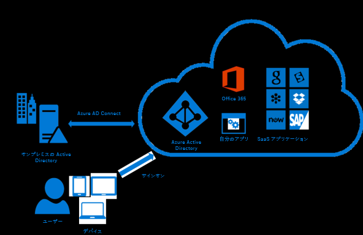

# Azure AD ConnectでADをAzure ADに接続

## 概要

- オンプレミスの Windows Server Active Directory ソリューションを使用する企業は、既存のユーザーとグループを Azure AD Connect を使用して Azure Active Directory と統合可能
- この無料ツールをダウンロードしてインストールすると、ローカル AD と Azure ディレクトリを同期

  

## Azure AD Connectで提供されるもの

- **同期サービス**
  - このコンポーネントは、ユーザー、グループ、およびその他のオブジェクトを作成する役割を果たす
  - オンプレミスのユーザーとグループの ID 情報をクラウド側と一致させる
- **正常性の監視**
  - `Azure AD Connect Health` では堅牢な監視機能が提供され、Azure portal の中央の場所でこのアクティビティを確認することができます。
- **AD FS**
  - **フェデレーションは Azure AD Connect のオプション コンポーネント**です。これを使用して、オンプレミスの AD FS インフラストラクチャから**ハイブリッド環境を構成**できます。 組織はこれを使用して、ドメイン参加による SSO、Active Directory サインイン ポリシーの適用、スマート カードやサード パーティの多要素認証など、複雑なデプロイに対応できます。
- **パスワード ハッシュの同期**
  - この機能は、ユーザーのオンプレミス Active Directory **パスワードのハッシュを Azure AD と同期させる**サインイン方法です。
- **パススルー認証**
  - ユーザーは、オンプレミスのアプリケーションとクラウド ベースのアプリケーションの両方に**同じパスワードを使用してサインインできます**。 ユーザーがサインイン方法を忘れる可能性が低くなるため、IT ヘルプデスクのコストが削減されます。 この機能は、パスワード ハッシュの同期の代わりに使用でき、組織のセキュリティとパスワードの複雑なポリシーを強制することができます。

## Azure Active Directory B2B

Azure AD B2Bを使用すると、他の企業のユーザーを自社の Azure AD テナントにゲスト ユーザーとして追加できる

