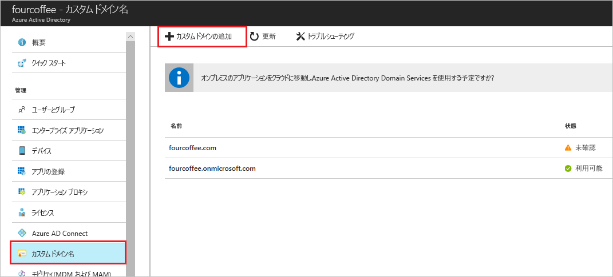
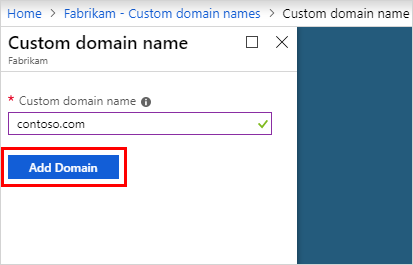
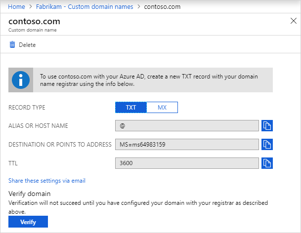
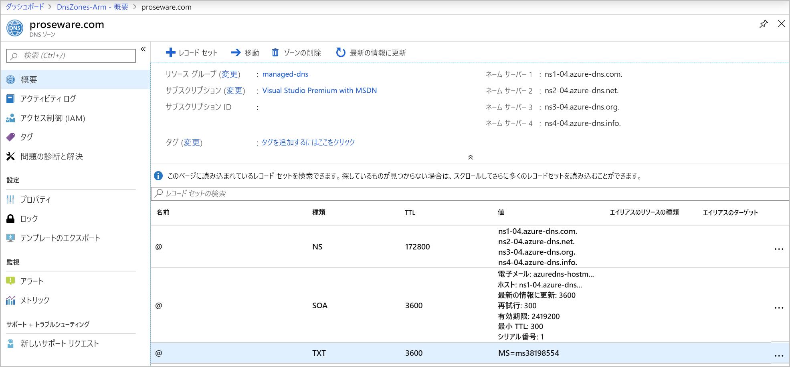
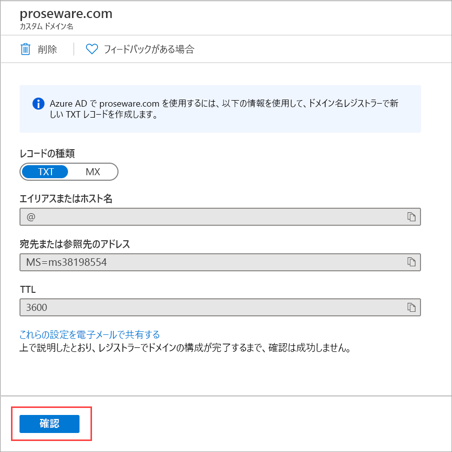

# Azure ADにカスタムドメインを追加

## 概要

### カスタムドメイン追加、とはどういうことか

- Azure AD テナントにはすべて、 `<domainname>.onmicrosoft.com` という初期ドメイン名が付く
- 初期ドメイン名は変更したり削除したりできませんが、お客様の組織の名前を追加することは可能
- カスタム ドメイン名を追加すると、alain@contoso.com など、**ユーザーになじみのあるユーザー名を作成**するのに役立ちます。

### 前提

カスタムドメインを追加するには、当然だが予めドメインレジストラーでドメインを作成しておく必要がある。

## カスタムドメイン追加手順

1. Azure ADディレクトリを作成
2. カスタムドメインを追加
3. ドメインレジストラーにDNS情報を追加
4. カスタムドメイン名を検証

### 1. ディレクトリの作成

- サブスクリプションの**所有者**ロールを持つアカウントで作成
- テナント=ディレクトリの作成者が自動的にそのテナントの全体管理者となる
- オンプレADとフェデレーションする予定の場合は、ディレクトリ同期でAzureADConnectを実行する際に、`このドメインを構成してローカルActiveDirectoryにシングルサインオンします`を選択

### 2. カスタムドメインを追加

  

  

- 以下の通り、未確認ドメインが追加され、contoso.com ページが表示され、DNS 情報が表示されます。
  - この情報は保存してください。 後で TXT レコードを作成して DNS を構成する際に、この情報が必要になります。

  

### 3. ドメインレジストラーにDNS情報を追加

2のステップでコピーした情報をドメインレジストラーの新しいTXTレコードを作成する。

  

### 4. カスタムドメイン名を検証

Azure ADで設定したドメインが有効になっているか確認する。

  

- Azure Portalにログインし、Azure ADを選択して、カスタムドメイン名を選択
- `「Verify」` を押して有効かどうか確認する。

## PowerShellでのドメイン管理

- **`New-AzureADDomain`** :新しいドメインを作成します。 パラメーター -IsDefault を使用して、ドメイン名をプライマリ ドメイン名として設定します。
- **`Confirm-AzureADDomain`** :ドメインの所有権の検証を試みることができます。
- **`Set-AzureADDomain`** :ドメイン名を更新し、ドメインをプライマリ ドメイン名に設定できます。
- **`Remove-AzureADDomain`** :Azure AD からドメインを削除します。

## トラブルシュート

### アンマネージド組織の影響下にあるカスタム ドメイン名

- 組織のメンバーが、OneDrive や Power BI などの別の Microsoft サービスにサインアップした場合、そのメンバーのメール ドメインを使用して、アンマネージド Azure AD 組織が作成される
- この組織またはディレクトリは、そのサービスにのみ使用できます。 カスタム ドメインとして Azure AD に追加することはできない
- これを解決する方法としては以下の2つの選択肢がある
  - 内部管理者引き継ぎ:管理されていない組織のグローバル管理者として自分自身を追加します。
  - 外部管理者引き継ぎ:ドメイン ネーム システム (DNS) ドメイン名をマネージド Azure AD 組織に追加します。

サービス | ソリューション
-----|--------
SharePoint | 内部管理者引き継ぎ
OneDrive | 内部管理者引き継ぎ
Office 365 | 内部管理者引き継ぎ
Power BI | 外部管理者引き継ぎ
Azure Rights Management | 外部管理者引き継ぎ
Exchange Online | 外部管理者引き継ぎ
Dynamics 365 | 外部管理者引き継ぎ

