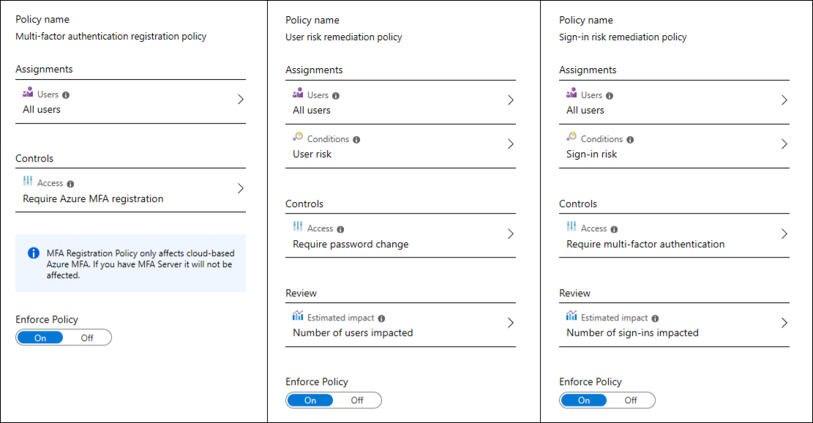

# Azure AD Identity Protectionを知る

https://docs.microsoft.com/ja-jp/azure/active-directory/identity-protection/overview-identity-protection

## 概要

以下の3つを実行してくれるツール

- IDベースのリスクの検出と修復を自動化
- ポータル上でデータを使用してリスクを調査する
- 詳細分析のため、3rd Party製 ユーティリティにデータをエクスポート

## リスクの検出と修復

リスク検出の種類 | 説明
---------|---
特殊な移動 | ユーザーの最近のサインインに基づき特殊と判断された場所からのサインイン。
匿名 IP アドレス | 匿名の IP アドレスからのサインイン (例:Tor Browser、Anonymizer VPN)。
通常とは異なるサインイン プロパティ | 指定されたユーザーで最近観察されていないプロパティを使用したサインイン。
マルウェアにリンクした IP アドレス | マルウェアにリンクした IP アドレスからのサインイン
資格情報の漏洩 | このリスク検出は、ユーザーの有効な資格情報が漏洩したことを示します
Azure AD 脅威インテリジェンス | Microsoft の内部および外部の脅威インテリジェンス ソースが既知の攻撃パターンを特定しました

## ポリシー

管理者が有効にする事を選択できる3つの既定のポリシー

  

- Azure MFA 登録ポリシー
  - 
- サインインリスクポリシー
- ユーザーリスクのポリシー

## リスクの調査

リスクの調査に使用する主要なレポート3つ

- 危険なユーザー
- リスクの高いサインイン
- リスク検出

## アクセス許可

Role | できること | できないこと
-----|-------|-------
全体管理者 | Identity Protection へのフル アクセス | 
セキュリティ管理者 | Identity Protection へのフル アクセス | ユーザーのパスワードをリセットする
セキュリティ オペレーター | すべての Identity Protection レポートと [概要] ブレードを表示する/ユーザー リスクを無視し、安全なサインインを確認して、セキュリティ侵害を確認する | ポリシーを構成または変更する/ユーザーのパスワードをリセットする/アラートを構成する
セキュリティ閲覧者 | すべての Identity Protection レポートと [概要] ブレードを表示する | ポリシーを構成または変更する/ユーザーのパスワードをリセットする/アラートを構成する/検出に関するフィードバックを送信する

## ライセンスの要件

機能 | 詳細 | Azure AD Premium P2 | Azure AD Premium P1 | Azure AD Basic/Free
---|----|---------------------|---------------------|--------------------
リスク ポリシー | ユーザー リスク ポリシー (Identity Protection 経由) | はい | いいえ | いいえ
リスク ポリシー | サインイン リスク ポリシー (Identity Protection または条件付きアクセス経由) | はい | いいえ | いいえ
セキュリティ レポート | 概要 | はい | いいえ | いいえ
セキュリティ レポート | 危険なユーザー | フル アクセス | 限定的な情報 | 限定的な情報
セキュリティ レポート | リスクの高いサインイン | フル アクセス | 限定的な情報 | 限定的な情報
セキュリティ レポート | リスク検出 | フル アクセス | 限定的な情報 | いいえ
通知 | 危険な状態のユーザーが検出されたアラート | はい | いいえ | いいえ
通知 | 週間ダイジェスト | はい | いいえ | いいえ
MFA 登録ポリシー | はい | いいえ | いいえ