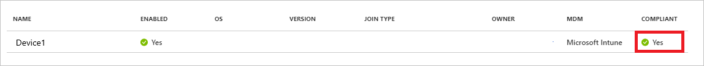

# Azure AD Join

https://docs.microsoft.com/ja-jp/azure/active-directory/devices/azureadjoin-plan

## 概要

- デバイスをオンプレミスと同期することなく、Azure ADに直接参加させる機能

## 実装ステップ

### シナリオのレビュー

Azure AD Joinが適しているのは以下のようなシナリオ

- Microsoft 365を使用している
- クラウドデバイス管理ソリューションを使用してデバイス管理を行いたい
- 地理的に分散したユーザーのデバイスプロビジョニングを行いたい
- アプリケーションインフラの最新化を計画している

### ID インフラストラクチャをレビューする

- マネージド環境とフェデレーション環境の両方で動作
  - マネージド環境
    - パスワードハッシュ同期もしくはパススルー認証のいずれかとシームレスシングルサインオンを使用してデプロイ
  - フェデレーション環境
    - 以下両方のプロトコルをサポートしているIDプロバイダーが必要
    - Ws-Fed: このプロトコルは、デバイスを Azure AD に参加させるために必要です。
    - WS-Trust: このプロトコルは、Azure AD 参加済みデバイスにサインインするために必要です。
- スマートカードと証明書ベースの認証を使用してAzure ADに参加させることはできない。
  - AD FS構成してある場合は、スマートカードを使用してAzure AD参加済みデバイスにサインインすることが可能
- ユーザーをオンプレミスのADに作成する場合は、Azure AD Connectを使用してAzure ADと同期する必要がある

### デバイス管理を評価する

- サポートされているデバイスは、Windows10 or Windows Server 2019 のみ
- 管理プラットフォームとして、Intune、MDM CSPなどが必要
- 参加済みデバイスの管理には2つのアプローチ
  - MDM のみ
    - デバイスは、Intune などの MDM プロバイダーによってのみ管理されます。 
    - すべてのポリシーは、MDM の登録プロセスの一環として配信されます。 Azure AD Premium または EMS のお客様の場合、MDM の登録は、Azure AD 参加の一部である自動化された手順です。
  - 共同管理
    - デバイスは、MDM プロバイダーと SCCM によって管理
    - SCCM エージェントは、MDM によって管理されるデバイスにインストールされて、特定の側面を管理します。

### アプリケーションとリソースに関する考慮事項を把握する

- アプリケーションをオンプレミスからクラウドに移行することをお勧め
- Azure AD 参加済みデバイスでは、オンプレミスとクラウドの両方のアプリケーションにシームレスにアクセス

### プロビジョニングのオプションを把握する

- Windows ut-of-box experience (OOBE) 時/設定内でのセルフサービス
  - セルフサービス モードでは、ユーザーは Windows Out of Box Experience (OOBE) の実行中に、または Windows 設定から、Azure AD 参加のプロセスを実行
- Windows Autopilot
  - Windows Autopilot により、Azure AD 参加を実行する OOBE のエクスペリエンスを円滑にするためにデバイスの事前構成
- 一括登録
  - 一括登録により、一括プロビジョニング ツールを使用してデバイスを構成することで、管理者主導の Azure AD 参加が可能

 | セルフサービス セットアップ | Windows Autopilot | 一括登録
-|----------------|-------------------|-----
セットアップにユーザーの操作が必要 | はい | はい | いいえ
IT 部門の作業が必要 | いいえ | はい | はい
適用可能なフロー | OOBE と設定 | OOBE のみ | OOBE のみ
プライマリ ユーザーに対するローカル管理者権限 | 既定では、はい | 構成可能 | いいえ
デバイス OEM のサポートが必要 | いいえ | はい | いいえ
サポートされているバージョン | 1511+ | 1709+ | 1703+

以下の選択指針を参考にする。

- ユーザーは技術的な知識に精通していてセットアップを自分で実行できるか?
  - これらのユーザーにはセルフサービスが最適です。 ユーザー エクスペリエンスを強化するために Windows Autopilot をご検討ください。
- ユーザーはリモートと企業プレミス内のどちらにいるか?
  - 手間をかけずにセットアップするために、リモート ユーザーにはセルフサービスまたは Autopilot が最適です。
- ユーザー主導の構成と管理者が管理する構成のどちらを優先するか?
  - 管理者主導のデプロイで、ユーザーに渡す前にデバイスをセットアップするには、一括登録が適しています。
- 1 社か 2 社の OEM からデバイスを購入するか、それとも広範な OEM のデバイスを使用するか?
  - Autopilot もサポートしている限られた OEM から購入する場合は、Autopilot とのより緊密な統合を活用できます。

### 企業の状態ローミングを構成する

Azure AD に対して状態ローミングを有効にして、ユーザーがデバイス間で設定を同期できるようにするには、「Azure Active Directory の Enterprise State Roaming を有効にする

### 条件付きアクセスを構成する

Azure AD 参加済みデバイスに対して MDM プロバイダーが構成されている場合、プロバイダーは、デバイスが管理下に入るとすぐにデバイスに準拠のフラグを設定

  

この実装を使用して、条件付きアクセスを使用してクラウド アプリへのアクセスにマネージド デバイスを要求することができる
