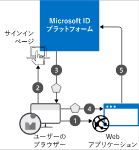
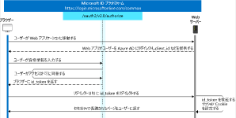

# OpenID Connect と Azure AD を使用してアプリケーションをセキュリティで保護

## 概要

- Azure ADは、OAuth 2.0 や OpenID Connect など業界標準のプロトコルをサポート

## Azure ADでの認証

1. ID プロバイダーは、ディレクトリ内に存在するユーザーの ID を検証します。 認証が成功すると、成功した認証に関連する情報を含むトークンが発行されます。
1. ユーザーはこれらのトークンをアプリケーションに渡します。 認証を確実に成功させるため、アプリケーションで、ユーザーのセキュリティ トークンを検証する必要があります

例

  

1. ユーザーが、セキュリティで保護されたリソース (この場合は Web アプリケーション) を要求します。
2. Web アプリケーションでは、ユーザーの認証資格情報を要求して確認する ID プロバイダーに、要求がリダイレクトされます。
3. ユーザーが正しい資格情報を送信すると、プロバイダーではセキュリティトークンがユーザーに返されて、もともと要求されていたリソースにユーザーがリダイレクトされます。
4. ユーザーは、セキュリティトークンを Web アプリケーションに送信します。
5. Web アプリケーションでは、トークンを使用して、ID プロバイダーによって認証が実行されたことを確認します。

## OAuth 2.0 と OpenID Connect

### OAuth 2.0

- OAuth 2.0 は、承認のための業界標準のプロトコル
- OAuth はサーバー間通信の承認に適していますが、認証の標準や仕様は含んでいません。 アプリケーション間でのデータとアカウント情報の共有が増大するのに伴い、シングル サインオンの標準のフレームワークの必要性が明確になりました。 これが、OpenID Connect の開発につながりました。

### OpenID Connect

- OpenID Connect は、OAuth 2.0 に基づいて構築された認証レイヤー
- OAuth 2.0 にはない ID の検証方法が含まれている
- ユーザーがアプリケーションに送信して ID を証明できるアクセス トークンと ID トークンを使用
- JSON Web トークンは、アプリケーションでデジタル署名されたメッセージとしてデータを安全に交換する方法が定義されているオープンな国際標準です。 各トークンの内容は暗号化されませんが、メッセージは ID プロバイダーの秘密キーで署名されます。 アプリケーションでは、対応する公開キーを使用して署名を確認することで、トークンが ID プロバイダーによって発行され、改ざんされていないことを証明

  

## 利用の流れ

1. テナントの作成・構成
   1. テナント内部のアプリの登録では、自分のテナント内のみ、またはすべてのテナント内のアカウントからの認証を許可できます。
2. Webアプリを登録
   1. テナント内にWebアプリを登録。以下を指定する
      1. **[名前]**
         1. この値では、登録とアプリケーションが示されます。
      2. **[アプリケーションの種類]**
         1. HTTP プロトコルを介してアクセスする Web サイトまたは Web API には、**[Web アプリ/API]** の種類を使用します。 ユーザーのデバイスまたはコンピューターにインストールされるアプリケーションには、**[ネイティブ]** の種類を使用します。
      3. [**サインオン URL]**
         1. この値は、発行されたアプリケーションのサインオン ページの場所です
      4. **[アプリケーション ID]**
         1. この生成された GUID は、登録に固有です。 ユーザーを認証するときは常に同じ GUID を Azure AD に送信するように、アプリケーションを構成します。
3. 認証用にアプリを構成
   1. 