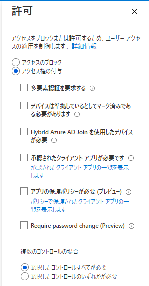

# Enterprise State Roaming(ESR)

## Azure におけるデバイスIDとは

AzureADにおいては、デバイスをデバイスIDに関連付けて管理する。併せてデバイスがアクセスできるデータ、リソース、資産も併せて制御する。
デバイスベースの**条件付きアクセスポリシー**を設定してアクセスの制御を行う。

## デバイスの登録のオプション

デバイスを登録するにあたっては、以下3つの登録オプションがある。

- AzureADに登録済み
  - BYODに分類される
  - 個人用アカウント、別のローカルアカウントが使用される
  - Windows、iOS、iPadOS、Android、macOSを実行するデバイスをサポート
  - デバイスのセキュリティは、パスワード、PIN、パターン、または Windows Hello から提供
- AzureADに参加済み
  - 組織所有のデバイス
  - 職場アカウントを使用
  - デバイスIDはクラウドのみに存在
  - Windows 10、Windows Server 2019デバイスのみで使用可能
  - パスワードまたは Windows Hello が使用
- ハイブリッド Azure AD 参加済み
  - デバイスは組織によって所有
  - その組織に属している Azure AD アカウントを使用してサインイン
  - デバイス ID は、クラウドとオンプレミスに存在
  - Windows 7、8.1、10、および Windows Server 2008 以上がサポート

## 条件付きアクセス

シグナルをユーザー定義ルールと照らし合わせてアクセス制御を行う。
条件付きアクセスポリシーは、多要素認証の第一人称が終了した時点で評価される。

  

シグナルには以下のようなものがある。

- **ユーザーまたはグループのメンバーシップ**
  - リソースへのきめ細かなアクセスを提供します。
- **IP の場所に関する情報**
  - 信頼できる IP アドレスの許可リストと、ブロックまたは禁止された IP アドレスの拒否リストを使用します。
- **デバイス**
  - デバイスの種類とその状態を指定できます。
- **アプリケーション**
  - 特定のデバイスについてアプリケーションへのアクセスを制御できます。
- **リアルタイムで計算されたリスク検出**
  - これにより、Azure AD が、サインイン中だけでなく、ユーザーのセッションの間中、動作を識別できるようになります。
- **Microsoft Cloud App Security**
  - ユーザーのセッションとアプリケーションのアクセスのリアルタイムの監視を提供します。 Cloud App Security は、クラウド環境の制御にも役立ちます

追加の判断条件

- 多要素認証
- デバイスが準拠としてマーク済みであること
- デバイスがハイブリッド Azure AD 参加済みであること
- 承認済みアプリケーション
- アプリ保護ポリシーが必要
  

## Enterprise State Roaming

- ユーザーがデバイスを切り替えるときにセキュリティをシームレスに維持するための仕組み
- Windows10の設定とアプリケーションデータを組織のクラウドサービスと同期することができる。
- ESRの利点は以下の通り。
  - 企業データとコンシューマー データの分離。
  - すべての適用可能なデバイス データは、クラウドと同期する前に Azure Rights Management を介して暗号化されるため、セキュリティが強化されます。 保存されているデータはすべて暗号化されたままです。
  - 管理と監視が向上することで、データを同期できるユーザーとデバイスを決定することができます。
- Enterprise State Roaming には Premium Azure Active Directory サブスクリプションが必要

### 同期とローミングの対象となるデータ

- Windows の設定: Windows オペレーティング システムに組み込まれている PC の設定。 一般に、ご利用の PC はこれらの設定によってカスタマイズされます。 それらには次のカテゴリが含まれています。
  - "テーマ": デスクトップ テーマやタスクバーの設定などの機能が含まれます。
  - "Internet Explorer の設定": 最近開いたタブとお気に入りが含まれます。
  - "Microsoft Edge ブラウザーの設定": お気に入りなど。
  - "パスワード": インターネット パスワード、Wi-Fi プロファイルなどが含まれます。
  - "言語設定": キーボード レイアウト、システム言語、日付と時刻などの設定が含まれます。
  - "コンピューターの簡単操作機能": ハイコントラスト テーマ、ナレーター、拡大鏡など。
  - "その他の Windows 設定": マウスの設定など。
- アプリケーション データ: ユニバーサル Windows アプリでは、設定データをローミング フォルダーに書き込むことができます。 このフォルダーに書き込まれたデータはいずれも自動的に同期されます。 この機能を利用するようにアプリを設計するかどうかは、個々のアプリ開発者の自由です。

### データストレージ

- Enterprise State Roaming では、ユーザー データは Azure AD インスタンスに最も近い地理的リージョンに格納
  - 北米 (USA)、ヨーロッパ、中東、アフリカ (EMEA)、およびアジア太平洋 (APAC) 

### データ保有期間

明示的に削除されるか古くなるまで、クラウドに保持されます。 削除されたデータは、少なくとも 90 日間、自動的に保持

明示的なデータの削除
明示的なデータの削除は、Azure 管理者が Azure AD 内のユーザーまたは組織に対して行う場合、またはユーザーのために特定のローミング データを削除するように要求する必要がある場合に発生します。

ユーザーの削除: 管理者が Azure AD からユーザーを削除すると、関連付けられているエンタープライズ ローミング データがすべて自動的に削除されます。

Azure AD 組織の削除: 管理者がディレクトリを削除すると、そのディレクトリに格納されているすべてのユーザー設定またはデータが自動的に破棄されます。

削除要求に応じて: このオプションを使用すると、特定のユーザーのローミング データを削除できます。 このオプションについては、管理者が Azure サポート チケットを作成する必要があります。

古いデータの削除
過去 1 年間にアクセスされていない Enterprise State Roaming データはすべて、自動的に古いデータとして処理されます。 古いデータはホスト クラウド ストレージから削除されます。 削除されたデータの保持期間は 90 日です。

削除されたデータの回復
保持期間が経過すると、データはクラウドから完全に削除され、回復することはできません。 ただし、次にデバイスがクラウドに接続するときに、そのデバイスからデータを復元することができます。

データ保持期間を変更することはできません。