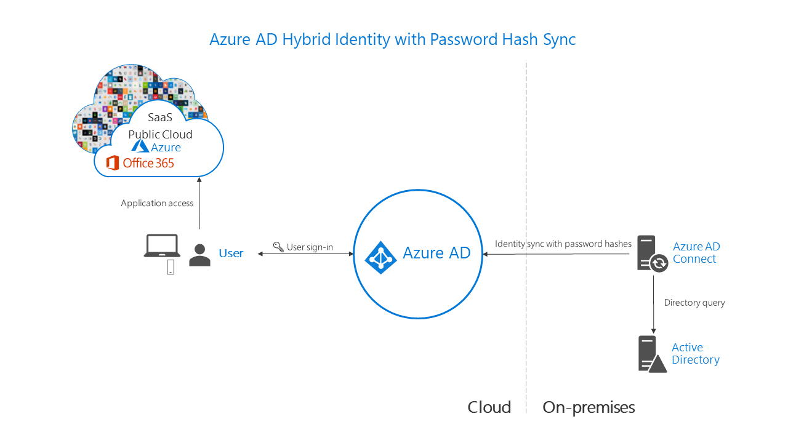
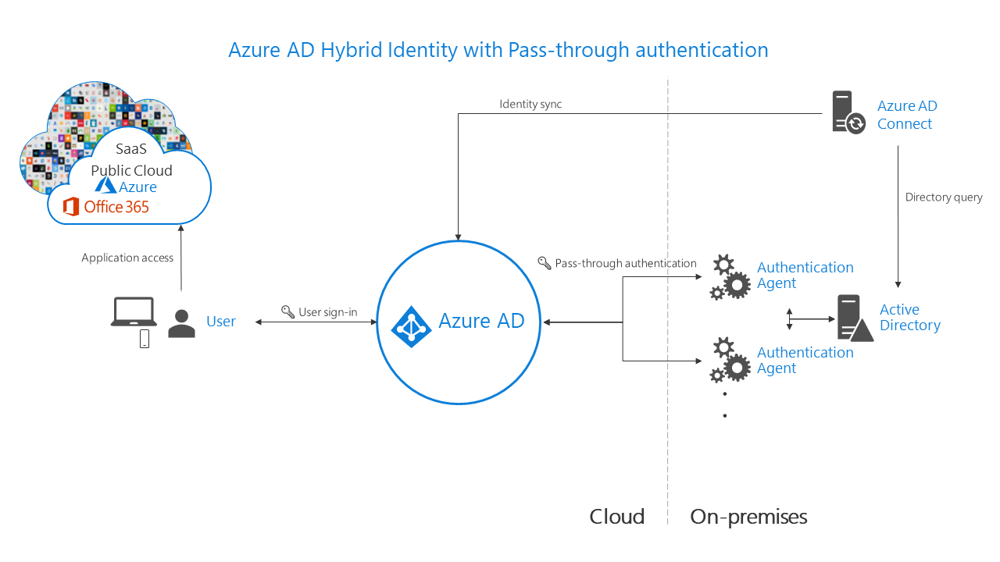
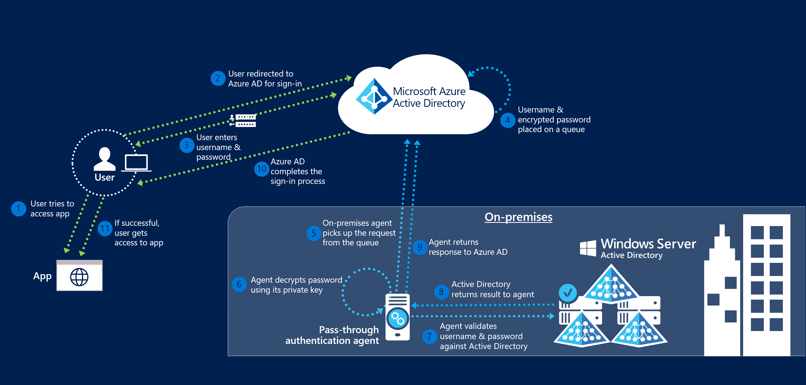
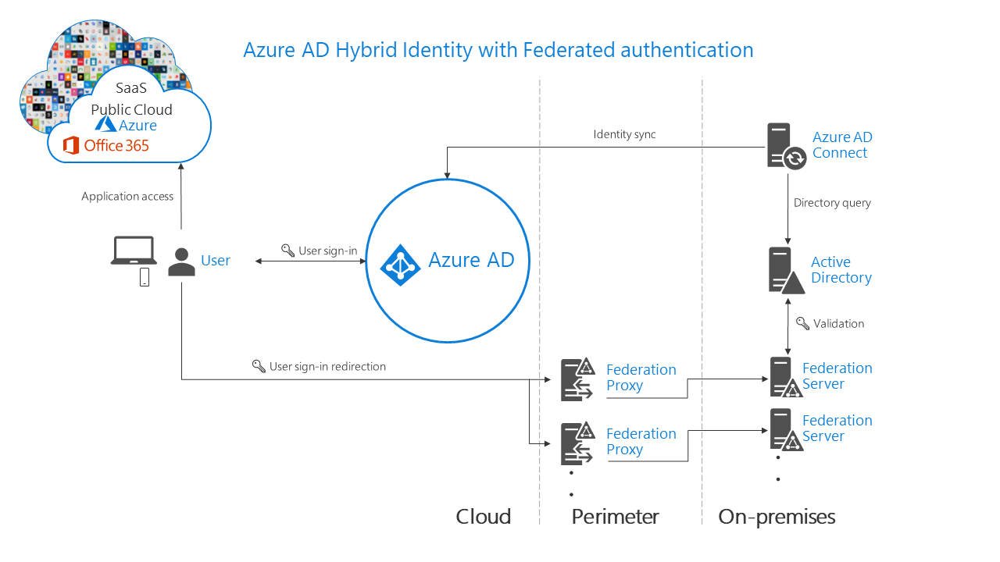

# Azure ADでのHybrid ID 

## 概要

- オンプレのIDとクラウド上でのIDをどのように管理するか。
- 3つのシナリオがある
  - パスワードハッシュの同期（PHS）
  - パススルー認証（PTA)
  - フェデレーション（AD FS)

## パスワードハッシュ同期

- Azure AD Connect では、オンプレミスの Active Directory インスタンスからクラウドベースの Azure AD インスタンスに、ユーザーのパスワードのハッシュを同期
- パスワード ハッシュ同期は、Azure AD Connect Sync によって実装されるディレクトリ同期の拡張機能
- サインイン方法として Active Directory フェデレーション サービス (AD FS) とのフェデレーションを使用する場合、必要に応じて、バックアップとしてパスワード ハッシュ同期を設定することができます
- 環境でパスワード ハッシュ同期を使用するには、以下のことを行う必要があります。
  - Azure AD Connect をインストールする。
  - オンプレミスの Active Directory インスタンスと Azure Active Directory インスタンスとの間のディレクトリ同期を構成する。
  - パスワード ハッシュ同期を有効にする

  

## パススルー認証

- Azure Active Directory (Azure AD) パススルー認証を使用すると、ユーザーは同じパスワードを使用して、オンプレミスのアプリケーションとクラウド ベースのアプリケーションの両方にサインインできます。
- クラウド上のAzure ADが、オンプレのAD DSに認証をパススルーしてお任せする方式
- 多要素認証 (MFA) など、ユーザーをセキュリティで保護するのに役立つ条件付きアクセス機能とシームレスに連携
- クラウド ベースのセルフサービスのパスワード管理 (オンプレミスの Active Directory へのパスワード ライトバックや、よく使用されているパスワードの禁止によるパスワードの保護を含む) と統合
- この機能を使用するために Azure AD の有料エディションは不要
- Azure AD Connect を使用して有効化

  

  

## フェデレーション

- フェデレーションとは、信頼が確立されたドメインのコレクション
- このサインイン方法では、すべてのユーザー認証が確実にオンプレミスで行われます。 この方法では、管理者はより厳しいレベルのアクセス制御（たとえば、スマートカード ベースの認証やサードパーティの多要素認証）を実装することができます
- Azure Active Directory (Azure AD) Connect を使用すると、オンプレミスの Active Directory フェデレーション サービス (AD FS) と Azure AD でフェデレーションを構成

  

## 比較

考慮事項 | パスワード ハッシュ同期 + シームレス SSO | パススルー認証 + シームレス SSO | AD FS とのフェデレーション
-----|--------------------------|---------------------|-----------------
認証が行われる場所 | クラウド内 | クラウド内で、オンプレミスの認証エージェントとのセキュリティで保護されたパスワード検証の交換後 | オンプレミス
プロビジョニング システム以外のオンプレミスのサーバーの要件: Azure AD Connect | なし | 追加の認証エージェントごとに 1 つのサーバー | 2 つ以上の AD FS サーバー境界/DMZ ネットワークに 2 つ以上の WAP サーバー
プロビジョニング システム以外のオンプレミスのインターネットおよびネットワークの要件 | なし | 認証エージェントを実行しているサーバーからの発信インターネット アクセス | 境界の WAP サーバーへの着信インターネット アクセス  境界の WAP サーバーから AD FS サーバーへの着信ネットワーク アクセス  ネットワークの負荷分散
TLS/SSL 証明書の要件 | いいえ | いいえ | はい
正常性の監視ソリューション | 必要なし | エージェントの状態は Azure Active Directory 管理センターによって提供される | Azure AD Connect Health
会社のネットワーク内のドメインに参加しているデバイスからクラウドのリソースへのユーザーのシングル サインオン | シームレス SSO を使用して実行 | シームレス SSO を使用して実行 | はい
サポートされているサインインの種類 | UserPrincipalName + パスワード / シームレス SSO を使用した Windows 統合認証 / 代替ログイン ID | UserPrincipalName + パスワード /シームレス SSO を使用した Windows 統合認証 / 代替ログイン ID | UserPrincipalName + パスワード / sAMAccountName + パスワード / Windows 統合認証 / 証明書とスマート カード認証 / 代替ログイン ID
Windows Hello for Business のサポート | キー信頼モデル | キー信頼モデル / Windows Server 2016 ドメインの機能レベルが必要 | キー信頼モデル / 証明書信頼モデル
多要素認証のオプション | Azure MFA / 条件付きアクセスを使用するカスタム コントロール* | Azure MFA / 条件付きアクセスを使用するカスタム コントロール* | Azure MFA / Azure MFA サーバー / サード パーティの MFA / 条件付きアクセスを使用するカスタム コントロール*
サポートされるユーザー アカウントの状態 | 無効なアカウント (最大 30 分の遅延) | 無効なアカウント / アカウントのロックアウト/アカウント期限切れ/パスワード期限切れ/サインイン時間 | 無効なアカウント/アカウントのロックアウト/アカウント期限切れ/パスワード期限切れ/サインイン時間
条件付きアクセスのオプション | Azure AD の条件付きアクセス、Azure AD Premium を使用 | Azure AD の条件付きアクセス、Azure AD Premium を使用 | Azure AD の条件付きアクセス、Azure AD Premium を使用/AD FS の要求規則
サポートされる従来のプロトコルのブロック | はい | はい | はい
サインイン ページのロゴ、イメージ、説明のカスタマイズ可能性 | Azure AD Premium を使用して可能 | Azure AD Premium を使用して可能 | はい
サポートされる高度なシナリオ | Smart Password Lockout/漏洩した資格情報レポート、Azure AD Premium P2 を使用 | Smart Password Lockout | 複数サイトの低待機時間の認証システム/AD FS エクストラネットのロックアウト/サード パーティの ID システムとの統合