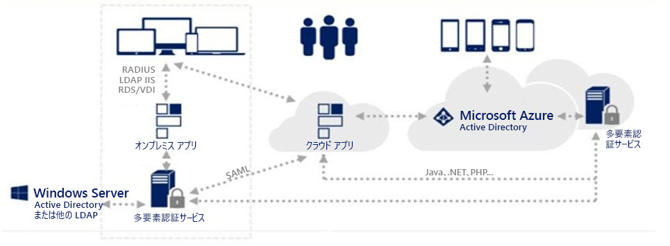
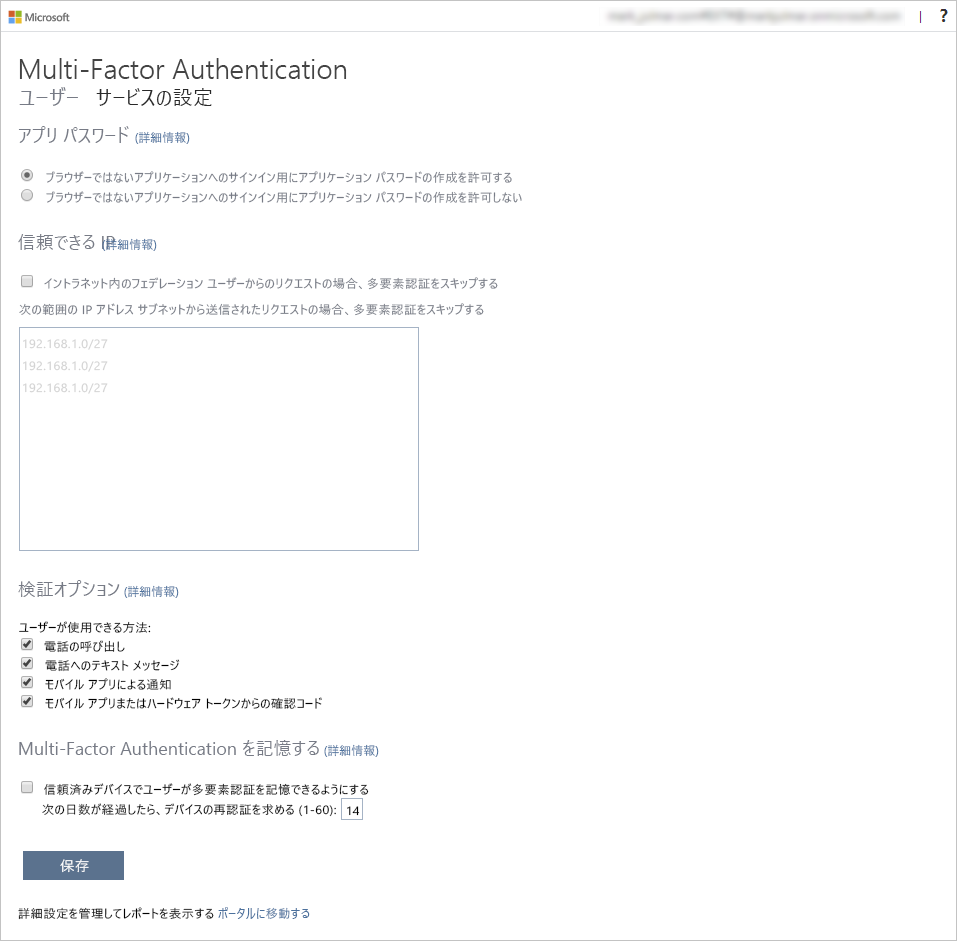
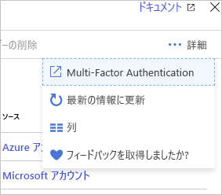

# 多要素認証によるセキュリティで Azure Active Directory ユーザーを保護

## 概要

- Azure Multi-Factor Authentication (MFA) では、完全な認証のために 2 つ以上の要素を必須とすることで、ID のセキュリティを強化
- 3つの要素
  - **ユーザーが知っているもの**
    - パスワード、あるいはセキュリティの質問に対する答えなどがこれに相当します。
  - **ユーザーが持っているもの**
    - 通知を受け取るモバイル アプリまたはトークンを生成するデバイスがこれに相当します。
  - **ユーザー自身**
    - 多くのモバイル デバイスで使用されている指紋や顔のスキャンなど、生体認証がこれに相当します。

### MFAを利用するには

- 以下のサービスに付属
  - **Azure Active Directory Premium** または **Microsoft 365 Business** - いずれのサービスも Azure Multi-Factor Authentication に対応しており、**条件付きアクセス ポリシー**を利用して多要素認証を要求
  - **Azure AD Free**、またはスタンドアロンの **Office 365 ライセンス** - 事前に作成した**条件付きアクセス ベースライン保護ポリシー**を使用し、ユーザーと管理者に多要素認証を要求します。
  - **Azure Active Directory 全体管理者** - Azure Multi-Factor Authentication の一部の機能を集めたものであり、全体管理者アカウントを保護するための手段として利用されます。

- 多要素認証を有効にするオプション
  - 特定の条件下で発動する**条件付きアクセスポリシー（Conditional Access Policy）**こっちが推奨
  - 個々のユーザーにAzure MFAを有効にする（Grand Access control）

### サポートされる認証方式

方法 | 説明
---|---
モバイル アプリの検証コード | Microsoft Authenticator アプリなど、モバイル認証アプリを利用し、OATH 検証コードを取得できます。取得したコードはサインイン インターフェイスに入力されます。 このコードは 30 秒おきに変更されます。このアプリは接続が限られている場合でも使えます。 中国では Android デバイスでこの手法を使えないことにご留意ください。
電話での呼び出し | Azure では、指定された電話機に電話をかけることができます。 着信後、ユーザーはキーパッドを利用して本人確認を是認します。 これはバックアップ手法として推奨されます。
電話へのテキスト メッセージ | 検証コードが記載されたテキスト メッセージを携帯電話に送信できます。 受信後、ユーザーはサインイン インターフェイスに検証コードを入力し、本人確認を完了します。

認証方法 | サービス
-----|-----
パスワード | Azure MFA と SSPR
セキュリティの質問 | SSPR
電子メール アドレス | SSPR
Microsoft Authenticator アプリ | Azure MFA と SSPR
OATH ハードウェア トークン | Azure MFA と SSPR
テキスト メッセージ | Azure MFA と SSPR
音声通話 | Azure MFA と SSPR
アプリ パスワード | Azure MFA (特定のケースで)

Method | プライマリ認証 | セカンダリ認証
-------|---------|--------
パスワード | はい | 
Microsoft Authenticator アプリ | はい (プレビュー) | MFA と SSPR
FIDO2 セキュリティ キー (プレビュー) | はい | MFA のみ
OATH ソフトウェア トークン | いいえ | MFA
OATH ハードウェア トークン (プレビュー) | はい | MFA
SMS | はい (プレビュー) | MFA と SSPR
音声通話 | いいえ | MFA と SSPR
セキュリティの質問 | いいえ | SSPR のみ
電子メール アドレス | いいえ | SSPR のみ
アプリ パスワード | いいえ | MFA のみ(特定の場合)

### ユーザーの認証方法の選択

- 選択した方法をユーザーが登録する方法を決定する必要があります。 
  - 最も簡単な方法は **Azure Active Directory Identity Protection** を使用することです。 組織に Identity Protection のライセンスがある場合、次回サインインしたとき、MFA の登録をユーザーに促すよう、それを構成できます。
  - 多要素認証を必要とするアプリケーションまたはサービスをユーザーが使用しようとしたときに MFA の登録をユーザーに促すこともできます
  - 組織に属するすべてのユーザーが含まれる Azure グループに適用される**条件付きアクセス ポリシー**を利用し、登録を強制

### MFAにおけるユーザーの状態

Status | 説明 | 非ブラウザー アプリに影響があるか | ブラウザー アプリに影響があるか | 影響を受ける先進認証
-------|----|-------------------|------------------|-----------
無効Disabled | Azure Multi-Factor Authentication に登録されていない、新しいユーザーの既定の状態です。 | いいえ | いいえ | いいえ
有効Enabled | ユーザーは多要素認証に登録されていますが、まだ登録されていません。 次回のサインイン時に登録することを求められます。 | いいえ。 これらは登録プロセスが完了するまで機能し続けます。 | はい。 セッションの有効期限が切れると、Azure Multi-Factor Authentication の登録が必要になります。 | はい。 アクセス トークンの有効期限が切れると、Azure Multi-Factor Authentication の登録が必要になります。
強制Enforced | ユーザーは登録されており、Azure Multi-Factor Authentication の登録プロセスが完了しています。 | はい。 アプリはアプリ パスワードを必要とします。 | はい。 ログイン時に Azure Multi-Factor Authentication が必要です。 | はい。 ログイン時に Azure Multi-Factor Authentication が必要です。

## 多要素認証の仕組み

  

1. ローカルの Azure MFA サービスにより、オンプレミスの Active Directory に認証要求を渡すことで、最初のサインイン要求が検証されます。
2. 正しい資格情報が入力され、その正当性が確認された場合、サービスから Azure Multi-Factor Authentication Server に要求が送信されます。
3. Azure Multi-Factor Authentication Server からユーザーに追加の検証課題が送信されます。 次のような検証方法を簡単に構成できます。
   1. 電話。 ユーザーが登録した電話機に Azure Multi-Factor Authentication Server から電話連絡が行われます。
   2. テキスト メッセージ。 ユーザーの携帯電話に Azure Multi-Factor Authentication Server から 6 桁のコードが届きます。
   3. ？モバイル アプリの通知。 Azure Multi-Factor Authentication Server からユーザーのスマートフォンに検証要求が届き、モバイル アプリで [検証] を選択し、検証を完了するように求められます。
   4. モバイル アプリの検証コード。 Azure Multi-Factor Authentication Server からユーザーのモバイル アプリに 6 桁のコードが届きます。 ユーザーはサインイン ページでこのコードを入力します。
   5. ？Open Authentication (OATH) 準拠トークンのイニシアチブ。 以下を検証方法として利用できます。

サービスを Azure で実行している場合:

4. サービスから、初回検証のために Azure AD にサインイン要求がまず送信され、次に、Azure Multi-Factor Authentication Server に送信されます。
5. 前述のように、Azure Multi-Factor Authentication Server からユーザーに追加の検証課題が送信されます。

## MFAを利用するには、

多要素認証を使用して、デバイスを認証するための設定。

- MFA Portalにアクセス
- 最低一つのverification methodを選択
- 信頼済みデバイスにMFAを記録させる
- アクセスポリシーを設定
  
  

特定のアプリでMFAを有効にするには**条件付きアクセス ルール**を設定

- ポリシーを作成する
- ユーザーとグループを選択して適用する対象を指定
- アプリを選択してMFAを有効にする対象アプリを設定
- 条件を指定して適用する場所などの情報を指定する
- アクセス制御の下で、多要素認証を要求する、を選択することで有効になる  

**ユーザーアカウントを指定**して多要素認証を有効にする方法

  

## 