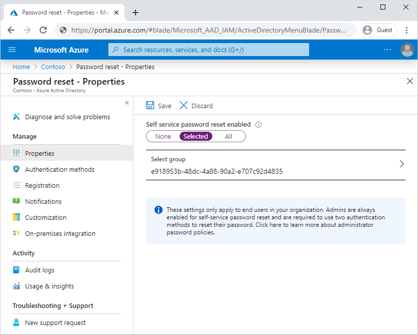

# Azure Active Directory のセルフサービス パスワード リセット

https://docs.microsoft.com/ja-jp/learn/modules/allow-users-reset-their-password/1-introduction

## 概要

Azure Active Directory (Azure AD) のセルフサービス パスワード リセット (SSPR) により、ユーザーは、管理者やヘルプ デスクが関与することなく、自分のパスワードを変更またはリセットできるようになる

## 手順

### セルフサービスパスワードリセットの有効化

Azure AD では、SSPR を有効にするユーザーを [なし] 、 [選択済み] 、または [すべて] から選択

選択済みで有効化できるグループは１つのみ

  

### 認証方法と登録オプションを選択

ロックを解除、パスワードリセットには追加の認証方法が必要（ゲートと呼ばれる）
1. 必要な方法の数を指定する（1か２）
2. 指定できる方法を選択する
3. 連絡先情報の登録は必須

認証方法 | 登録方法 | パスワード リセットの認証方法
-----|------|----------------
モバイル アプリの通知 | モバイル デバイスに Microsoft Authenticator アプリをインストールした後、多要素認証のセットアップ ページで登録します。 | Azure からアプリに通知が送信されます。この通知は、確認または拒否することができます。
モバイル アプリ コード | この方法でも Authenticator アプリが使用され、同じ方法でインストールして登録します。 | アプリからコードを入力します。
電子メール | Azure と Office 365 の外部にある電子メール アドレスを指定します。 | Azure によってアドレスにコードが送信されるので、それをリセット ウィザードで入力します。
携帯電話 | 携帯電話番号を指定します。 | Azure によって SMS メッセージで携帯電話にコードが送信されるので、それをリセット ウィザードで入力します。 または、自動呼び出しを受け取るように選択することもできます。
会社電話 | 携帯以外の電話番号を指定します。 | この番号で自動呼び出しを受け取り、# キーを押します。
セキュリティの質問 | "母親が生まれた市区町村" のような質問を選択し、 それに対する応答を保存します。 | 質問に回答します。

- セキュリティの質問については、質問の数も指定可能。
- 管理者ロールアカウントについては、他のユーザーに対する構成に関係なく、常に、強力な 2 つの方法の認証ポリシーが適用されます。管理者ロールに関連付けられているアカウントに対しては、セキュリティの質問の方法は使用できません。

無料および試用版の Azure AD 組織では、電話呼び出しのオプションはサポートされない

#### モバイルアプリでのSSPR

リセットに必要な方法の数 | 1 つ | 2 つ
-------------|-----|----
使用可能なモバイル アプリの機能 | コード | コードまたは通知

注：1 ゲート ポリシーを構成するときに、唯一の認証方法として認証アプリを選択することはできません。

#### 認証方法を変更する

登録されている認証情報よりも必要な方法の数の法が多い状態になると、リセットまたは特区解除は不可となる。

### 通知とカスタマイズを構成する

パスワード変更時に通知を行うように設定することが可能。

- 変更したユーザー
- 管理者が自分のパスワードを変更した際に、他のすべての管理者に通知
- 

## パスワードリセットポータルの仕組み

ポータル表示時に以下を確認するワークフローが実行される

- ページのローカライズの必要があるか
  - ポータルでブラウザーのロケール設定が確認されて、適切な言語で SSPR ページが表示されます。
- ユーザーアカウントは有効か
  - ユーザーは、ユーザー名を入力し、CAPTCHA を渡して、自分がボットではなくユーザーであることを証明します。
  - ユーザーは、ID の認証に必要なデータを入力します。 たとえば、コードを入力したり、セキュリティの質問に回答したりします。
- ユーザーが属している組織は
- パスワードはどこで管理されているか
- ユーザーがこの機能を使用するライセンスがあるか

## オンプレミスのパスワードライトバックを有効にする

- パスワード ライトバックを使用すると、Azure AD でのパスワード変更をオンプレミスの AD DS 環境に同期することが可能
- Azure AD Connect には、これらのパスワード変更を Azure AD から既存のオンプレミス ディレクトリに送信するための安全なメカニズムが用意されている
- パスワードハッシュ同期、パススルー認証、AD FSで利用可能

### 前提

### パスワードライトバックの仕組み

1. AD DS側のパスワードポリシーの確認
2. ゼロ遅延フィードバック
   1. もし、ぽりしーに会わなかった場合にはすぐにフィードバックされる
3. パスワードの変更
4. 管理者によるAzure Portalでのパスワード変更によるライトバック（Office管理ポータルではサポートされず）
5. パスワードライトバックは、基盤の通信チャネルを利用（Azure Service Busリレーを利用）

## ライセンスの要件

- サインインしているすべてのユーザーは、Azure AD のエディションに関係なく、自分のパスワードを変更できます。
- サインインしていないときに、パスワードを忘れた場合、またはパスワードの有効期限が切れた場合、Azure AD Premium P1 または P2 では SSPR を使用可能
- Microsoft 365 Business または Office 365 でも使用可能
- Azure AD の Free エディションでは、SSPR は使用不可

ハイブリッド環境では

- ハイブリッド環境では、クラウドでのパスワードの変更を、オンプレミスのディレクトリに書き戻す必要があります。 
- この書き戻しのサポートは、Azure AD Premium の P1 または P2 で使用可能
- Microsoft 365 Business でも使用可能