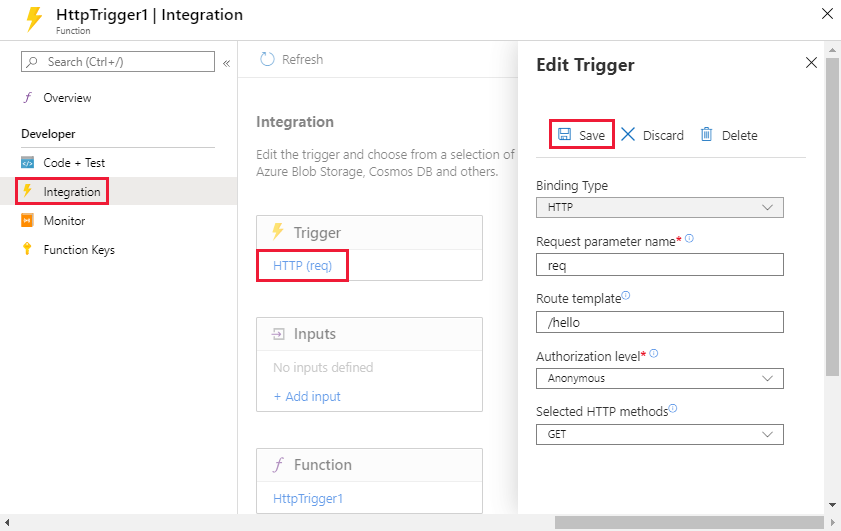

# Azure Functions

## 概要

- イベントをトリガーにコードを実行する仕組み
- オープンソースのWebJobsに持つぢて構築
- 多言語対応（PHP、Java、JS、Python、）
- 様々なサービスと連携

## スケールとホスティング

### プラン

- 従量課金
  - アクセス時にCold Start
- AppService
  - AppServiceのプラン上で稼働
- Premium
  - 常にwarm状態のインスタンスが確保される

### 

- ストレージアカウントが必要
- 別のサービスからINPUTを得たい場合は、統合（Integration）で設定を行う
- Bindingsの設定は、JSONファイルに記録される。接続のコードを書く必要がない
- Virtual nework統合で、自分のVNetと接続できる
  
## ベストプラクティス

- 長時間実行を避ける
- クロスファンクション通信にはキューを使用（スケール時の対応）
- ステートレスに作る
- 防御的なコード
  - 前にエラー起きても動作する様に作る。（500/1000で処理が中断した場合、501から再開できる、みたいな）

## 開発

- Visual Studio Codeから直接コードをアップロードしたりもできる
  - Azure Functions用の拡張が提供されている
  -   

## Durable Functions

- ステートレス環境でステートフル関数を 記述
- オーケストレーター関数を定義する

### シナリオ

- ファンアウト/ファンイン
  - 並列分散処理後に結果を集約
- オーケストレーション
  - 非同期関数的に各Functionのオーケストレーションを行う
- 非同期HTTP API
- 監視
  - 定期的にステータスをポーリング CreateTimer


## エンドポイントのカスタマイズ

### URL

既定のURLフォーマットは以下の通り

```url
http://<yourapp>.azurewebsites.net/api/<funcname>?code=<functionkey>
```

以下のようにカスタマイズする。

  

`/api` の部分については、
既定では、すべての関数のルートには api というプレフィックスが付きます。 host.json ファイルで extensions.http.routePrefix プロパティを使用すると、このプレフィックスをカスタマイズまたは削除できます。 次の例では、host.json ファイル内でプレフィックスに空の文字列を使用することで、api ルート プレフィックスを削除します。
https://docs.microsoft.com/ja-jp/azure/azure-functions/functions-bindings-http-webhook-trigger?tabs=csharp