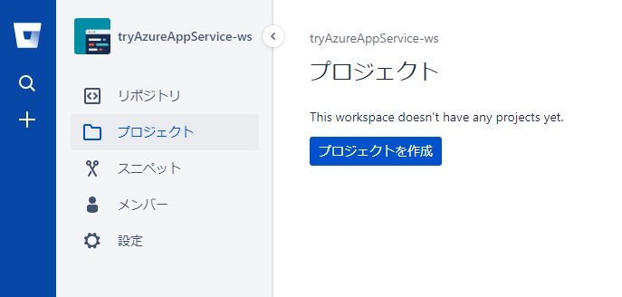

# Azure App Service

## Azure App Serviceとは

AzureのPaaS

### デプロイスロット

その名の通り、アプリの実行のコンテキスト？のようなもの。
例えば、ステージング、本番、などを用意する。

### CI/CDのサポート

 Azure DevOps、GitHub、Bitbucket、FTP、またはローカル Git リポジトり  と統合可能
 AzureDevOpsでは、独自のビルドとリリースプロセスを定義可能

### 自動でスケール

 スケールアップ、スケールアウト、スケールダウン可能

## Webアプリケーションの作成

アプリケーションの作成  
基本  
  

監視  
  
Azure Insightsは、Azure Monitorの一機能であり、Application Performance Managementサービスを提供する。パフォーマンスの問題個所を特定したり、ユーザーのどのようにアプリケーションを利用しているかを調査したりするのに利用できる。  
言語は .NET、node.js、Java、Python、オンプレ、ハイブリッド、どのパブリッククラウドでも利用できる。
この段階でApplication Insightを有効化できるのは、agent basedのInstrumentationをサポートしている .NET、.ASPを選択したときのみ。  
node.jsはPreview。その他は手動でのInstrumentationが必要。

## 継続的なデプロイの構成

https://support.atlassian.com/bitbucket-cloud/docs/create-a-repository-in-bitbucket-cloud/

### BitBucketリポジトリを用意する

  

  

  

  

  

  
