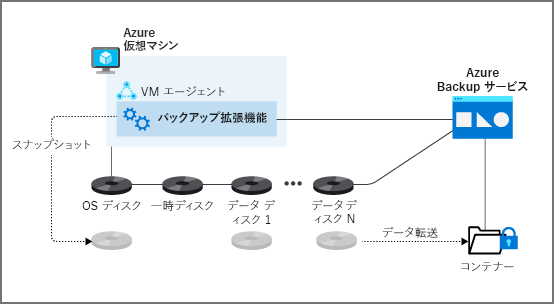
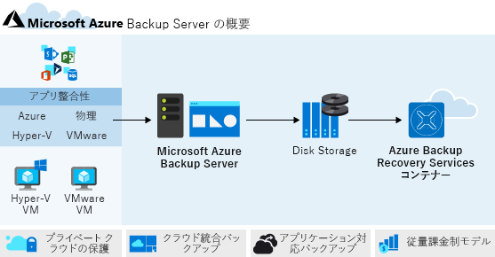
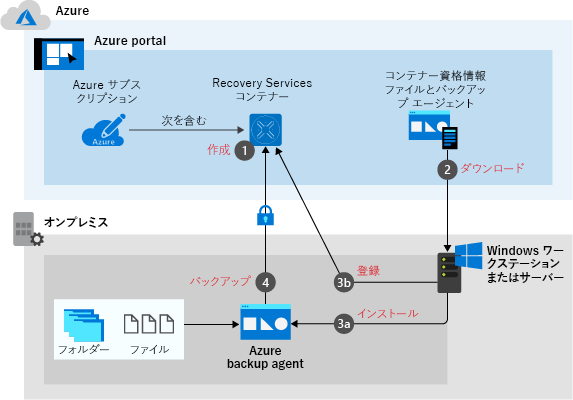

# Azure Backup

## 概要

- Azure とオンプレミスの両方の仮想マシンに対し、クラウドベースのバックアップおよび復元サービスが提供
- データ、ワークロード、およびマシンの状態のすべてを、詳細レベルで自動的にバックアップ
- Azure Backup では、SQL Server、SharePoint、Exchange などの Microsoft 固有のアプリケーションと統合
- Azure Site Recoveryと異なり、データがより細かく復旧されます。 たとえば、破損したり、ユーザーによって誤って削除されたりした、仮想マシンのディスク、またはファイルおよびフォルダーが復旧されます。

### こんな時に利用する・こんなところが良いところ

- **自動ストレージ管理**:完全に Azure ベースのバックアップ ソリューション、またはオンプレミスと Azure の**両方でデータがバックアップ**されて格納される異種ソリューションを維持することができます。 オンプレミスのストレージ デバイスの使用は無料で、Azure 内に格納すると従量課金制モデルが使われます。
- **高可用性**:サービスはクラウドベースであるため、本質的に冗長であり、高可用性が備わっています。 従来のソリューションのように、サービスの保守、アップグレード、パッチの適用は必要はありません。
- **無制限のデータ転送**:Azure サブスクリプションとの間のインバウンドおよびアウトバウンド バックアップ トラフィックは無制限です。
- **データ セキュリティ**:サービスでは、オンプレミス仮想マシンに対しては AES 256 ビット暗号化が使用され、Azure 仮想マシンに対しては Storage Service Encryption が使用されます。 **データは Azure プラットフォームでの保存時にセキュリティで保護**され、その後、承認されたユーザーまたはサービスによってアクセスされたときに暗号化が解除されます。
- **無制限の保有時間**:データ保持ポリシーに応じて、データを保持するために長期オプションと短期オプションを使用できます。
- **高可用性ストレージ**:次の 2 種類のストレージは、確実にデータを常に使用できるようにするのに役立ちます。
  - ローカル冗長ストレージ (LRS):データは、**同じリージョン内で 3 回レプリケート**されます。
  - geo 冗長ストレージ (GRS):データは、**地理的な場所内の別のリージョンにレプリケートされます。 これが既定値です**。 このオプションではプライマリ リージョンとセカンダリ リージョンで LRS が使用されるため、ほとんどの場合、これをお勧めします。

## バックアップエージェント

バックアップにはエージェントが必要。
エージェントは、マシンに直接導入することも、専用のバックアップサーバーを用意する事も可能。但し、何を取得するかによってどれが必要か、が変わる。

### **Azure Backup 仮想マシンの拡張機能**

  

- 最初のバックアップの間に、VMSnapshot (Windows の場合) または VMSnapshotLinux (Linux の場合) 拡張機能がインストールされる
- 仮想マシンの**ディスク全体のスナップショット**が取得され
  - これは、**ファイルレベルやフォルダーレベルの復元が有効にならない**ことを意味
- 作成されたスナップショットは、**Recovery Services コンテナーに格納**

### **Microsoft Azure Backup Server (MABS)**

  

- Azure またはオンプレミスの仮想マシンにインストールされている Microsoft Azure Backup Server (MABS) エージェントから、Azure Backup Server にバックアップ
- SQL や他のアプリケーション サービスをバックアップおよび復元することが可能
  - AzureBackupWindowsWorkload 拡張機能を使用して、Exchange や SharePoint などのワークロードをサポートすることも
- マシンとワークロードは **Azure Backup Server にバックアップ**され、**Recovery Services コンテナーには移動されません**。
  - バックアップを Recovery Services コンテナーに移動する必要がある場合は、Microsoft Azure Recovery Services (MARS) エージェントをインストール

### **Microsoft Azure Recovery Services (MARS)**

  

- MARS エージェントを使用して、**Windows のファイル、フォルダー、およびシステム状態データを Recovery Services コンテナーにバックアップ**
- バックアップ対象のマシンに、エージェントを手動でインストール
- MARS エージェントを Azure Backup 拡張機能と共に Azure 仮想マシンにインストールすると、バックアップのレベルが向上
- MARS を使うと、オンプレミスの Windows マシンを Recovery Services コンテナーに直接バックアップ可能
- MARS エージェントを Azure Backup Server と組み合わせて使用すると、サーバーからコンテナーにスナップショットがコピーされる（通常はMABSからコンテナ―に移動されない）

### **System Center Data Protection Manager (DPM)**

## バックアップの種類

バックアップ取得のレベル、

- ファイル
- フォルダー
- ボリューム
- システム状態
- アプリデータ
- 仮想マシン全体
  
ファイルとフォルダはすべての種類でサポートされている

これ覚えないといけないの？

場所 | OS | 環境 | レベル | 注記
---|----|----|-----|---
オンプレミス | Windows | 仮想 | ファイル、フォルダー、ボリューム、システム状態、アプリ データ | System Center Data Protection Manager (DPM) または Microsoft Azure Backup Server (MABS) を使用します。 このシナリオでは、アプリ対応のスナップショットがサポートされます。
オンプレミス | Windows | 物理 | ファイル、フォルダー、ボリューム、システム状態、アプリ データ | DPM または MABS を使用します。 このシナリオでは、アプリ対応のスナップショットがサポートされます。
オンプレミス | Windows | 両方 | ファイル、フォルダー、システム状態の直接バックアップ | Microsoft Azure Recovery Services (MARS) エージェントを使用します。 これは、アプリ対応のバックアップではありません。
オンプレミス | Linux | 仮想 | ファイルの直接バックアップ | MARS ではサポートされていません。
オンプレミス | Linux | 物理 | ファイルの直接バックアップ | MARS ではサポートされていません。
オンプレミス | Linux | 仮想 | ファイル、フォルダー、ボリューム、システム状態、アプリ データ | DPM または MABS を使用します。 このシナリオでは、アプリ対応のスナップショットがサポートされます。
オンプレミス | Linux | 物理 | ファイル、フォルダー、ボリューム、システム状態、アプリ データ | サポートされていません。
Azure | Windows | 仮想 | 仮想マシン全体 | Azure Backup 仮想マシンの拡張機能を使用します。 このシナリオでは、アプリ対応バックアップが提供されます。
Azure | Windows | 仮想 | ファイル、フォルダー、システム状態 | 仮想マシンの拡張機能と MARS を使用します。 このシナリオでは、アプリ対応バックアップが提供されます。
Azure | Linux | 仮想 | 仮想マシン全体 | Azure Backup 仮想マシンの拡張機能を使用します。 このシナリオでは、ファイル整合性バックアップが提供されます。
Azure | Linux | 仮想 | ファイル、フォルダー、ボリューム、システム状態、アプリ データ | DPM または MARS を使用します。 このシナリオでは、アプリ対応スナップショットが提供されます。

### SQL Serverのバックアップ

Azure Backup では、Windows 上の SQL Server インスタンスにワークロード バックアップ拡張機能をインストールして、次のオプションをサポート

- **完全**:データベースとファイル グループ全体をバックアップします。 また、復元を行うのに十分なログが含まれます。 トランザクション ログには、データベース内のレコードの最新の追加または削除のレコードが保持されます。 最近のトランザクション ログは、データベースの最新の復元を実行するために必要です。
- **差分**:最後に実行された完全バックアップに基づき、最後の完全バックアップ以降に変更されたデータのブロックのみがキャプチャされます。
- **トランザクション ログ**:データベースを特定の時点に復元できます。

## 機能詳細

### スナップショット

AzureVMの場合は、以下の様なVMの拡張機能が使用される。

拡張機能 | OS | 説明
-----|----|---
VMSnapshot | Windows | この拡張機能はボリューム シャドウ コピー サービス (VSS) で動作し、ディスク上およびメモリ内のデータのコピーが取得されます。
VMSnapshotLinux | Linux | スナップショットはディスクのコピーです。

#### 一貫性のレベル

- **アプリケーション整合性**
  - スナップショットでは、**仮想マシン全体がキャプチャ**されます。 VSS ライターを使用して、マシンのメモリの内容と保留中の I/O 操作をキャプチャします。
  - Linux マシンの場合は、**アプリごとに事前または事後のカスタム スクリプトを記述して、アプリケーションの状態をキャプチャ**する必要があります。
  - 仮想マシンと実行中のすべてのアプリケーションについて、完全な一貫性を得ることができます。
- **ファイル システム整合性**
  - Windows の VSS で障害が発生する場合、または Linux で事前および事後のスクリプトが失敗する場合でも、Azure Backup では**ファイル システム整合性スナップショット**が作成されます。
  - 復旧中に、マシン内で破損が発生することはありません。 しかし、インストールされているアプリケーションでは、一貫性を保つために起動時に独自のクリーンアップを行う必要があります。
- **クラッシュ整合性**
  - 通常、このレベルの整合性は、仮想マシンがバックアップ時に**シャットダウンされていた場合に発生**します。
  - この種のバックアップ中に I/O 操作やメモリの内容はキャプチャされません。 この方法では、OS やアプリのデータの整合性は保証されません。

### 格納先はRecovery Servicesコンテナ―

- Recovery Services コンテナーを使用して、Azure でバックアップ データを管理および格納
- 通常、コンテナーは、データのコピー、仮想マシン、サーバー、およびワークステーションのワークロードの構成情報で構成されます。
- Recovery Services コンテナーを使用して、サービスとしてのインフラストラクチャ (IaaS) 仮想マシンのバックアップ データを保持することもできます。

コンテナーでは以下の事ができる

- Azure 仮想マシンのバックアップを監視する
  - ハイブリッド シナリオもサポートされているので、Azure Backup で保護されているオンプレミス マシンも監視できます。
- バックアップ ジョブとそのプロパティを管理する。
- アクセス管理コントロールを利用し、管理者のアクセス許可を微調整できるようにする。
- マシン全体を復旧させるのではなく、仮想マシン内のファイルやフォルダーをすばやく復元する。
- Recovery Services コンテナーにあるすべてのデータが、保存中に確実にセキュリティで保護されるようにする。

## コスト

価格は使用しているディスク領域に依存

## バックアッププロセス

1. バックアップ ジョブの最初の段階では、**拡張機能が自動的にインストール**されます。 VMSnapshot 拡張機能は Windows マシン用で、VMSnapshotLinux 拡張機能は Linux 仮想マシン用です。
   1. Windows 環境の Azure Backup ではボリューム シャドウ コピー サービスを使って、バックアップ手順に使用される仮想マシンのアプリ整合性スナップショットが取得されます。
   2. Linux 環境の Azure Backup では、バックアップ手順に使用されるファイル整合性スナップショットが取得されます。
2. スナップショットは、Azure 内の Recovery Services コンテナーに転送されます。
   1. 選択された仮想マシンの各ディスクは、最適化のために並列でバックアップされます。
   2. 最初の完全バックアップの後、Azure Backup によって、変更されたデータのブロックが識別されます。 2 回目は仮想マシン全体ではなく、その情報のみがバックアップされます。
3. スナップショットが Azure 内の Recovery Services コンテナーに転送されるまでに、最大で 24 時間かかることがあります。 転送が終了すると、サービスによってスナップショットが削除され、マシンの復旧ポイントが作成されます。

## セキュリティ

- Azure Disk Encryption で暗号化された仮想マシンをバックアップする機能が提供
  - Azure Disk Encryption によって、オペレーティング システムとデータ ディスクが暗号化されます。 これは、シークレットとしてキー コンテナーで保護されている、BitLocker 暗号化キー (BEK) で動作します。 Azure Key Vault 暗号化キー (KEK) でも動作します。
  - バックアップ手順の間に、BEK と KEK の両方がバックアップされて暗号化されます。 その後、適切なアクセス許可があるユーザーは、必要に応じてキーとシークレットを復元し、暗号化された仮想マシンを復旧させることもできます。
- Storage Service Encryption では、コンテナーにコピーされた後、保存されているときにバックアップが暗号化されます。 バックアップされたデータに対して復元操作が呼び出されると、自動的に暗号化が解除され、使用できる状態になります。

## 復元

3つのオプション

- **新しい VM を作成する**
  - これは、既定の設定で復元ポイントから仮想マシンを起動して実行するための最も簡単な方法です。
  - **復元を実行する前に、名前、リソース グループ、仮想ネットワーク、ストレージの種類を選択**できます。
- **ディスクを復元する**
  - 新しい仮想マシンの作成に使用できるように、バックアップされているディスクを復元します。 ポータルでは、**新しいマシンをカスタマイズするのに役立つテンプレートが提供**されます。
  - 復元では、選択したストレージ アカウントに仮想ハード ディスク (VHD) がコピーされます。 VHD は、使用している Recovery Services コンテナーと同じ場所にある必要があります。 復元されたディスクを既存の仮想マシンに接続することもできます。
- **既存のものを置き換える**
  - **ディスクを復元し、それを使って既存の仮想マシン上のディスクを置き換え**ます。
  - Azure Backup では、復旧されたディスクが接続される前に仮想マシンのスナップショットが取得されます。 スナップショットは指定したステージング場所に格納されます。 Recovery Services コンテナーには、保持ポリシーに従ってスナップショットが格納されます。
  - このオプションでは、**暗号化されていないマネージド仮想マシンのみがサポート**されます。

### ファイルの復旧

- バックアップが Microsoft Azure Recovery Services (MARS) エージェントで作成されている場合、Azure 仮想マシンからファイルやフォルダーを復旧
  - 本来のバックアップ元と同じマシン、またはサブスクリプション内の別のマシンに、データを復元
- Azure Backup スナップインを使ってターゲット マシン上でデータを復元するには、**インスタント リストアを使用**します。
  - スナップインが読み込まれた後、バックアップが作成された**元のサーバーを選択**できます。 その後、個々の**ファイル、フォルダー、またはボリューム全体のいずれを復元するかを指定**
  - 回復ポイントをローカル コンピューター上のドライブとしてマウントするには、復元する日付を選択してから、[マウント] を選択

### 暗号化された仮想マシンの復元

- 仮想マシンをバックアップして復元できるのは、それらがメンバーになっているのと同じサブスクリプションとリージョンに対してのみです。 サブスクリプションとリージョンは、使用する Recovery Services コンテナーと同じである必要があります。
- Azure Backup では、スタンドアロン キー暗号化のみがサポートされます。 証明書の一部であるキーは、現在、サポートされていません。
- 暗号化された仮想マシンでは、ファイルレベルやフォルダーレベルの復元はサポートされません。 そのレベルの細分性に復元するには、仮想マシン全体を復元する必要があります。 その後、ファイルまたはフォルダーを手動でコピーできます。
- [既存の VM を置き換える] オプションは、暗号化された仮想マシンでは使用できません。

