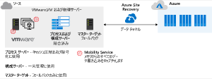
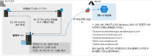
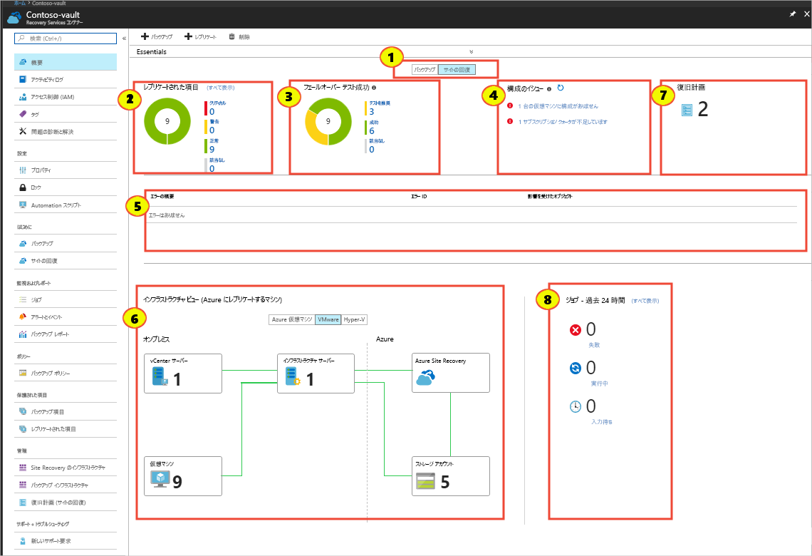

# Azure Site Recovery

## 概要

- プライマリサイトがダウンした場合に、セカンダリサイトにフェールオーバーする
- フェールオーバーは、オンプレ―Azure、Azure―Azureが可能
  
### 主な機能

- **中央管理**
  - レプリケーションのセットアップと管理およびフェールオーバーとフェールバックの呼び出しをすべて、Azure portal 内から実行可能
- **オンプレミスの仮想マシンのレプリケーション**
  - 必要に応じて、オンプレミスの仮想マシンを Azure にレプリケートすることも、オンプレミスのセカンダリ データセンターにレプリケートすることも可能
- **Azure 仮想マシンのレプリケーション**
  - Azure の仮想マシンを、あるリージョンから別のリージョンにレプリケート可能
- **フェールオーバーの間のアプリの整合性**
  - 復旧ポイントとアプリケーション整合性スナップショットを使うと、仮想マシンは、レプリケーションの間常に、整合性のある状態に維持される
- **柔軟なフェールオーバー**
  - フェールオーバーは、テストとしてオンデマンドで実行することも、実際の障害発生時にトリガーすることも可能
  - テストを実行して、ライブ サービスを中断せずにディザスター リカバリー シナリオをシミュレートすることができる
- **ネットワーク統合**
  - Site Recovery では、レプリケーションおよびディザスター リカバリー シナリオ時にネットワークの管理を行うことができる
  - これには、仮想マシンが新しい場所ですぐに動作できるように、予約済み IP アドレスとロード バランサーが含まれる

### スナップショットと復旧ポイント

- **クラッシュ整合性**
  - スナップショットが取得された時点のディスク上のデータを表す
  - キャプチャの規定値は5分毎
- **アプリ整合性**
  - クラッシュ整合性と同じデータがキャプチャされるほか、メモリ内のデータとインプロセスのトランザクションもすべて含まれる
  - アプリの稼働状況まで復元できるということ
  - スナップショットのキャプチャの規定値は60分毎

これらは24時間保管されるが、72時間まで延長可能

### セットアップ

  

以下のコンポーネントのセットアップが必要

- **ネットワーク**
  - レプリケートされた仮想マシンで使用される、有効な Azure 仮想ネットワークが必要です。
- **Recovery Services**
  - コンテナー: フェールオーバーの実行時に**移行された VM が格納される Azure サブスクリプション内のコンテナー**です。 コンテナーには、レプリケーション ポリシーと、レプリケーションおよびフェールオーバーのソースとターゲットの場所も含まれます。
- **資格情報**
  - Azure に使用する資格情報には、Site Recovery が接続されている **VM とストレージの両方を変更するためのアクセス許可**があるように、仮想マシン共同作成者ロールと Site Recovery 共同作成者ロールが必要です。
- **構成サーバー**
  - オンプレミスの VMware サーバーは、フェールオーバーおよびレプリケーション プロセス中にいくつかの役割を果たる
    - それは、簡単にデプロイできるように、Azure portal からオープン仮想マシン アプライアンス (OVA) として取得されます。 構成サーバーには、次のものが含まれます。
- **プロセス サーバー**
  - このサーバーは、レプリケーション トラフィックに対するゲートウェイとして機能します。 トラフィックはキャッシュ、圧縮、および暗号化された後、WAN 経由で Azure に送信されます。 また、プロセス サーバーでは、フェールオーバーおよびレプリケーションの対象となるすべての物理マシンと仮想マシンにモビリティ サービスがインストールされます。
- **マスター ターゲット サーバー**
  - このコンピューターでは、Azure からのフェールバックの間にレプリケーション プロセスが処理されます。

### レプリケーションプロセス

  

- Azureのリージョンからリージョンへのレプリケーションの場合、Azure VM のレプリケーションを有効にすると、**Site Recovery モビリティ サービスのインストール**が行われる
- インストールされた拡張機能により、VM が Site Recovery に登録される
- VM の継続的なレプリケーションが開始され、ディスクへの書き込みは直ちに**ローカル ストレージ アカウントに転送**される
- Site Recovery では、このアカウントを使用して、**レプリケーション先の環境のストレージ アカウントにキャッシュをレプリケート**する
- Site Recovery では、キャッシュ内の格納データをコピーして、ターゲット ストレージ アカウントまたはレプリケートされたマネージド ディスクと同期する
- データが処理された後、クラッシュ整合性の復旧ポイントが作成される
- アプリ整合性の復旧ポイントが有効化されている場合は、Site Recovery レプリケーション ポリシーに設定されているスケジュールに従って復旧ポイントが生成される

Site Recovery では、Azure 仮想マシンの高速ネットワークを使用して、ジッターを減らし、CPU 使用率を下げることができます。

### その他、保護されるワークロード

基本、以下が保護されている。

- Azure VM: サポート対象の Azure 仮想マシンで実行されているすべてのワークロードで、レプリケーションを使用できます。
- Hyper-V VM: Hyper-V 仮想マシンで実行されているすべてのワークロードで、保護を使用できます。
- 物理サーバー: Windows および Linux オペレーティング システムで、保護を使用できます。
- VMware VM: VMware 仮想マシンで実行されているすべてのワークロードで、保護を使用できます。

これ以外、個々のアプリケーション毎によりシームレスなフェールオーバーが行えるような機能が提供されている。

- **同期に近いレプリケーション**: データはほぼ同期的にプライマリ ストレージとレプリカに書き込まれ、復旧時間を短縮することができます。
- アプリ整合性スナップショット: 復旧のために作成されるスナップショットでは、メモリ内の情報と保留中の I/O 操作がわかるので、迅速に復旧することができます。 アプリケーションは、レプリカ VM に切り替えられた後に実行する準備ができています。
- **SQL Always On との統合**: Always On は、通常のデータベース ミラーリング手法に代わるエンタープライズ レベルの方法です。
- **柔軟な復旧計画**: 1 回のクリックでアプリケーション スタック全体を復旧する機能。 手動操作とスクリプト化された操作の両方を、全体的な計画に組み込むことができます。
- **ネットワーク管理**: IP アドレスの予約を簡略化し、ロード バランサーを構成し、Azure Traffic Manager と統合するための自動化された機能。
- **オートメーション ライブラリ**: ダウンロードして復旧計画と統合し、必要に応じて完全に自動化された復旧を提供できる、運用対応のスクリプト。

## ディザスターリカバリー訓練

いざというときに機能するように、事前のテスト・訓練は必須。しかし、本番環境に影響を与えないように行うにはそれなりに配慮が必要だが、テストフェールオーバー機能を提供してくれている。

### テスト復旧の流れ

1. 復旧計画・テストフェールオーバーを選択
2. 復旧ポイントを選択
3. 移行先仮想ネットワークを選択
4. Portalで進行状況を確認

以下のようなダッシュボードで確認可能。

  

### フェールオーバーとフェールバック

- フェールオーバー
  - フェールオーバーは、Azure Site Recovery を使用して保護されている現在のライブ環境が、レプリカ環境に移動されるときに発生
  - このターゲット レプリカ環境は、ライブ環境の代わりに、プライマリ インフラストラクチャになる。
- フェールバック
  - フェールオーバーの逆のことです。 前のライブ環境 (フェールオーバーが行われたため、今はレプリカ環境になっています) が元の役割を取り戻して、再びライブ環境になります。

フェールバックポリシーには、変更不可な固定属性がある。

- 自分のオンプレミス構成サーバーに対してのみレプリケートして戻すことができます。
- 目標復旧時点は 15 分に設定されます。
- 復旧ポイントの保持期間は 24 時間に設定されます。
- アプリ整合性スナップショットは、1 時間ごとに設定されます。

フェールバックでは、AzureVMが停止するので、ビジネス影響のないタイミングにスケジュールする必要がある。

## PowerShellでのAzure to Azureのフェールオーバーとフェールバック

### PowerShell を使用して VM をセカンダリ リージョンにフェールオーバーする

`Start-ASRCommitFailoverJob`

```sh
$vault = Get-AzRecoveryServicesVault -Name "asr-vault"
Set-AzRecoveryServicesAsrVaultContext -Vault $vault
$PrimaryFabric = Get-AsrFabric -Name "asr-a2a-default-westus2"
$PrimaryProtContainer = Get-ASRProtectionContainer -Fabric $PrimaryFabric
$ReplicationProtectedItem = Get-ASRReplicationProtectedItem -ProtectionContainer $PrimaryProtContainer -FriendlyName "patient-records"
$RecoveryPoints = Get-ASRRecoveryPoint -ReplicationProtectedItem $ReplicationProtectedItem
$Job_Failover = Start-ASRUnplannedFailoverJob -ReplicationProtectedItem $ReplicationProtectedItem -Direction PrimaryToRecovery -RecoveryPoint $RecoveryPoints[-1]

do {
        $Job_Failover = Get-ASRJob -Job $Job_Failover;
        sleep 30;
} while (($Job_Failover.State -eq "InProgress") -or ($JobFailover.State -eq "NotStarted"))

$Job_Failover.State
$CommitFailoverJob = Start-ASRCommitFailoverJob -ReplicationProtectedItem $ReplicationProtectedItem
Get-ASRJob -Job $CommitFailoverJob
```

### PowerShell を使用して VM を再保護する

`Update-AzRecoveryServicesAsrProtectionDirection`

```sh
$RecoveryFabric = Get-AsrFabric -Name "asr-a2a-default-eastus2"
$RecoveryProtContainer = Get-ASRProtectionContainer -Fabric $RecoveryFabric
$ProtectionContainerMapping = Get-AzRecoveryServicesAsrProtectionContainerMapping -ProtectionContainer $RecoveryProtContainer -Name eastus2-westus2-24-hour-retention-policy
$StorageAccount = New-AzStorageAccount -ResourceGroupName "east-coast-rg" -AccountName "reprotectcache" -Location eastus2 -SkuName Standard_GRS
$ResourceGroup = Get-AzResourceGroup -Name "west-coast-rg"

$ReprotectJob = Update-AzRecoveryServicesAsrProtectionDirection -AzureToAzure -ProtectionContainerMapping $ProtectionContainerMapping -ReplicationProtectedItem $ReplicationProtectedItem -LogStorageAccountId $StorageAccount.ID -RecoveryResourceGroupId $ResourceGroup.ResourceId
```

## 手順

Hyper-vの場合
1. Recovery Services Vaultの作成
2. （Azure NWをセットアップ）
3. オンプレからAzureへの移行のゴールの設定
4. Hyper-v Siteの作成
5. Site Recovery ProviderをHyper-vホストに導入
6. Hyper-v hostをVaultに登録

