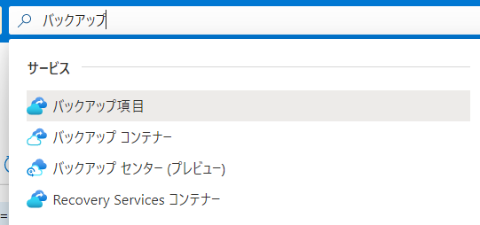
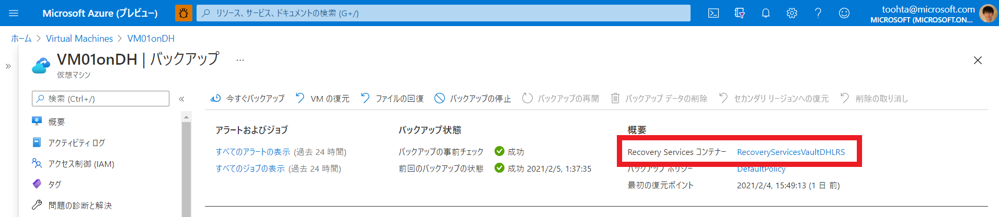
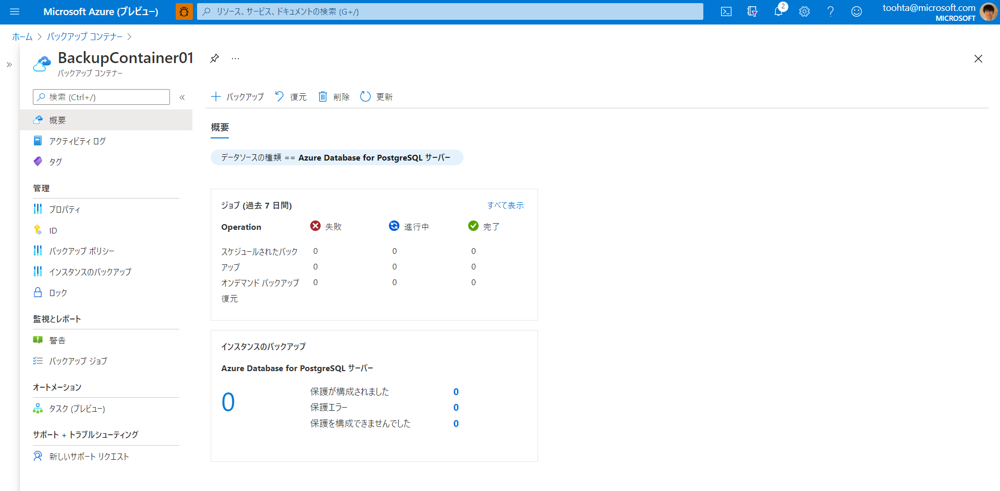
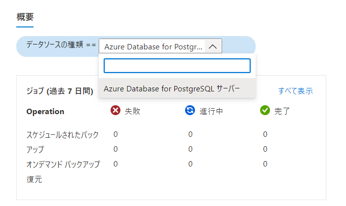
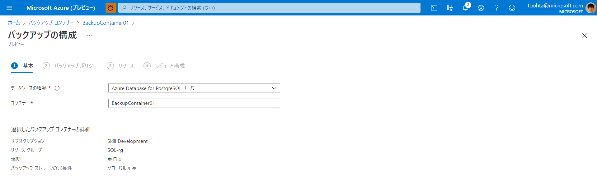
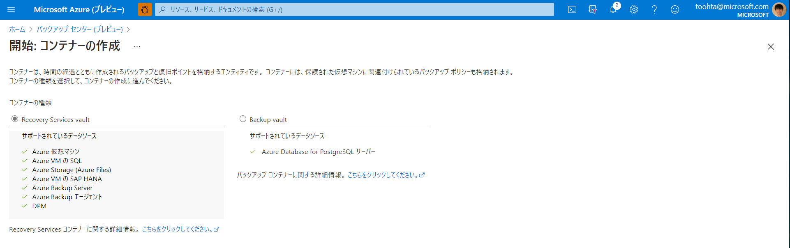

# Azure の各種バックアップ機能・サービスのコンテナーの体系について

## コンテナーの位置づけ

バックアップに関連してドキュメントや、AzurePortalの画面構成を見ていると、バックアップに関連しそうなコンテナーが、複数種ありそうなことに気づきます。
  
ここでは、それぞれの位置づけと提供機能を整理してみます。

まず、ドキュメントを確認すると、以下のような説明になっています。

Aazure Backupの[FAQ](https://docs.microsoft.com/ja-jp/azure/backup/backup-architecture#where-is-data-backed-up)によると、

> データはどこにバックアップされますか。
>  
> Azure Backup を使用すると、バックアップされたデータはコンテナー (Recovery Services コンテナーとバックアップ コンテナー) に格納されます。

そう、そのどちらに格納されるのかを知りたいのです。

それぞれのコンテナーのドキュメントによると・・・

- [バックアップコンテナー](https://docs.microsoft.com/ja-jp/azure/backup/backup-vault-overview)

    > バックアップ コンテナーは、Azure Backup によってサポートされる特定の新しいワークロードのバックアップ データを格納する Azure のストレージ エンティティです。バックアップ コンテナーを使用すると、Azure Database for PostgreSQL サーバーなど、さまざまな Azure サービスのバックアップ データと Azure Backup によってサポートされる新しいワークロードを保持できます。

 データストア系サービスのバックアップが対象になる、というイメージでしょうか。

- [Recovery services コンテナー](https://docs.microsoft.com/ja-jp/azure/backup/backup-azure-recovery-services-vault-overview)

    > データは通常、データのコピーであるか、仮想マシン (VM)、ワークロード、サーバー、ワークステーションのいずれかの構成情報です。 Recovery Services コンテナーを使用すると、IaaS VM (Linux または Windows) や Azure SQL データベースなどのさまざまな Azure サービスのバックアップ データを保持できます。

こちらはIaaS系も、データストア系も、両方が対象になるというイメージで、さらに、Azure Site Recoveryによる保護対象イメージも格納されることになります。

- バックアップセンター（プレビュー）
ちなみに、[バックアップセンター](https://docs.microsoft.com/ja-jp/azure/backup/backup-center-overview)とは、以下の通り、バックアップの統合管理を行えるようにするための機能の様です。

    > バックアップ センターは、大規模かつ分散された Azure 環境で適切に機能するように設計されています。 バックアップ センターを使用して、複数の種類のワークロード、コンテナー、サブスクリプション、リージョン、Azure Lighthouse テナントに渡ってバックアップを効率的に管理できます。

## バックアップの取得方法と取得先

### VM

VMの「操作」メニューにあるバックアップを確認すると、取得先はRecovery Services コンテナーであることがわかります。

  

## SQL DB

### 取得先

共用SQL DBは機能として組み込まれて自動でバックアップされるため、コンテナーを意識するという事はない模様。

https://docs.microsoft.com/ja-jp/azure/azure-sql/database/automated-backups-overview?tabs=single-database

但し、Azure VM上のSQL Serverについては[例外](https://docs.microsoft.com/ja-jp/azure/backup/backup-azure-sql-database)

### バックアップ頻度

- 完全バックアップを毎週
- 差分バックアップを 12 から 24 時間ごと
- そしてトランザクション ログ バックアップを 5 から 10 分ごとに作成 (トランザクション ログ バックアップの頻度は、コンピューティング サイズとデータベース アクティビティの量に基づいて決定）

### バックアップの冗長性

- ローカル冗長、ゾーン冗長、geo 冗長のいずれかのストレージ BLOB から選択可能
  - 既定で、ペアになっているリージョンにレプリケートされる geo 冗長ストレージ BLOB にデータが格納

### リストア

- **既存データベースのポイントインタイム リストア** 
  - Azure portal、Azure PowerShell、Azure CLI、または REST API を使用して、保持期間内の 過去の特定の時点に既存のデータベースを復元します。 SQL Database では、この操作により、元のデータベースと同じサーバーに新しいデータベースが作成されますが、元のデータベースが上書きされるのを防ぐため、別の名前が使用されます。 復元が完了したら、元のデータベースを削除することができます。 または、元のデータベースの名前を変更したうえで、復元されたデータベースの名前を元のデータベース名に変更してもかまいません。 SQL Managed Instance でも同様に、この操作により、同じリージョン、同じサブスクリプションの同じ、または異なるマネージド インスタンスに、データベースのコピーが作成されます。
- **削除されたデータベースのポイントインタイム リストア**
  - 削除されたデータベースを削除の時点に復元します。または、保持期間内の特定の時点に復元します。 削除されたデータベースは、元のデータベースが作成されていたのと同じサーバーまたはマネージド インスタンスにのみ復元できます。 データベースを削除すると、データが失われないように、削除前にサービスによって最後のトランザクション ログ バックアップが取得されます。
- **geo リストア**
  - 別の地理的リージョンにデータベースを復元します。 geo リストアを使用すると、プライマリ リージョンのデータベースまたはバックアップにアクセスできないときでも、地理的な災害から復旧できます。 任意の Azure リージョンの既存のサーバーまたはマネージド インスタンスに、新しいデータベースが作成されます。geo リストアは、geo 冗長バックアップ ストレージを使用して構成された SQL データベースまたはマネージド インスタンスでのみ利用できます。
- **長期的バックアップからの復元**
  - データベースの長期保有ポリシー (LTR) が構成されている場合、単一データベースまたはプールされたデータベースの 特定の長期バックアップからデータベースを復元します。 LTR により、Azure portal または Azure PowerShell を使用して、コンプライアンスの要求を満たすため、またはアプリケーションの以前バージョンを実行するために、以前のバージョンのデータベースを復元できます。

## Cosmos DB

### 取得先

こちらも[自動でバックアップ](https://docs.microsoft.com/ja-jp/azure/cosmos-db/online-backup-and-restore)される

CosmosDBの場合、考え方としてデータを分散配置して複製を保持するBASE型なので、バックアップに対するスタンスが他のACID型のデータストアとは異なっているように思います。
ドキュメントによると、

> すべてのバックアップは別々のストレージ サービス内に個別に保存されます。これらのバックアップは、リージョンの障害からの回復性を確保するためにグローバルにレプリケートされます。 自動バックアップは、Azure Cosmos アカウント、データベース、またはコンテナーを誤って削除または更新した後でデータの回復が必要になったシナリオの場合に役に立ちます。

との事。

### バックアップ頻度

- データベースが**4 時間ごとと任意の時点で自動的に完全バックアップ**され、既定では**最新の 2 回分のバックアップのみ**が保存
- コンテナーまたはデータベースが削除された場合、Azure Cosmos DB には、特定のコンテナーまたはデータベースの既存のスナップショットが 30 日間保持
- Azure Cosmos DB では、これらのバックアップが Azure Blob Storage に保存される一方、実際のデータは Azure Cosmos DB 内にローカルに存在

### バックアップの冗長性

- バックアップのスナップショットは、現在の書き込みリージョン (または、マルチリージョン書き込み構成の場合は、書き込みリージョンの 1 つ) と**同じリージョンの Azure Blob Storage に格納**されます。
- リージョンの障害に対する回復性を確保するために、Azure BLOB ストレージにあるバックアップ データの各スナップショットが、**地理冗長ストレージ (GRS) 経由でもう一度レプリケート**されます。 バックアップのレプリケート先のリージョンは、ソース リージョンと、ソース リージョンに関連付けられている**リージョン ペアに基づいて**います。

### リストア

- このバックアップに直接アクセスすることはできません。 **サポート リクエストを通してお客様から要求があると、Azure Cosmos DB チームによりバックアップが復元**されます。

また、現在プレビューで 「[継続的バックアップ機能](https://docs.microsoft.com/ja-jp/azure/cosmos-db/continuous-backup-restore-introduction)」というものが提供されています。

## PostgreSQL

### 取得先

こちらも[自動でバックアップ](https://docs.microsoft.com/ja-jp/azure/postgresql/concepts-backup)される

ドキュメントによると、

> サーバーのバックアップを自動的に作成し、ユーザーが構成したローカル冗長または geo 冗長ストレージに保存します。 バックアップを使用すると、サーバーを特定の時点に復元できます。

との事。
データファイルとトランザクションログのバックアップが作成されます。サポートされている最大ストレージ サイズに応じて、完全バックアップと差分バックアップ (最大 4 TB のストレージ サーバー) またはスナップショット バックアップ (最大 16 TB のストレージ サーバー) を使用します。 これらのバックアップを使用すると、サーバーを、バックアップの構成済みリテンション期間内の任意の時点に復元できます。 バックアップの既定のリテンション期間は 7 日です。 これは、必要に応じて、最大 35 日に設定できます。 すべてのバックアップが、AES 256 ビット暗号化を使用して暗号化されます。

### バックアップ頻度

- 最大 4 TB のストレージを持つサーバー
  - **完全バックアップは毎週 1 回**実行されます。
  - **差分バックアップは 1 日に 2 回**実行されます。
  - **トランザクション ログ バックアップは 5 分ごと**に実行されます。
- 最大 16 TB のストレージを持つサーバー
  - Azure リージョンのサブセットでは、新しくプロビジョニングされたすべてのサーバーで最大 16 TB のストレージがサポートされます。 これらの大規模なストレージ サーバー上のバックアップは、スナップショット ベースです。
  - 初回の完全スナップショット バックアップは、サーバーの作成直後にスケジュールされます。最初の完全スナップショット バックアップは、サーバーのベース バックアップとして保持されます。
  - **以降のスナップショット バックアップでは、差分バックアップのみ**が行われます。 差分スナップショット バックアップは、固定のスケジュールでは実行されません。 
  - **1 日に 3 回の差分スナップショット バックアップ**が実行されます。
  - **トランザクション ログ バックアップは 5 分ごと**に実行されます。
  - 7 日間から 35 日間までの保有期間を選択できます。 既定の保有期間は 7 日です。

### バックアップの冗長性

- 汎用レベルとメモリ最適化レベルで、ローカル冗長バックアップ ストレージまたは geo 冗長バックアップ ストレージのいずれかを柔軟に選択できます。
- geo 冗長バックアップ ストレージにバックアップが格納されるとき、そのバックアップは、サーバーがホストされているリージョンに格納されるだけでなく、ペアになっているデータ センターにもレプリケートされます。 これにより、災害発生時に、より適切な保護が提供され、別のリージョンにサーバーを復元することができます。
- Basic レベルでは、ローカル冗長バックアップ ストレージのみが提供されます。

### リストア

- Azure Database for PostgreSQL で復元を実行すると、元のサーバーのバックアップから新しいサーバーが作成されます。使用できる復元には 2 つの種類があります。
  - **ポイントインタイム リストア** - いずれのバックアップ冗長オプションでも使用でき、元のサーバーと同じリージョンに新しいサーバーが作成されます。
  - **geo リストア** - サーバーを geo 冗長ストレージ用に構成した場合にのみ使用でき、ご利用のサーバーを別のリージョンに復元できます。新規サーバー作成時に、保管されているバックアップを指定して作り直すイメージ。

## バックアンプコンテナーは何処に？

ここまで、各バックアップリソースの説明ではバックアップコンテナーに言及されてませんね・・・いったいどのように使うのか？

実際に作成して何が出来そうか診てみることにします。
実際に作成した直後の概要画面がこちらです。
  

データソースの種類をみてみると、規定でPostgreSQLサーバーが指定されています。選択肢として何があるかというと・・・

  
今のところPostgreSQLしかない様です。

実際新規でバックアップ項目を作成しようとしてみても・・・

  

やはり選択肢としてPostgreSQLしか表示されません。

あっ、分かりやすい画面がありました。冒頭のバックアップセンターの画面から、バックアップを作成しようとすると、以下の選択画面に遷移します。

  

一目でそれぞれに何が格納されるかわかりますね。
バックアップコンテナーには、PostgreSQLのみですが、そのほかに [Azure ディスクバックアップ](https://docs.microsoft.com/ja-jp/azure/backup/disk-backup-overview)もプレビューで利用可能の様です。
今後バックアップ対象が拡充されていくのかも知れません。

成程、これらのコンテナーを統合的に管理するのが、バックアップセンターだった、というオチでした。
