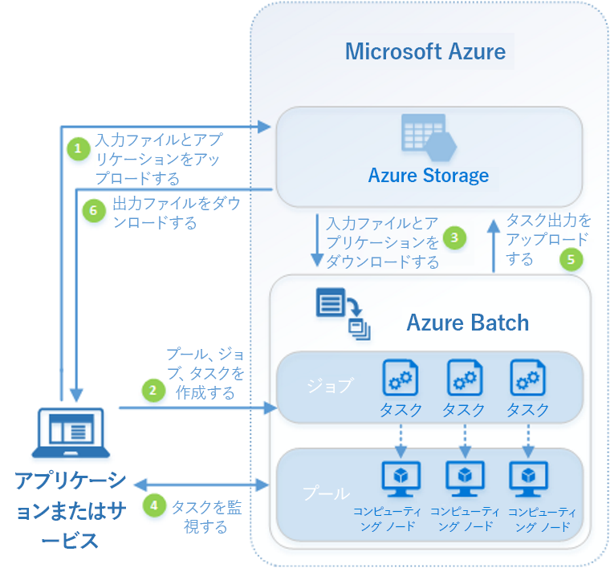
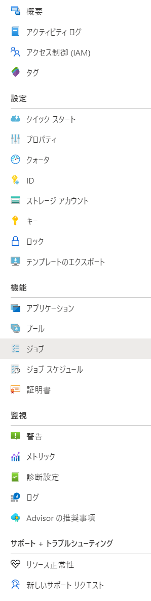

# Azure Batchを知る

## 概要

- Compute Intensiveな処理を並行処理するサービス
- WebSphere XD Compute Grid、JSR-352 Batch Applications for javaのようなもの
- 以下のような枠組みで動く
-   
- データとアプリケーションをAzure Storageにアップロードしておく必要がある
- 実際に処理を行うノードのプールを作成する
- 処理結果はやはりAzure Storageに保管される
- コマンドラインから操作する

Azure Portal上のメニュー

  

## 実行してみる

### Azure Batchリソースを作成する

RESOURCE_GROUP=AzureBatch-rg
BATCH_ACCOUNT=batchaccounttoohta
LOCATION=japaneast


```sh
az group create \
--name $RESOURCE_GROUP \
--location $LOCATION
{
  "id": "/subscriptions/cacb158e-adcf-4815-b7d4-1dd87212e9a0/resourceGroups/AzureBatch-rg",
  "location": "japaneast",
  "managedBy": null,
  "name": "AzureBatch-rg",
  "properties": {
    "provisioningState": "Succeeded"
  },
  "tags": null,
  "type": "Microsoft.Resources/resourceGroups"
}
```


```sh
az batch account create \
 --name $BATCH_ACCOUNT \
 --resource-group $RESOURCE_GROUP \
 --location $LOCATION
{- Finished ..
  "accountEndpoint": "batchaccounttoohta.japaneast.batch.azure.com",
  "activeJobAndJobScheduleQuota": 300,
  "autoStorage": null,
  "dedicatedCoreQuota": 0,
  "dedicatedCoreQuotaPerVmFamily": [
    {
      "coreQuota": 0,
      "name": "standardAv2Family"
    },
    {
      "coreQuota": 0,
      "name": "standardDv2Family"
    },
    {
      "coreQuota": 0,
      "name": "standardDv3Family"
    },
    {
      "coreQuota": 0,
      "name": "standardEv3Family"
    },
    {
      "coreQuota": 0,
      "name": "standardDSv2Family"
    },
    {
      "coreQuota": 0,
      "name": "standardDSv3Family"
    },
    {
      "coreQuota": 0,
      "name": "standardESv3Family"
    },
    {
      "coreQuota": 0,
      "name": "standardFFamily"
    },
    {
      "coreQuota": 0,
      "name": "standardFSFamily"
    },
    {
      "coreQuota": 0,
      "name": "standardA0_A7Family"
    },
    {
      "coreQuota": 0,
      "name": "standardA8_A11Family"
    },
    {
      "coreQuota": 0,
      "name": "standardDFamily"
    },
    {
      "coreQuota": 0,
      "name": "standardGFamily"
    },
    {
      "coreQuota": 0,
      "name": "basicAFamily"
    },
    {
      "coreQuota": 0,
      "name": "standardNVFamily"
    },
    {
      "coreQuota": 0,
      "name": "standardNVPromoFamily"
    },
    {
      "coreQuota": 0,
      "name": "standardNCFamily"
    },
    {
      "coreQuota": 0,
      "name": "standardNCPromoFamily"
    },
    {
      "coreQuota": 0,
      "name": "standardHFamily"
    },
    {
      "coreQuota": 0,
      "name": "standardHPromoFamily"
    },
    {
      "coreQuota": 0,
      "name": "standardMSFamily"
    },
    {
      "coreQuota": 0,
      "name": "standardDSFamily"
    },
    {
      "coreQuota": 0,
      "name": "standardGSFamily"
    },
    {
      "coreQuota": 0,
      "name": "standardLSFamily"
    },
    {
      "coreQuota": 0,
      "name": "standardLSv2Family"
    },
    {
      "coreQuota": 0,
      "name": "standardNCSv2Family"
    },
    {
      "coreQuota": 0,
      "name": "standardNDSFamily"
    },
    {
      "coreQuota": 0,
      "name": "standardNCSv3Family"
    },
    {
      "coreQuota": 0,
      "name": "standardFSv2Family"
    },
    {
      "coreQuota": 0,
      "name": "standardHBSFamily"
    },
    {
      "coreQuota": 0,
      "name": "standardHCSFamily"
    },
    {
      "coreQuota": 0,
      "name": "standardNVSv3Family"
    },
    {
      "coreQuota": 0,
      "name": "standardHBrsv2Family"
    },
    {
      "coreQuota": 0,
      "name": "standardDASv4Family"
    },
    {
      "coreQuota": 0,
      "name": "standardEAv4Family"
    },
    {
      "coreQuota": 0,
      "name": "standardEASv4Family"
    }
  ],
  "dedicatedCoreQuotaPerVmFamilyEnforced": false,
  "encryption": {
    "keySource": "Microsoft.Batch",
    "keyVaultProperties": null
  },
  "id": "/subscriptions/cacb158e-adcf-4815-b7d4-1dd87212e9a0/resourceGroups/azurebatch-rg/providers/Microsoft.Batch/batchAccounts/batchaccounttoohta",
  "identity": {
    "principalId": null,
    "tenantId": null,
    "type": "None"
  },
  "keyVaultReference": null,
  "location": "japaneast",
  "lowPriorityCoreQuota": 0,
  "name": "batchaccounttoohta",
  "poolAllocationMode": "BatchService",
  "poolQuota": 100,
  "privateEndpointConnections": null,
  "provisioningState": "Succeeded",
  "publicNetworkAccess": "Enabled",
  "resourceGroup": "azurebatch-rg",
  "tags": null,
  "type": "Microsoft.Batch/batchAccounts"
}
```

バッチアカウントにログイン

```sh
 az batch account login \
 --name $BATCH_ACCOUNT \
 --resource-group $RESOURCE_GROUP \
 --shared-key-auth
```

プールを作成する

```sh
 az batch pool create \
 --id mypool --vm-size Standard_A1_v2 \
 --target-dedicated-nodes 3 \
 --image canonical:ubuntuserver:16.04-LTS \
 --node-agent-sku-id "batch.node.ubuntu 16.04"

 az batch pool show --pool-id mypool \
 --query "allocationState"
"steady"
```

ジョブを作成する

```sh
az batch job create \
 --id myjob \
 --pool-id mypool
```

タスクを作成する

```sh
 for i in {1..10}
do
   az batch task create \
    --task-id mytask$i \
    --job-id myjob \
    --command-line "/bin/bash -c 'echo \$(printenv | grep \AZ_BATCH_TASK_ID) processed by; echo \$(printenv | grep \AZ_BATCH_NODE_ID)'"
done

{
  "affinityInfo": null,
  "applicationPackageReferences": null,
  "authenticationTokenSettings": null,
  "commandLine": "/bin/bash -c 'echo $(printenv | grep \\AZ_BATCH_TASK_ID) processed by; echo $(printenv | grep \\AZ_BATCH_NODE_ID)'",
  "constraints": {
    "maxTaskRetryCount": 0,
    "maxWallClockTime": "10675199 days, 2:48:05.477581",
    "retentionTime": "7 days, 0:00:00"
  },
  "containerSettings": null,
  "creationTime": "2020-07-30T08:20:45.355137+00:00",
  "dependsOn": null,
  "displayName": null,
  "eTag": "0x8D8346175129D0F",
  "environmentSettings": null,
  "executionInfo": {
    "containerInfo": null,
    "endTime": null,
    "exitCode": null,
    "failureInfo": null,
    "lastRequeueTime": null,
    "lastRetryTime": null,
    "requeueCount": 0,
    "result": null,
    "retryCount": 0,
    "startTime": null
  },
  "exitConditions": null,
  "id": "mytask1",
  "lastModified": "2020-07-30T08:20:45.355137+00:00",
  "multiInstanceSettings": null,
  "nodeInfo": null,
  "odata.metadata": "https://batchaccounttoohta.japaneast.batch.azure.com/$metadata#tasks/@Element",
  "outputFiles": null,
  "previousState": null,
  "previousStateTransitionTime": null,
  "resourceFiles": null,
  "state": "active",
  "stateTransitionTime": "2020-07-30T08:20:45.355137+00:00",
  "stats": null,
  "url": "https://batchaccounttoohta.japaneast.batch.azure.com/jobs/myjob/tasks/mytask1",
  "userIdentity": {
    "autoUser": {
      "elevationLevel": "nonadmin",
      "scope": "pool"
    },
    "userName": null
  }
}
：
}
```

ジョブの削除

```sh
    az batch job delete --job-id myjob -y
```

ジョブを再作成

```sh
az batch job create \
 --id myjob2 \
 --pool-id mypool
```

タスクの状態を確認する

```sh
az batch task show \
 --job-id myjob2 \
 --task-id mytask1
 {
  "affinityInfo": null,
  "applicationPackageReferences": null,
  "authenticationTokenSettings": null,
  "commandLine": "/bin/bash -c 'echo $(printenv | grep \\AZ_BATCH_TASK_ID) processed by; echo $(printenv | grep \\AZ_BATCH_NODE_ID)'",
  "constraints": {
    "maxTaskRetryCount": 0,
    "maxWallClockTime": "10675199 days, 2:48:05.477581",
    "retentionTime": "7 days, 0:00:00"
  },
  "containerSettings": null,
  "creationTime": "2020-07-30T08:45:47.716087+00:00",
  "dependsOn": null,
  "displayName": null,
  "eTag": "0x8D83464F48CB3AB",
  "environmentSettings": null,
  "executionInfo": {
    "containerInfo": null,
    "endTime": null,
    "exitCode": null,
    "failureInfo": null,
    "lastRequeueTime": null,
    "lastRetryTime": null,
    "requeueCount": 0,
    "result": null,
    "retryCount": 0,
    "startTime": null
  },
  "exitConditions": null,
  "id": "mytask1",
  "lastModified": "2020-07-30T08:45:47.716087+00:00",
  "multiInstanceSettings": null,
  "nodeInfo": null,
  "odata.metadata": "https://batchaccounttoohta.japaneast.batch.azure.com/$metadata#tasks/@Element",
  "outputFiles": null,
  "previousState": null,
  "previousStateTransitionTime": null,
  "resourceFiles": null,
  "state": "active",
  "stateTransitionTime": "2020-07-30T08:45:47.716087+00:00",
  "stats": null,
  "url": "https://batchaccounttoohta.japaneast.batch.azure.com/jobs/myjob2/tasks/mytask1",
  "userIdentity": {
    "autoUser": {
      "elevationLevel": "nonadmin",
      "scope": "pool"
    },
    "userName": null
  }
}

az batch task file list \
 --job-id myjob2 \
 --task-id mytask5 \
 --output table