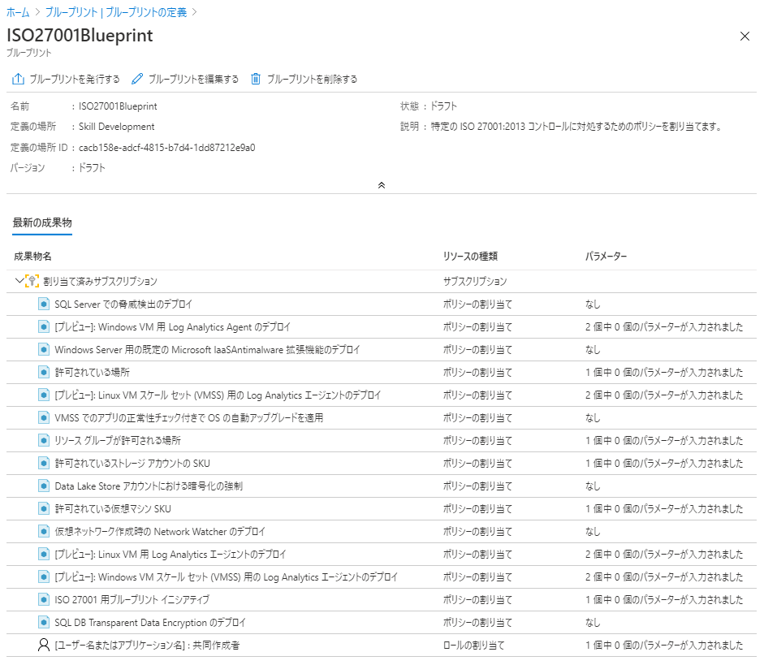
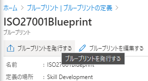
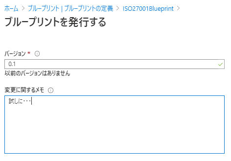
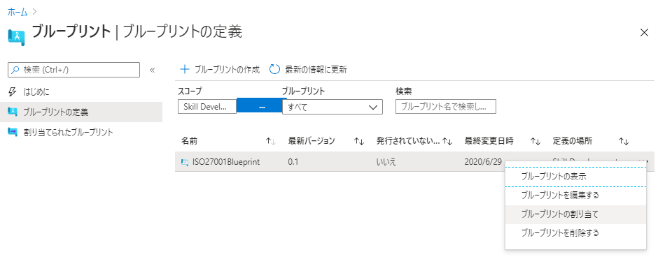
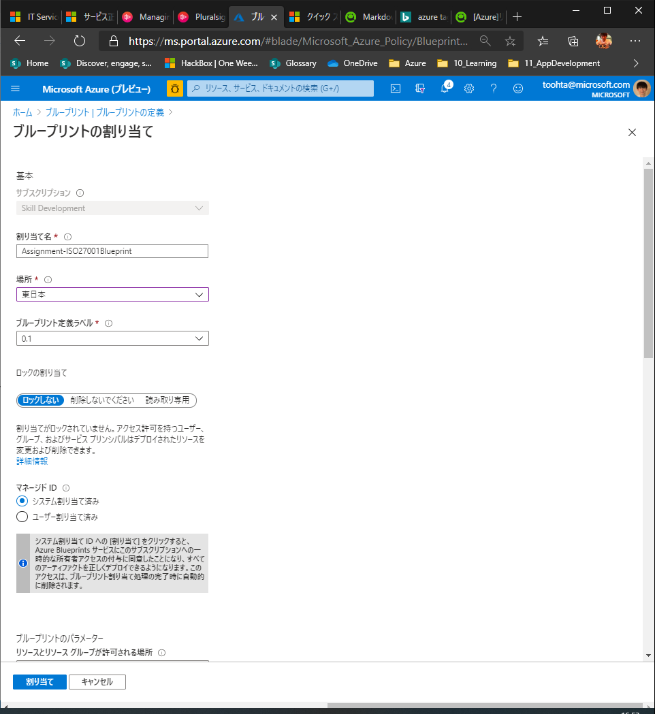
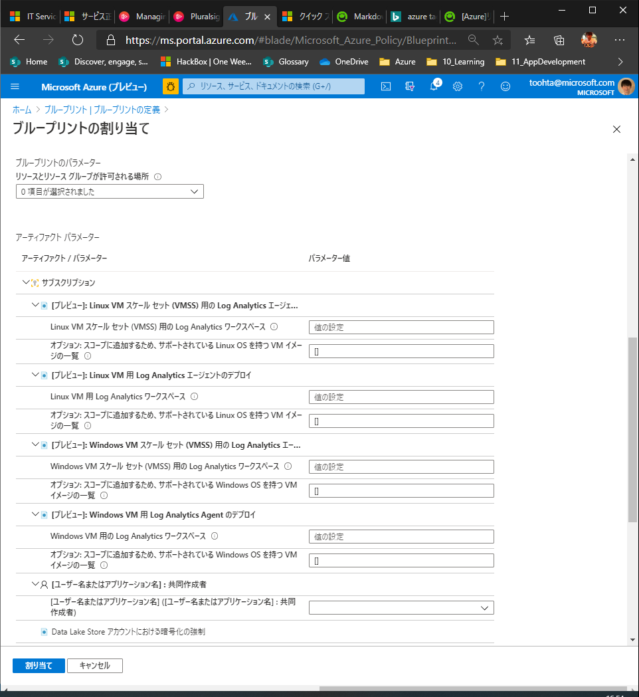

# Azure Blueprint

- Azure Blueprintsで組織の標準、パターン、要件を実装および順守した反復可能な一連の Azure リソースを定義
- 以下の様なアーティファクトのデプロイを宣言的に行う
  - ロールの割り当て
  - ポリシーの割り当て
  - Azure Resource Manager テンプレート
  - リソース グループ

## 実装のプロセス

1. Azure ブループリントを作成する
2. ブループリントを割り当てる
3. ブループリントの割り当てを追跡する

## 他の概念との違い

### ARM テンプレートとの違い

ブループリントを使用すると、ブループリント定義 (何をデプロイする必要があるか) とブループリント割り当て (何がデプロイされたか) の間に関係が維持されます。 この結び付きによって、デプロイの追跡と監査が向上
 各ブループリントは、0 個以上の Resource Manager テンプレート アーティファクトで構成することができます。 つまり、Resource Manager テンプレートのライブラリを開発およびメンテナンスするために行った以前の作業をブループリントにおいて再利用することができます。

### Azure Policyとの違い

ポリシーは、デプロイ時のリソース プロパティと、既に存在するリソースのリソース プロパティに焦点を合わせた、既定での許可と明示的な拒否のシステム
ポリシーは、数多くのアーティファクトの 1 つとしてブループリント定義に含めることができます。 また、ブループリントでは、ポリシーおよびイニシアティブでパラメーターを使用することもできます。

## イメージ

こんな感じ

ドラフトの作成

  

ブループリントを発行

  

  

ブループリントの割り当て

  

  

  
