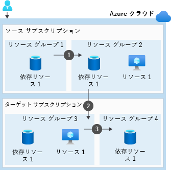

# リソースおよびリソースグループを知る

- 1つのリソースは、1つのリソースグループにのみ属する
- 1つのリソースグループには、異なるリージョンの異なる種類のリソースを含むことができる


## リソースを別のリソースグループに移動する

https://docs.microsoft.com/ja-jp/learn/modules/move-azure-resources-another-resource-group/

https://docs.microsoft.com/ja-jp/azure/azure-resource-manager/management/move-support-resources

- AppServiceは別のリソースグループに移動する前に**SSL証明書を削除**する必要がある。
- **Load Balancer**は、サブスクリプション内/外で**移動不可**
- 標準ロード バランサーまたは標準パブリック IP を使用して**仮想マシン スケール セット**を移動することはできません。
- **可用性ゾーン**にある**マネージド ディスク**を別のサブスクリプションに移動することはできません。
- VNet移動時には**ピアを解除**
- VNEtは同じサブスクリプション内で移動可能、**併せて依存しているものをすべて**持っていく必要がある
- **Azure Key Vault 内の証明書**を使用してサブスクリプション間で仮想マシンを移動することはできません。
- Azure AD DSは移動できない

## 移動をテストする

Azure Portal を使用する場合は移動の検証が行われた後に実際の移動が行われる。
それ以外の場合は、REST API validate move 操作で検査を行う。

## 移動の手順

移動操作を開始すると、リソースを保持しているリソース グループと新しい移動先のリソース グループがロックされ移動操作が終了するまで、リソース グループで書き込み操作と削除操作を実行することはできません

### サブスクリプション間の移動

移動対象のあるリソースグループが他のリソースグループに依存している場合、一旦リソースグループをひとまとめにして依存関係を解消した後に、サブスクリプションをまたがった移動を行う。
移動後に再度分割移動を行う。

  

### 手順

#### Azure CLI

1. ターゲットリソースグループを作成 `az group create`
2. リソースを取得 `az resource show`
3. リソースIDを指定して移動 `az resource move`
4. 移動確認
5. リソースを参照するツールとスクリプトのリソース ID を更新します。

```sh
#1
az group create \
    --name <destination resource group name> \
    --location <location name>

#2
yourResource=$(az resource show \
    --resource-group <resource group name> \
    --name <resource name> \
    --resource-type <resource type> \
    --query id \
    --output tsv)

#3
az resource move \
    --destination-group <destination resource group name> \
    --ids $yourResource

#4
az group show \
    --name <destination resource group name>
```

#### PowerShell

1. ターゲットリソースグループを作成 `New-AzResourceGroup`
2. リソースを取得 `Get-AzResource`
3. リソースIDを指定して移動 `Move-AzResource`
4. 移動確認 `Get-AzResource`
5. リソースを参照するツールとスクリプトのリソース ID を更新します。

```sh

#1
New-AzResourceGroup
-Name <destination resource group name>
-Location <location name>

#2
$yourResource =
    Get-AzResource
        -ResourceGroupName <resource group name> -ResourceName <resource name>

#3
Move-AzResource
-DestinationResourceGroupName <destination resource group name>
-ResourceId $yourResource.ResourceId

#4
Get-AzResource
-ResourceGroupName <destination resource group name> | ft
```
