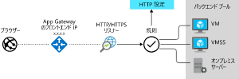
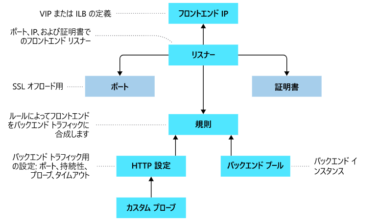
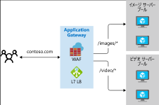
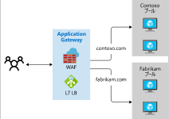

# Application Gatewayでトラフィックをルーティングする

- URLに基づいたWebサーバーのルーティング
- 所謂レイヤ７の負荷分散サービス
- Webサーバーのプールとして、Azure VM、Azure VMスケールセット、App Service、オンプレミスサーバーを使用可能

  

こんな仕組みで動く  

  

## ルーティングの種類

### パスベースのルーティング

URLパスに応じて、ルーティング先のサーバー/プールを変更する
  

https://docs.microsoft.com/ja-jp/azure/application-gateway/url-route-overview

### 複数サイトのホスティング

アプリケーションゲートウェイの同じインスタンスに複数のWebアプリケーションを構成。
同じIPに複数のCNAMEを設定し、CNAME毎にルーティング先のサーバー/プールを変更する。つまり、HTTP/1.1ホストヘッダーで見分けている。
Server Name Indication (SNI) TLS 拡張機能によって TLS オフロードをサポートすることも可能。

  

https://docs.microsoft.com/ja-jp/azure/application-gateway/multiple-site-overview

### その他のルーティング機能

- リダイレクト - リダイレクトは、別のサイトに対して、または HTTPS から HTTP に対して、使用できます。
- HTTP ヘッダーの書き換え - クライアントとサーバーは、HTTP ヘッダーを使用して、要求または応答で追加の情報を渡すことができます。
- カスタム エラー ページ - Application Gateway では、既定のエラー ページを表示する代わりに、カスタム エラー ページを作成することができます。

## Application Gatewayでの負荷分散

- 基本ラウンドロビン
- Affinityの設定も可能

## その他の機能

### Secure Sockets Layer (SSL/TLS) のターミネーション

- SSL/TLSを終端してバックエンドの負荷をオフロード
- end to endでのSSL/TLSも可能。この場合、一旦AP GWにて複合化され、再度暗号化されてルーティングされる

https://docs.microsoft.com/ja-jp/azure/application-gateway/ssl-overview

### 自動スケーリング

Standard v2では、自動スケーリングがサポートされる。

### ゾーン冗長性

Standard_v2 の Application Gateway は、複数の可用性ゾーンを対象にできるため、障害回復性が高く、ゾーンごとに個別の Application Gateway をプロビジョニングする必要がありません。

### 静的 VIP

Application Gateway Standard_v2 SKU では、静的な VIP の種類だけをサポートします。 これにより、アプリケーション ゲートウェイに関連付けられた VIP は、Application Gateway の有効期間を過ぎても変化しません。

### Web アプリケーション ファイアウォール

WAF は、OWASP (Open Web Application Security Project) コア ルール セット 3.1 (WAF_v2 のみ)、3.0、2.2.9 の規則に基づいています。
WAFは、ApGWの他に、Front Door、CDNでも利用可能
https://docs.microsoft.com/ja-jp/azure/web-application-firewall/overview

### AKS のイングレス コントローラー

AKSのイングレスコントローラーとしても利用可能
Application Gateway Standard_v2 SKU および WAF_v2 SKU のみがサポート
https://docs.microsoft.com/ja-jp/azure/application-gateway/ingress-controller-overview

### リダイレクト

- HTTP→HTTPSなどのポート間のリダイレクト
- パスベースのリダイレクト
- 外部サイトへのリダイレクト
などが可能

https://docs.microsoft.com/ja-jp/azure/application-gateway/redirect-overview

### セッションアフィニティ

Passive Cookie Affinityをサポート

### Websocket と HTTP/2 トラフィック

WebSocket および HTTP/2 プロトコルをネイティブにサポートしています。 ユーザーが構成可能な、WebSocket のサポートを選択的に有効または無効にするための設定はありません。

### 接続のドレイン

メンテナンス時に、割り振りを完了するまでに一定期間待機して、新規接続は受け付けなくするようにできる。Gracefulに割り振り停止。

### カスタム エラー ページ

以下の2つのカスタムエラーをサポート。

- メンテナンス ページ - 502 無効なゲートウェイ ページの代わりに、このカスタム エラー ページを送信します。 これは、Application Gateway にトラフィックをルーティングするバックエンドがないときに表示されます。 たとえば、予定メンテナンスがある場合、または予期しない問題がバックエンド プール アクセスに影響する場合です。
- 未承認のアクセス ページ - 403 未承認のアクセス ページの代わりに、このカスタム エラー ページを送信します。 これは、Application Gateway WAF が悪意のあるトラフィックを検出し、そのトラフィックをブロックするときに表示されます。

バックエンドのエラーについては、そのまま応答

### HTTP ヘッダーを書き換える

HTTPヘッダーの操作によって、以下のようなことが実現できる。

- HSTS/ X-XSS-Protection などのセキュリティ関連ヘッダー フィールドを追加する。
- 機密情報が漏れる可能性がある応答ヘッダー フィールドを削除する。
- X-Forwarded-For ヘッダーからポート情報を削除する。

### サイズ設定

Application Gateway Standard_v2 は、自動スケーリング用、または固定サイズ デプロイ用に構成

## Application Gateway のオプション

- アプリケーション ゲートウェイは、Standard レベルまたは WAF レベルで作成できます。 また、パフォーマンス、価格、スケーラビリティが異なる次の 3 つのサイズから選択できます: Small、Medium、Large。
- Standard レベルと WAF レベルは、V1 と V2 の 2 つのバージョンで利用できます。 V2 では Azure Availability Zones がサポートされますが、現在はプレビュー段階です。
- Application Gateway では、手動スケーリングと自動スケーリングがサポートされます。 自動スケーリングを選択すると、Application Gateway はアプリケーションのトラフィックに応じて自動的にスケールアウトおよびスケールインします。 Application Gateway のインスタンスの最大数と最小数を制限することができます。
- 