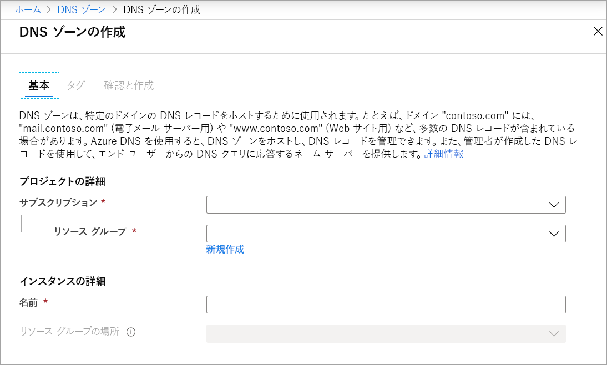
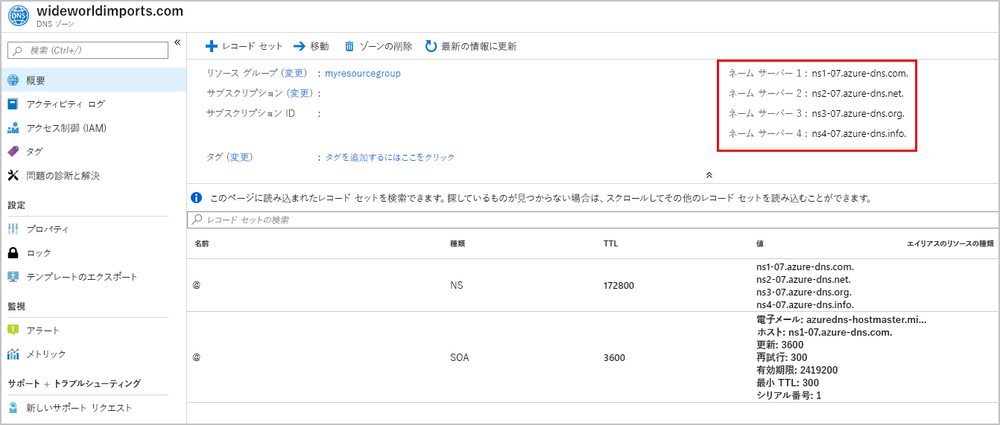
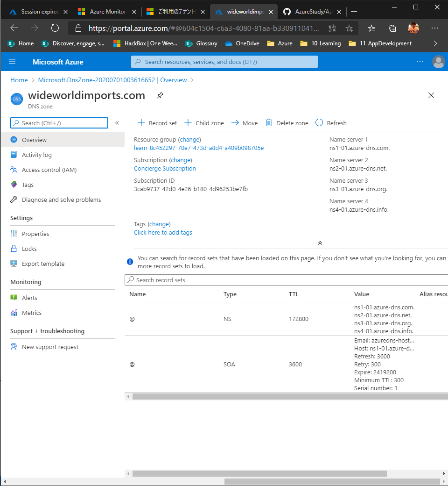
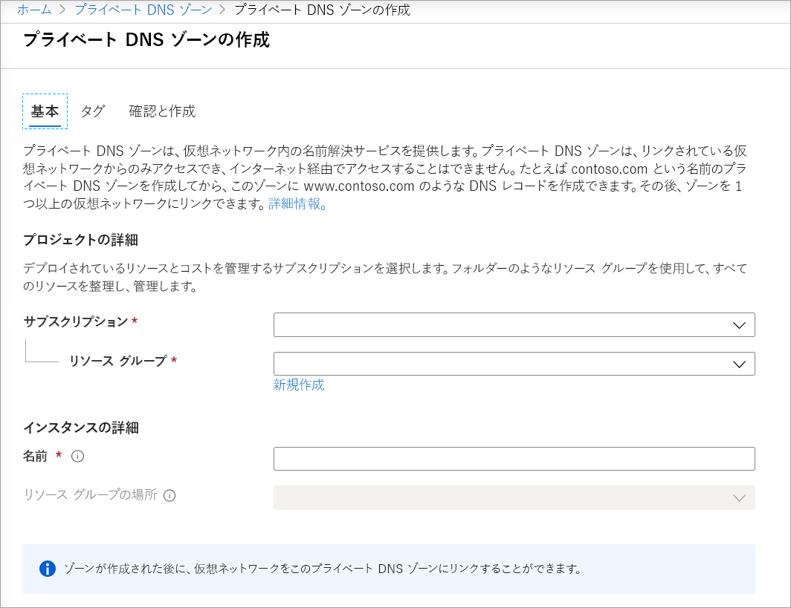
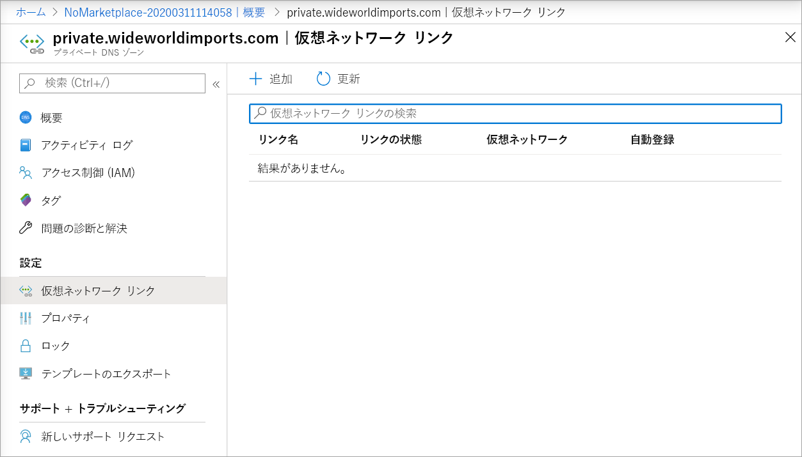
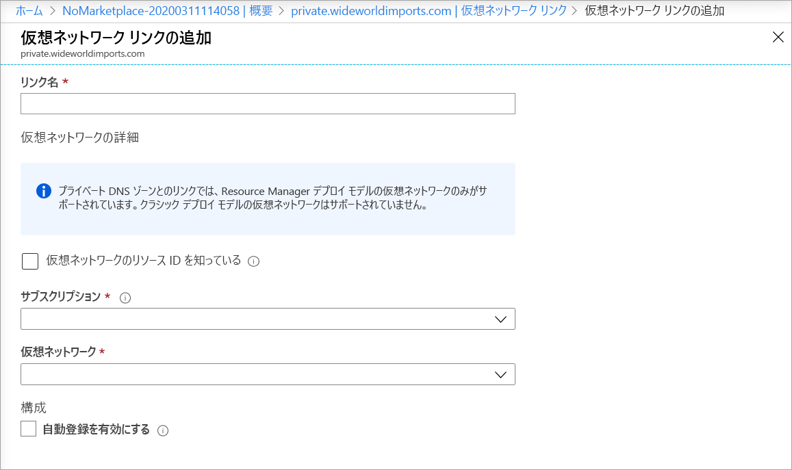
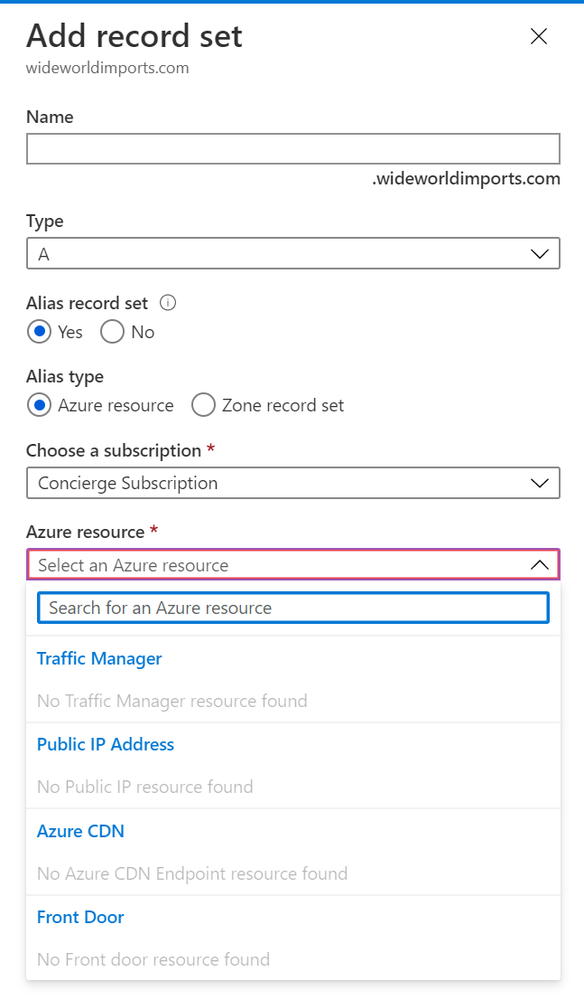
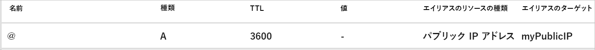

# Azure DNS

## 概要

- Microsoft Azure インフラストラクチャを使用して名前解決を提供する、DNS ドメインのホスティング サービス
- Azure インフラストラクチャ上のドメインの DNS レコードをホストすることが可能
- Azure DNS は、ドメインの SOA として機能
- Azure DNS を使用して、ドメイン名を登録することはできません。 ドメインを登録するには、サードパーティのドメイン レジストラーを使用
  
## DNS 概要

### DNSレコードの種類

- A はホスト レコードであり、最も一般的な種類の DNS レコードです。 ドメインまたはホスト名を IP アドレスにマップします。
- CNAME は、正規名、または A レコードのエイリアスです。 異なるドメイン名があり、それらがすべて同じ Web サイトにアクセスした場合は、CNAME を使用します。
- MX は、メール交換レコードです。 オンプレミスとクラウドのどちらでホストされているかにかかわらず、メール サーバーにメール要求をマップします。
- TXT はテキスト レコードです。 これは、テキスト文字列をドメイン名に関連付けるために使用されます。 Azure と Office 365 では、TXT レコードを使用してドメインの所有権を確認します。

さらに、次のレコードの種類もあります。

- ワイルドカード
- CAA (証明機関)
- NS (ネーム サーバー)
- SOA (Start of Authority)
- SPF (送信者ポリシー フレームワーク)
- SRV (サーバーの場所)
  
SOA および NS レコードは、Azure DNS を使用して DNS ゾーンを作成するときに自動的に作成されます。

### レコードセット

一部のレコードの種類では、レコード セット、またはリソース レコード セットの概念がサポートされます。 レコード セットを使用すると、複数のリソースを単一のレコードで定義できます。 たとえば、IP アドレスが 2 つある 1 つのドメインを持つ A レコードを以下に示します。

```DNS
www.wideworldimports.com.     3600    IN    A    127.0.0.1
www.wideworldimports.com.     3600    IN    A    127.0.0.2
```

## AzureDNSのどこが良いか

### セキュリティ

- ロールベースのアクセス制御。Azure リソースに対するユーザーのアクセスをきめ細かく制御できます。 使用状況を監視し、アクセス権があるリソースとサービスを制御できます。
- アクティビティ ログ。これにより、リソースに対する変更を追跡し、エラーが発生した場所を特定できます。
- リソース ロック。これにより、リソース グループ、サブスクリプション、または任意の Azure リソースに対するアクセスを制限または削除するためのより高いレベルの制御を行うことができます。

### 使いやすさ

- Azure サービスの DNS レコードを管理し、外部リソースの DNS を提供
- Azure DNS では、他の Azure サービスと同じ Azure 資格情報、サポート契約、および課金情報が使用
- Azure portal、Azure PowerShell コマンドレット、または Azure CLI を使用して、ドメインとレコードを管理できます。 自動 DNS 管理を必要とするアプリケーションは、REST API と SDK を使用してサービスと統合

### プライベートドメイン

- 外部ドメイン名の IP アドレスへの変換を処理、Azure DNS では、プライベート ゾーンを作成
  - これらにより、カスタムの DNS ソリューションを作成する必要なく、仮想ネットワーク内および仮想ネットワーク間で仮想マシン (VM) の名前解決を行うことができます
- これにより、Azure で提供される名前ではなく、独自のカスタム ドメイン名を使用
- プライベート DNS ゾーンを仮想ネットワークに公開するには、ゾーン内のレコードの解決が許可される仮想ネットワークのリストを指定

プライベート DNS ゾーンには、次の利点があります。

- DNS ソリューションに投資する必要がありません。 DNS ゾーンは、Azure インフラストラクチャの一部としてサポートされます。
- 次の DNS レコードの種類がすべてサポートされています: A、CNAME、TXT、MX、SOA、AAAA、PTR、SVR。
- 仮想ネットワーク内の VM のホスト名は、自動的に維持されます。
- 水平分割 DNS サポートにより、プライベート ゾーンとパブリック ゾーンの両方に同じドメイン名を使用することができます。 これは、元の要求の場所に基づいて、適切な名前に解決します。

### エイリアスのレコード セット

- エイリアスのレコード セットでは、Azure リソースをポイントすることが可能
  - たとえば、Azure パブリック IP アドレス、Azure Traffic Manager プロファイル、または Azure Content Delivery Network エンドポイントにトラフィックを送信するようにエイリアス レコードを設定
- エイリアスのレコード セットは、次の DNS レコードの種類でサポートされます。
  - A
  - AAAA （ipv6用）
  - CNAME

## ドメインをホストする手順

ドメインは取得・登録しておくのが前提

### 1．DNSゾーンを作成する

  

### 2. Azure DNS ネームサーバーを登録する

ネーム サーバーの詳細をネーム サーバー (NS) レコードから取得する必要があります。 これらの詳細を使用して、ドメイン レジストラーの情報を更新し、Azure DNS ゾーンをポイント

  

### 3. ドメイン レジストラーの設定を更新

ドメインレジストラーの設定で、NSレコードを編集して Azure DNSのネームサーバーを登録。”ドメインの委任” を行う。

### 4．ドメイン ネーム サービスの委任を確認

SOAレコードにクエリをかけて、委任されていることを確認する。

### 5. カスタムDNS設定を構成する

  

#### A レコード

各 A レコードには、次の詳細が必要

- [名前]: カスタム ドメインの名前 (たとえば、webserver1 など)。
- 種類: このインスタンスでは、A です。
- TTL: "Time to Live" を整数単位として表します。1 は 1 時間です。 この値は、有効期限が切れる前に A レコードが DNS キャッシュ内に存在する期間を示します。
- IP アドレス:この A レコードが解決される必要があるサーバーの IP アドレス。

#### CNAME レコード

CNAME は、正規名、または A レコードのエイリアスです。**異なる複数のドメイン名があり、それらがすべて同じ Web サイトにアクセスする場合は、CNAME を使用**します。 たとえば、www.wideworldimports.com と wideworldimports.com がともに同じ IP アドレスに解決されるようにする場合は、wideworldimports ゾーンに CNAME が必要になることがあります。

次の情報を使用して、wideworldimports ゾーンに CNAME レコードを作成します。

- 名前: www
- TTL: 600 秒
- レコードの種類: CNAME

Web 関数を公開した場合は、Azure 関数に解決される CNAME レコードを作成します。

## プライベートDNSゾーンを構成

### 1. プライベートDNSゾーンを作成

リソースから、”プライベートDNSゾーン”を選択する。

  

### 2. 仮想ネットワークを特定する

名前解決に必要なVMに関連付けられている仮想ネットワークを特定する。

### 3. 仮想ネットワークをプライベートDNSゾーンにリンクする

プライベート DNS ゾーンを仮想ネットワークにリンクするには、仮想ネットワーク リンクを作成します。 Azure portal で、プライベート ゾーンに移動し、[仮想ネットワーク リンク] を選択

  

  

## エイリアスレコードを使用してリソース名を動的に解決する

apexドメインは、最高レベルのドメインを示し、DNSレコードでは、@ 記号で表記される。

次の 2 つの apex ドメイン レコード (NS と SOA) があることがわかります。 NS および SOA レコードは、DNS ゾーンを作成したときに自動的に作成

### エイリアスレコードとは

Azure エイリアスレコードを使用すると、ゾーンの頂点ドメインで、DNS ゾーンから他の Azure リソースを参照

Azure エイリアス レコードでは、次の Azure リソースをポイントすることができます。

- Traffic Manager プロファイル
- Azure Content Delivery Network エンドポイント
- パブリック IP リソース
- フロント ドア プロファイル

  

こんな感じのエントリが作成される

  

### エイリアスレコード使用の利点

- **未解決の DNS レコードを防ぐ**: 未解決の DNS レコードは、DNS ゾーン レコードが、IP アドレスの変更に対応していない場合に発生します。 エイリアス レコードでは、**DNS レコードのライフ サイクルと Azure リソースを密に結合することで、未解決の参照を防ぎ**ます。
- **IP アドレスの変更時に DNS レコード セットを自動的に更新する**: リソース、サービス、またはアプリケーションの基になる**IP アドレスが変更された場合、エイリアス レコードによって、関連付けられているすべての DNS レコードが確実に自動的に更新**されるようになります。
- **ゾーンの頂点で負荷分散されたアプリケーションをホストする**: エイリアス レコードでは、Traffic Manager にゾーンの頂点リソースをルーティングすることができます。
- **ゾーンの頂点から Azure Content Delivery Network エンドポイントをポイントする**: エイリアス レコードでは、Azure Content Delivery Network を直接参照できるようになりました。

