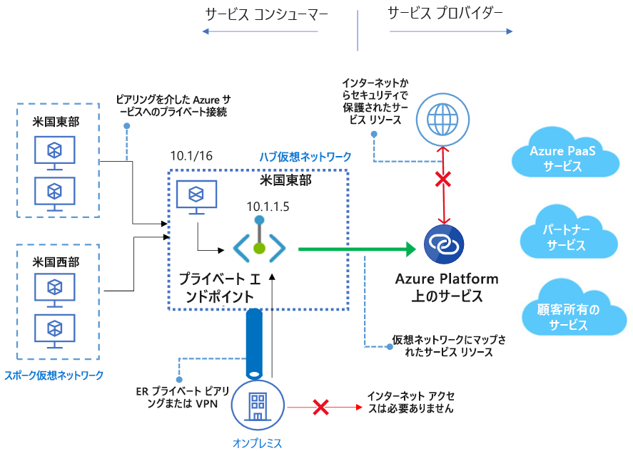

# Azure Private Linkを知る

https://docs.microsoft.com/ja-jp/azure/private-link/private-link-overview

## 概要

- Azure Private Link を使用すると、お使いの仮想ネットワーク内のプライベート エンドポイント経由で Azure PaaS サービス (Azure Storage、SQL Database など) と Azure でホストされている顧客所有の、またはパートナー サービスにアクセス

  
  
似たようなものがあったような・・・・そう、[サービスエンドポイント](./ServiceEndPoint.md)

### サービス エンドポイントとプライベート エンドポイントの違いは何ですか

プライベート エンドポイントを使用すると、特定のサービスの背後にある特定のリソースへのネットワーク アクセスが許可され、きめ細かなセグメント化が可能になります。また、**トラフィックは、パブリック エンドポイントを使用せずにオンプレミスからサービスのリソースに到達**できるようになります。
**サービス エンドポイントは、公的にルーティング可能な IP アドレスのまま**です。 プライベート エンドポイントは、プライベート エンドポイントが構成されている仮想ネットワークのアドレス空間にあるプライベート IP です。

### Private Link サービスとプライベート エンドポイントの関係はどのようなものですか

プライベート エンドポイントは、Azure PaaS サービスや独自の Private Link サービスなど、**各種プライベート リンク リソースへのアクセスを提供**します。 これは**一対多の関係**です。 1 つの Private Link サービスで複数のプライベート エンドポイントから接続を受信できます。  
 一方、1 つのプライベート エンドポイントで接続できるのは 1 つの Private Link サービスのみです。