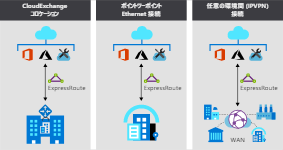
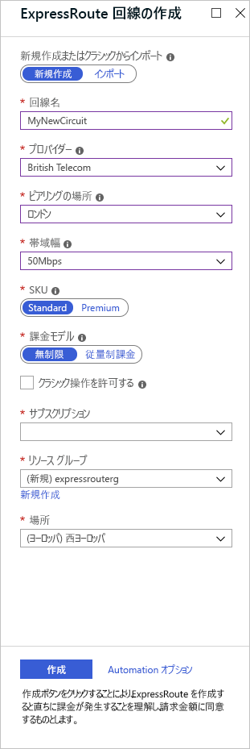

# Azure ExpressRoute について知る

https://docs.microsoft.com/ja-jp/learn/modules/configure-network-for-azure-virtual-machines/6-describe-azure-expressroute

## ExpressRoute が提供する利点
  
- 帯域幅の動的スケーリングがある 50 Mbps から 10 Gbps のより速い速度
- より短い待機時間
- 組み込みピアリングを通じたより高い信頼性（プロバイダーが冗長性を確保）
- 高度なセキュリティで保護
- サポートされているすべての Microsoft Cloud サービスへの接続性。以下に直接アクセスできる。
  - Microsoft Office 365
  - Microsoft Dynamics 365
  - Azure Virtual Machines などの Azure コンピューティング サービス
  - Azure Cosmos DB や Azure Storage などの Azure クラウド サービス
- すべてのリージョンへのグローバル接続 (Premium アドオンが必要)
- Border Gateway Protocol 経由での動的ルーティング
- 接続アップタイムに関するサービス レベル アグリーメント (SLA)
- Skype for Business のサービスの品質 (QoS)
- ExpressRoute Global Reachでオンプレミス間の接続

## Express Routeの接続モデル

  

### IP VPN ネットワーク (任意の環境間)

通常、IPVPN プロバイダーは、マネージド レイヤー 3 接続経由でブランチ オフィスと会社のデータセンターの間の接続を提供します。 ExpressRoute では、Azure データセンターは別のブランチ オフィスであるかのように見えます。

### イーサネット交換による仮想交差接続（CloudExchangeコロケーション）

クラウド エクスチェンジ施設でのコロケーションを利用している場合は、プロバイダーのイーサネット エクスチェンジを通して Microsoft Cloud への交差接続を要求します。 このような Microsoft Cloud への交差接続は、ネットワーク OSI モデルのように、レイヤー 2 とレイヤー 3 マネージドのどちらの接続でも運用できます。

### ポイント ツー ポイントのイーサネット接続

ポイント ツー ポイントのイーサネット リンクでは、Microsoft Cloud にオンプレミス データセンターまたはオフィス間のレイヤー 2 またはマネージド レイヤー 3 接続を提供できます。

## セキュリティに関する考慮事項

そもそも通信がインターネットに出ないため、潜在的なリスクを避けることができる。  
ExpressRouteを使用している場合でも、DNSクエリ、証明書失効リスト、Azure CDNなどのトラフィックはインターネットを経由する。

## Express Routeの仕組み

実際の回線は、プロバイダーが用意する。こパートナープロバイダーがエッジサービスとしてルーターや認証された接続を提供。このエッジサービスがマイクロソフトのエッジと接続される。
固定の帯域幅、ピアリングが特定される。既定のクォータと制限がある。
各回線は、sキーというGUIDでユニークに識別される

## Express Routeの前提条件

### 必要なもの  

- オンプレミス ネットワークから Microsoft クラウドへの接続を設定できる、ExpressRoute 接続パートナーまたはクラウド エクスチェンジ プロバイダー
- パートナーに登録されているAzureサブスクリプション
- アクティブなMicrosoft Azureアカウント

### ネットワーク・ルーティング要件  

- BGPセッションが構成されている
- お客様またはプロバイダーは、NAT サービスを使用して、オンプレミスで使用されているプライベート IP アドレスをパブリック IP アドレスに変換する必要があり
- ネットワークで複数の IP アドレス ブロックを予約します。 これらのブロックは、IP アドレス空間で 1 つの /29 サブネットまたは 2 つの /30 サブネットとして構成します。 これらのサブネットの 1 つは、Microsoft クラウドへのプライマリ回線を構成するために使用され、その他ではセカンダリ回線が実装されます。 これらのサブネットで最初のアドレスを使用して、Microsoft クラウド内のサービスと通信します。 Microsoft では、2 番目のアドレスを使用して BGP セッションを確立
  
## ピアリング

### プライベートピアリング

- Azure 仮想ネットワーク内にデプロイされた Azure IaaS および PaaS サービスに接続
- アクセスするリソースはすべて、プライベート IP アドレスを持つ 1 つまたは複数の Azure 仮想ネットワークに配置
- プライベート ピアリングを経由するパブリック IP アドレスを使用してリソースにアクセスすることはできません

### Microsoft ピアリング

- Azure PaaS サービス、Office 365 サービス、Dynamics 365 に接続

## ExpressRouteの構成

### 1. 回線を作成

回線を作成し、生成されたキーをプロバイダーに送信
  

### 2.ピアリング構成を作成

ピアリング済となった改正について詳細構成

#### 2.1.プライベートピアリングを構成

Azure で実行されている仮想ネットワークにネットワークを接続

- ピア ASN。 ピアリングのお客様の側の自律システム番号。 この ASN は、パブリックまたはプライベート、および 16 ビットまたは 32 ビットにすることができます。
- プライマリ サブネット。 これは、ネットワークで作成したプライマリ /30 サブネットのアドレス範囲です。 このサブネットの最初の IP アドレスをルーターに使用します。 Microsoft では、2 番目のものをルーターに使用します。
- セカンダリ サブネット。 これは、セカンダリ /30 サブネットのアドレス範囲です。 このサブネットでは、Microsoft へのセカンダリ リンクが提供されます。 最初の 2 つのアドレスは、お客様のルーターと Microsoft ルーターの IP アドレスを保持するために使用されます。
- VLAN ID。 これは、ピアリングを確立する VLAN です。 プライマリおよびセカンダリ リンクの両方で、この VLAN ID が使用されます。
- 共有キー。 これは、回線を通過するメッセージをエンコードするために使用される省略可能な MD5 ハッシュです。

#### 2.2.Microsoftピアリングを構成

プライベート接続以外に、以下も指定する

- -アドバタイズされたパブリック プレフィックス。 これは、BGP セッションを介して使用するアドレス プレフィックスの一覧です。 これらのプレフィックスは自分に登録する必要があり、パブリック アドレス範囲のプレフィックスである必要があります。
- 顧客の ASN。 これは省略可能です。 これは、ピア ASN に登録されていないプレフィックスをアドバタイズする場合に使用するクライアント側の自律システム番号です。
- ルーティング レジストリ名。 この名前で、顧客の ASN とパブリック プレフィックスが登録されているレジストリが識別されます。

### 3.ExpressRoute 回線に仮想ネットワークを接続する

## 高可用性とフェールオーバー

- 各 ExpressRoute 回線には、接続プロバイダーから 2 つの異なる Microsoft エッジ ルーターへの 2 つの接続があります。 この構成は自動的に行われる
- 異なるピアリングの場所に ExpressRoute 回線を設定することを検討してください。 たとえば、米国東部リージョンと米国中部リージョンで回線を作成

## どういう場合にExpressRouteを使用するのか？

- 可能な限り低遅延が求められる
- 大量データの生成・消費が発生する
- Microsoft Office365 やDynamics 365などのMS Cloudサービスの利用が相当量あるとき
- 大規模オンプレの移行
- セキュリティ上、インターネットにトラフィックを流したくない
- 可用性と接続が求められる（SLA 99.95%） 

敷設にはだいたい数か月単位かかる
