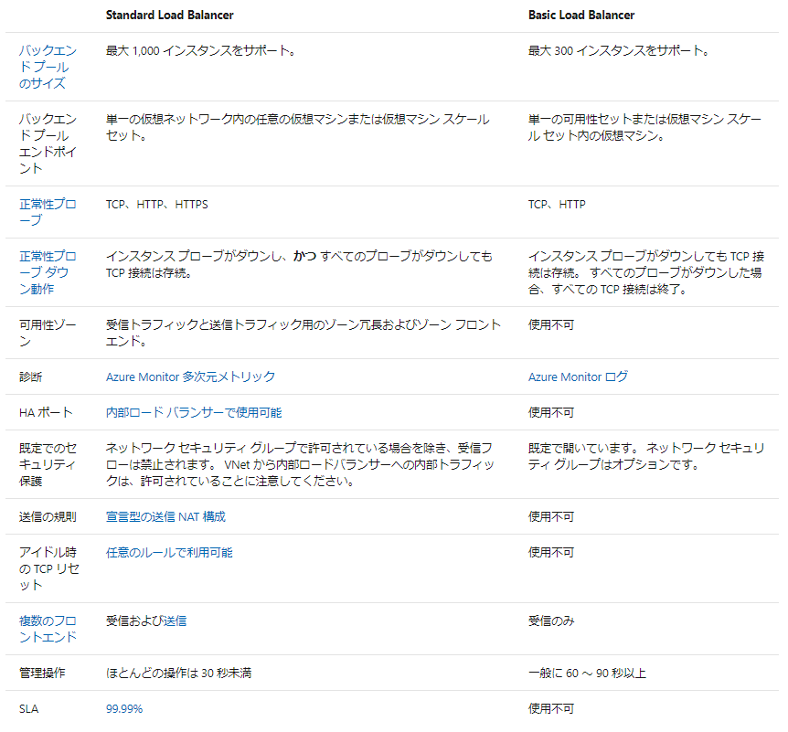

# Azure Load Balancer

複数の仮想マシン間でトラフィックを分散するために使用できるサービス。
これによって、システム全体で
・負荷増大に対応できる拡張性の獲得  
・仮想マシン等障害時に正常サーバーに振り分けることによる可用性の確保  
が実現できる。

## トラフィックの分散

Azure Load Balancerは、トラフィックを分散させるが、分散される側も適切な配置が必要。
可用性セットや可用性ゾーンを構成してVM側の可用性を確保しておくのが前提となる。

### 分散モード

#### 5 タプルハッシュ
接続元 IP、接続元ポート、接続先 IP、接続先ポート、プロトコルの種類で割り振り先を判断する。
接続元ポートがハッシュに含まれ、接続元ポートはセッションごとに変わるため、クライアントはセッションごとに異なる仮想マシンに転送される。

#### 接続元 IP アフィニティ
"セッション アフィニティ" または "クライアント IP アフィニティ" とも呼ばれる。
2 タプル ハッシュ (接続元 IP アドレスと接続先 IP アドレス) または 3 タプル ハッシュ (接続元 IP アドレス、接続先 IP アドレス、プロトコルの種類) が使用されるので、特定のクライアントからのリクエストは必ず同じVMに転送される。

#### 分散モードの指定例

```sh
$lb = Get-AzLoadBalancer -Name MyLb -ResourceGroupName MyResourceGroup
$lb.LoadBalancingRules[0].LoadDistribution = 'sourceIp'
Set-AzLoadBalancer -LoadBalancer $lb
```

## Azure Load Balancerの選択指針

Azure Load Balancerは、`Basic`と`Standard`がある。それぞれの機能性の違いは以下の通り。

  

特に、Standardでは以下が追加でできることに注目

- HTTPS 正常性プローブ
- 可用性ゾーン
- 多次元メトリックに関する Azure Monitor による診断
- 高可用性 (HA) ポート
- アウトバウンド規則
- 保証された SLA (2 台以上の仮想マシンの場合は 99.99%)

## 内部Load Balancerと外部Load Balancer

