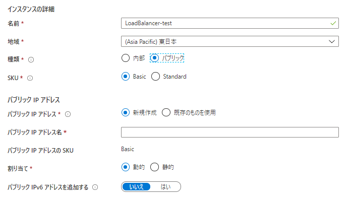
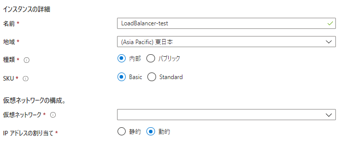
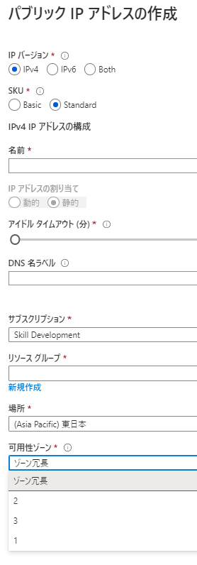

# Azure Load Balancer

https://docs.microsoft.com/ja-jp/azure/load-balancer/load-balancer-overview

複数の仮想マシン間でトラフィックを分散するために使用できるサービス。
これによって、システム全体で
・負荷増大に対応できる拡張性の獲得  
・仮想マシン等障害時に正常サーバーに振り分けることによる可用性の確保  
が実現できる。

## トラフィックの分散

Azure Load Balancerは、トラフィックを分散させるが、分散される側も適切な配置が必要。
可用性セットや可用性ゾーンを構成してVM側の可用性を確保しておくのが前提となる。

### 分散モード

#### 5 タプルハッシュ
接続元 IP、接続元ポート、接続先 IP、接続先ポート、プロトコルの種類で割り振り先を判断する。
接続元ポートがハッシュに含まれ、接続元ポートはセッションごとに変わるため、クライアントはセッションごとに異なる仮想マシンに転送される。

#### 接続元 IP アフィニティ
"セッション アフィニティ" または "クライアント IP アフィニティ" とも呼ばれる。
2 タプル ハッシュ (接続元 IP アドレスと接続先 IP アドレス) または 3 タプル ハッシュ (接続元 IP アドレス、接続先 IP アドレス、プロトコルの種類) が使用されるので、特定のクライアントからのリクエストは必ず同じVMに転送される。

#### 分散モードの指定例

```sh
$lb = Get-AzLoadBalancer -Name MyLb -ResourceGroupName MyResourceGroup
$lb.LoadBalancingRules[0].LoadDistribution = 'sourceIp'
Set-AzLoadBalancer -LoadBalancer $lb
```

## Azure Load Balancerの選択指針

Azure Load Balancerは、`Basic`と`Standard`がある。[それぞれの機能性の違い](https://docs.microsoft.com/ja-jp/azure/load-balancer/skus)は以下の通り。

| | Standard Load Balancer | Basic Load Balancer|
|-|------------------------|--------------------|
|バックエンド プールのサイズ | 最大 1,000 インスタンスをサポート。 | 最大 300 インスタンスをサポート。|
|バックエンド プール エンドポイント | 単一の仮想ネットワーク内の任意の仮想マシンまたは仮想マシン スケール セット。 | 単一の可用性セットまたは仮想マシン スケール セット内の仮想マシン。|
|正常性プローブ | TCP、HTTP、HTTPS | TCP、HTTP|
|正常性プローブ ダウン動作 | インスタンス プローブがダウンし、かつ すべてのプローブがダウンしても TCP 接続は存続。 | インスタンス プローブがダウンしても TCP 接続は存続。 すべてのプローブがダウンした場合、すべての TCP 接続は終了。|
|可用性ゾーン | 受信トラフィックと送信トラフィック用のゾーン冗長およびゾーン フロントエンド。 | 使用不可|
|診断 | Azure Monitor 多次元メトリック | Azure Monitor ログ|
|HA ポート | 内部ロード バランサーで使用可能 | 使用不可|
|既定でのセキュリティ保護 | ネットワーク セキュリティ グループで許可されている場合を除き、受信フローは禁止されます。 |VNet から内部ロードバランサーへの内部トラフィックは、許可されていることに注意してください。 | 既定で開いています。 ネットワーク セキュリティ グループはオプションです。|
|送信規則 | 宣言型の送信 NAT 構成 | 使用不可|
|アイドルの TCP リセット | 任意のルールで利用可能 | 使用不可|
|複数のフロントエンド | 受信および送信 | 受信のみ|
|管理操作 | ほとんどの操作は 30 秒未満 | 一般に 60 ～ 90 秒以上|
|SLA | 99.99% | 使用不可

特に、Standardでは以下が追加でできることに注目

- HTTPS 正常性プローブ
- 可用性ゾーン
- 多次元メトリックに関する Azure Monitor による診断
- 高可用性 (HA) ポート
- アウトバウンド規則
- 保証された SLA (2 台以上の仮想マシンの場合は 99.99%)

## 内部Load Balancerと外部Load Balancer

https://docs.microsoft.com/ja-jp/azure/load-balancer/components#frontend-ip-configurations


|| パブリック ロード バランサー | 内部ロード バランサー|
|------------|-----------------|------------|
|フロントエンド IP の構成 | パブリック IP アドレス | プライベート IP アドレス|
|　　説明　　 | パブリック ロード バランサーは、受信トラフィックのパブリック IP およびポートを、VM のプライベート IP およびポートにマップします。 ロード バランサーは、VM からの応答トラフィックについてはその逆にマップします。 負荷分散規則を適用することで、特定の種類のトラフィックを複数の VM やサービスに分散できます。 たとえば、複数の Web サーバー間で Web 要求のトラフィックの負荷を分散できます。 | 内部ロード バランサーは、仮想ネットワーク内のリソースにトラフィックを分散させます。 負荷分散の対象となる、仮想ネットワークのフロントエンド IP アドレスは、Azure によってアクセスが制限されます。 フロントエンド IP アドレスと仮想ネットワークは、インターネット エンドポイントに直接公開されることはありません。 社内の基幹業務アプリケーションは Azure で実行され、Azure 内またはオンプレミス リソースからアクセスされます。|
|サポートされている SKU | Basic、Standard | Basic、Standard|

内部ロードバランサーの構成は、外部パブリックロードバランサーと同じ手順で構成できるが、以下が異なる。

- ロード バランサーを作成するときに、[種類] の値として [内部] を選択します。 この設定を選択すると、ロード バランサーのフロントエンド IP アドレスはインターネットに公開されません。
- ロード バランサーのフロントエンドには、パブリック IP アドレスではなく、プライベート IP アドレスを割り当てます。
- 要求を処理する仮想マシンが含まれている保護された仮想ネットワーク内にロード バランサーを配置します。

パブリックの指定項目
  

内部の指定項目
  

## Standard Load Balancerと可用性ゾーン

https://docs.microsoft.com/ja-jp/azure/load-balancer/load-balancer-standard-availability-zones

- Load Balancerは、以下のコンポーネントからゾーン構成を継承する
  - フロントエンド
  - ルール
  - バックエンドプールの定義

### フロントエンド

フロントエンドのIPをどう作ったかによってゾーン冗長か、ゾーンベースになるかが決定される。
確かに、パブリックIP作成のパラメータにはゾーン冗長がある。

  

### バックエンド

バックエンドのVMは、スタンドアロンでも、可用性セットでも、スケールセットでもOK。  
同一のVNet内のVMであればバックエンドに追加できる。

### 設計上の考慮点

- ゾーン冗長していれば、ゾーン障害時にも自動で排除・組み入れが可能
- これは、フロントエンドのIP、バックエンドのVM、それぞれで整合をとって構成する必要がある。
- フロントエンドだけゾーン冗長していても、バックエンドが単一ゾーンベースだと意味なし。

## アウトバウンド接続

https://docs.microsoft.com/ja-jp/azure/load-balancer/load-balancer-outbound-connections