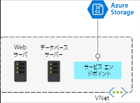
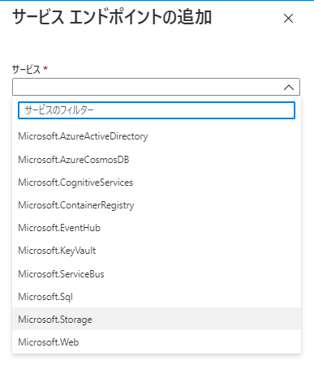
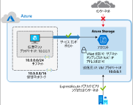

# サービスエンドポイント

## 概要

- 仮想ネットワーク サービス エンドポイントを使い、**自分の Azure サービスに直接接続できるようにする**ことで、Azure 内のプライベート アドレス空間を拡張
- Azure リソースを自分の仮想ネットワークだけに限定できます。 サービス トラフィックは Azure のバックボーンに残り、インターネットに送信されることはありません
-   

- 既定では、Azure サービスはすべてインターネットに直接アクセスするために設計
- サービス エンドポイントでは、**Azure 内のプライベート アドレス空間に一部の PaaS Services を直接接続**できます。直接接続すると、同じ仮想ネットワーク上にあるかのように動作
  - プライベート アドレス空間を使用し、PaaS サービスに直接アクセス
- サービス エンドポイントを追加しても、パブリック エンドポイントは削除されない
  - トラフィックがリダイレクトされるようになるだけ
- 以下のようなサービスで利用可能
  - Azure Storage
  - Azure SQL Database
  - Azure Cosmos DB
  - Azure Key Vault
  - Azure Service Bus
  - Azure Data Lake

## サービスエンドポイントの仕組み

サービス エンドポイントを有効にするには、次の 2 つを行う必要があります。

1. サービスへの**パブリック アクセスをオフ**にする。
2. 仮想ネットワークに**サービス エンドポイントを追加**する。

サービス エンドポイントを有効にすると、トラフィックのフローが制限され、Azure 仮想マシンで自分のプライベート アドレス空間からサービスに直接アクセスできるようになる
デプロイされた仮想マシンの vNIC で [有効なルート] を確認すると、サービス エンドポイントが [次ホップの種類] になっている

  

## サービス エンドポイントとハイブリッド ネットワーク

- 既定では、仮想ネットワーク サービス エンドポイントを使ってセキュリティで保護したサービス リソースに、オンプレミス ネットワークからアクセスすることは不可
- オンプレミス ネットワークからリソースにアクセスするには、NAT IP を使います。
- 既定では、各回線で Azure バックボーン ネットワークに接続するために 2 つの NAT IP アドレスが使用されます
  - 次に、これらの IP アドレスを、Azure サービス リソース (例: Azure Storage) の IP ファイアウォール構成に追加する必要

   

