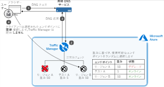
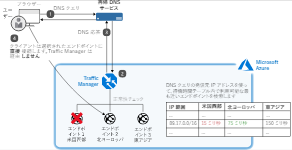
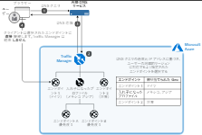
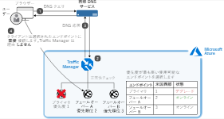

# Azure Traffic Manager

## Traffic Managerの仕組み

DNSベースの負荷分散サービス

## Traffic Manager エンドポイント

エンドポイントは、クライアントに返されるアクセス先を指す。各アプリケーションのデプロイをエンドポイントとして構成する。
エンドポイントは以下の3種類。

- Azureエンドポイント：Azureでホストされるサービス。Azure AppServiceなど。
- 外部エンドポイント：Azure外でホストされるサービス。
- 入れ子になったエンドポイント：プロファイルの組み合わせで、より複雑・柔軟なスキームを構成
  
## ルーティング方法

6つのトラフィックルーティング方法がある

1. 重みづけルーティング
1. パフォーマンスルーティング
1. 地理的ルーティング
1. 複数値ルーティング
1. サブネットルーティング
1. 優先順位によるルーティング

### 1. 重みづけルーティング

重みづけに基づいたランダムな応答  
  

### 2. パフォーマンスルーティング

ユーザーにとってパフォーマンスが最適になるエンドポイントに誘導インターネット待機時間テーブルを使用する。  
  

### 3. 地理的ルーティング

クエリ元の場所に基づいて特定のエンドポイントに誘導  
  

### 4. 複数値ルーティング

1 回の DNS クエリ応答で複数の正常なエンドポイントを応答する

### 5. サブネットルーティング

特定のサブネットからのクエリを特定のエンドポイントにマップ

### 6. 優先順位によるルーティング

エンドポイントに優先順位をつけて置き、利用不可の場合につぎの優先度のエンドポイントを返す
  

