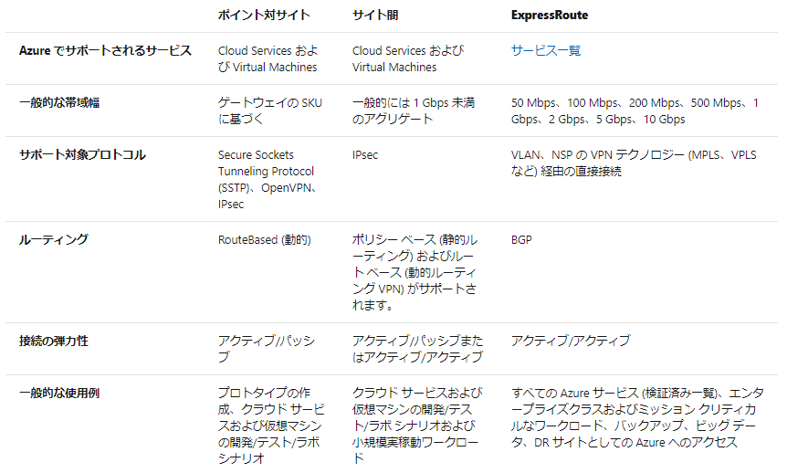
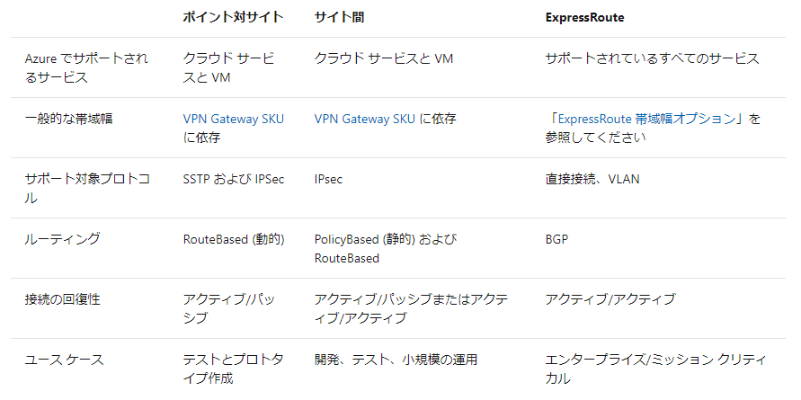
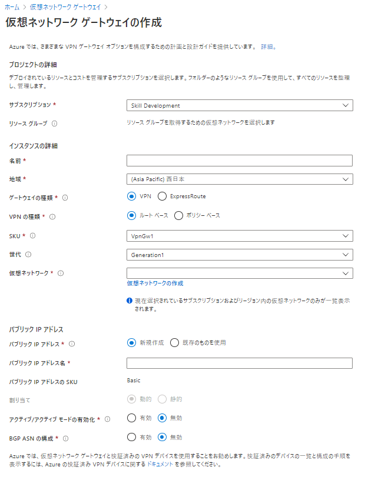
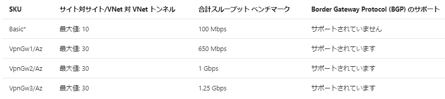
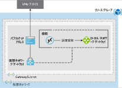
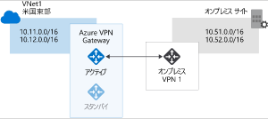
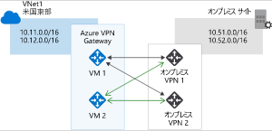

# Azure VPN Gateway について知る

## Azureへのエンドポイント

- 暗号化された接続のエンドポイントとなる特殊なネットワークゲートウェイ
- 異なるリージョン間の仮想ネットワークを接続する際にも使用される
- 各仮想ネットワークには、VPNゲートウェイを一つだけ作成可能、すべての接続、帯域を共有する
- 重要な設定は"ゲートウェイの種類"、これによって機能が決定される。
  - VPNの場合はvpn
  - IPsec/IKE VPN トンネリング経由のネットワーク間接続：VPN ゲートウェイを他の VPN ゲートウェイとリンク
  - クロスプレミス IPsec/IKE VPN トンネリング：専用の VPN デバイスを通じてオンプレミス ネットワークを Azure と接続し、サイト間接続を作成
  - IKEv2 または SSTP 経由のポイント対サイト接続：クライアント コンピューターを Azure のリソースにリンクします。
- VPNゲートウェイを検討する際には、以下の3つのどれになるのかをまずは決定する必要がある
  - インターネット経由でのポイント対サイト
  - インターネット経由でのサイト間
  - 専用ネットワーク経由でのサイト間 (Azure ExpressRoute など)
  -   

## VPN計画における要素

- スループット - Mbps または Gbps
- バックボーン - インターネットかプライベートか
- パブリック (静的) IP アドレスの可用性
- VPN デバイスの互換性
- 複数のクライアント接続か、またはサイト間のリンクか
- VPN ゲートウェイの種類
- Azure VPN Gateway の SKU
-   
貼り付け元  <https://docs.microsoft.com/ja-jp/learn/modules/configure-network-for-azure-virtual-machines/4-explore-azure-vpn-gateway> 

設定画面  
  

## VPNゲートウェイのサイズ

Basicは本番向きではない。Basicから他に移行しるためには、一旦ゲートウェイを削除して再デプロイする必要がある。  

  

## 必要なAzureのリソース

### 仮想ネットワーク

- 接続先オンプレとアドレス空間は重複しないように！
- VPNゲートウェイは仮想ネットワーク内で1つのみ！

### Gateway Subnet

- 名前固定の”Gateway Subnet”という専用のサブネットが必要、ほかの用途で使えない
- 少なくとも/27のアドレスマスクを使用、将来の拡張も考慮

### パブリック IPアドレス

- ゾーン非対応のゲートウェイを使用している場合は、Basic-SKU 動的パブリック IP アドレスを作成
- このアドレスでは、ご利用のオンプレミス VPN デバイスのターゲットとして、ルーティング可能なパブリック IP アドレスが提供されます。
- この IP アドレスは動的ですが、VPN ゲートウェイを削除して再作成しない限り、変わりません。

### ローカルネットワークゲートウェイ

- オンプレミス ネットワークの構成 (VPN ゲートウェイの接続場所と対象) を定義するためにローカル ネットワーク ゲートウェイを作成
- この構成には、オンプレミス VPN デバイスのパブリック IPv4 アドレスと、ルーティング可能なオンプレミス ネットワークが含まれ
- この情報は、オンプレミス ネットワークが宛先となるパケットを IPSec トンネル経由でルーティングするために VPN ゲートウェイによって使用され

### 仮想ネットワークゲートウェイ

- トラフィックをルーティングするためのゲートウェイが必要
- VPN or Express Route

### 接続

- 接続リソースを作成する必要がある。  

  

## 必要なオンプレミスのリソース

### ポリシーベースまたはルートベースの VPN ゲートウェイをサポートする VPN デバイス
### 公開された (インターネット ルーティング可能な) IPv4 アドレス

## VPN検討・構成のワークフロー

1. 接続するすべてのネットワークのアドレス空間をリストする、接続トポロジを設計する
2. Azure 仮想ネットワークを作成する
3. 仮想ネットワークに VPN ゲートウェイを作成する
4. 必要に応じて、オンプレミス ネットワークやその他の仮想ネットワークへの接続を作成および構成する
5. 必要に応じて、Azure VPN ゲートウェイのポイント対サイト接続を作成および構成する

## 検討時の考慮事項

- サブネットは重複不可
- IPアドレスは一意
- VPN ゲートウェイには、GatewaySubnet という名前のゲートウェイ サブネットが必要
- 各仮想ネットワークでデプロイできるのは 1 つの VPN ゲートウェイのみだが、1 つのゲートウェイを使用して、他の Azure 仮想ネットワークやオンプレミス データセンターなど、複数の場所に接続可能

## VPN ゲートウェイの種類

- VPNには、以下の2種類があるが、これは暗号化するトラフィックを指定する
- いずれの場合でも、認証の唯一の方法として事前共有キーが使用される。どちらの種類も、バージョン 1 またはバージョン 2 のインターネット キー交換とインターネット プロトコル セキュリティ (IPSec) に依存

### RouteBased

IPアドレスでの定義が煩雑な場合、ルートベースを利用。
ルート ベース VPN デバイスは、Any 間 (ワイルドカード) のトラフィック セレクターを使用して、ルーティング/転送テーブルを異なる IPsec トンネルへのトラフィックに転送します。 ルート ベースの接続は、通常、それぞれの IPsec トンネルがネットワーク インターフェイスまたは VTI (仮想トンネル インターフェイス) としてモデル化されるルーターのプラットフォームに基づいて構築されます。
デバイス（NICなど）に紐づくので、そのデバイスを通過する物は自動的に暗号化されるということ？
以下のようなケースで利用する。

- 仮想ネットワーク間の接続
- ポイント対サイト接続
- マルチサイト接続
- Azure ExpressRoute ゲートウェイとの共存

提供機能

- IKEv2のサポート
- Any to Anyのトラフィックセレクターを使用
- "動的ルーティング プロトコル" を使用できる BGP

### PolicyBased

パケットのIPアドレスを静的に指定。送信先によって送信先のトンネルが選択される。
ポリシー ベース VPN デバイスは、両方のネットワークからプレフィックスの組み合わせを使用して、トラフィックがどのように IPsec トンネルを介して暗号化/復号化されるかを定義します。 ポリシー ベースの接続は、通常、パケット フィルタリングを実行するファイアウォール デバイスに基づいて構築されます。 IPsec トンネルの暗号化と復号化は、パケット フィルタリングと処理エンジンに追加されます。

- IKEv1のみサポート
- 静的ルーティング、送信元先がポリシーで定義されていて、ルーティングテーブルで宣言する必要がない
- 特定のシナリオで利用。従来のオンプレミスVPNデバイスとの互換性を保つ場合など

## 高可用性のシナリオ

### アクティブ/スタンバイ

デフォルトでは、VPNゲートウェイとしては1つしか見えていない場合でも、**実際には2つのインスタンスとしてデプロイ**されている。計画停止や障害時の中断によって、ユーザーの介入なしで自動的に切り替えが行われる。  
計画停止の場合は数秒の停止、計画外であっても90秒以内に復元される。  

  

### アクティブ/アクティブ

アクティブ/アクティブで構成することも可能。この場合、**IPアドレスはそれぞれに必要**になる。**接続先側も同様**。BGPでルーティングする  

  

### Express Routeのフェールオーバー

もう 1 つの高可用性オプションは、ExpressRoute 接続用にセキュリティで保護されたフェールオーバー パスとして VPN ゲートウェイを構成することも可能。  
ExpressRoute 回線には回復性が組み込まれていますが、接続を提供するケーブルに影響を与える物理的な問題や、完全な ExpressRoute の場所に影響を与える障害の影響を免れることはできないため、**接続の代替方法としてインターネットを使用する VPN ゲートウェイもプロビジョニング**して、Azure 仮想ネットワークへの接続を常に維持することも検討するとよい

### ゾーン冗長ゲートウェイ

可用性ゾーンをサポートするリージョンでは、ゾーン冗長構成で VPN と ExpressRoute のゲートウェイをデプロイ可能。  
Azure Availability Zones にゲートウェイをデプロイすると、オンプレミス ネットワークの Azure への接続をゾーン レベルの障害から保護しながら、ゲートウェイを 1 つのリージョン内に物理的かつ論理的に分離できる  
これらには異なるゲートウェイ SKU が必要であり、基本パブリック IP アドレスではなく標準パブリック IP アドレスを活用  
