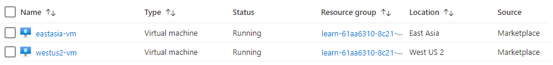
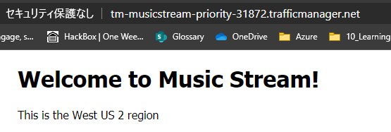
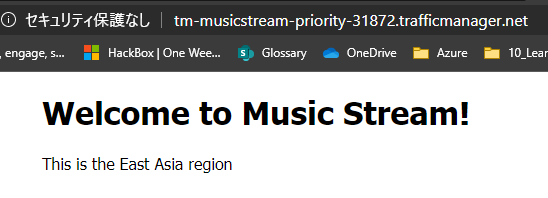

# 優先順位ルーティングによる自動フェールオーバーを試す

基本的にはMS Learnのシナリオをそのまま実行してポイントを押さえておく。
以下が前提シナリオ

- 稼働アプリケーション：稼働リージョンを表示するシンプルなアプリ
- ユーザーは、米国西部と東アジア
- エンドポイントは、米国をプライマリ、次にアジア

全体の流れとしては、

1. Traffic Manager プロファイルを作成
1. Web アプリケーションをデプロイする
1. Traffic Manager にエンドポイントを追加する
1. 動作確認

## Traffic Manager プロファイルを作成

`az network traffic-manager profile create`を覚えておく。

```sh
az network traffic-manager profile create \
    --resource-group learn-61aa6310-8c21-42f8-86c1-f852903fb1b5 \
    --name TM-MusicStream-Priority \
    --routing-method Priority \
    --unique-dns-name TM-MusicStream-Priority-$RANDOM
```

大事なパラメータは以下の通り
- `--routing-method Priority`:優先順位によるルーティング方法を使用して Traffic Manager プロファイルを作成、指定可能なパラメータは以下
  - 重みづけルーティング：Weighted
  - パフォーマンスルーティング：Performance
  - 地理的ルーティング：Geographic
  - 複数値ルーティング：Multivalue
  - サブネットルーティング：Subnet
  - 優先順位によるルーティング：Priority
- `--unique-dns-name`:グローバルに一意なドメイン名 *unique-dns-name*.trafficmanager.net を作成します。 ここではランダムな整数を返す $RANDOM Bash 関数を使って、名前が確実に一意になるようにします。  

その他のパラメータは以下参照  
[az network traffic-manager profile create](https://docs.microsoft.com/ja-jp/cli/azure/network/traffic-manager/profile?view=azure-cli-latest#az-network-traffic-manager-profile-create)

<details><summary>出力JSON</summary><div>

```json
{
  "TrafficManagerProfile": {
    "dnsConfig": {
      "fqdn": "tm-musicstream-priority-31872.trafficmanager.net",
      "relativeName": "tm-musicstream-priority-31872",
      "ttl": 30
    },
    "endpoints": [],
    "id": "/subscriptions/c8e91e7a-1ac8-436f-a03c-d3569abbd0f9/resourceGroups/learn-61aa6310-8c21-42f8-86c1-f852903fb1b5/providers/Microsoft.Network/trafficManagerProfiles/TM-MusicStream-Priority",
    "location": "global",
    "maxReturn": null,
    "monitorConfig": {
      "customHeaders": null,
      "expectedStatusCodeRanges": null,
      "intervalInSeconds": 30,
      "path": "/",
      "port": 80,
      "profileMonitorStatus": "Inactive",
      "protocol": "HTTP",
      "timeoutInSeconds": 10,
      "toleratedNumberOfFailures": 3
    },
    "name": "TM-MusicStream-Priority",
    "profileStatus": "Enabled",
    "resourceGroup": "learn-61aa6310-8c21-42f8-86c1-f852903fb1b5",
    "tags": null,
    "trafficRoutingMethod": "Priority",
    "trafficViewEnrollmentStatus": "Disabled",
    "type": "Microsoft.Network/trafficManagerProfiles"
  }
}
```
</div>
</details>

##2.  Web アプリケーションをデプロイする

ARM テンプレートを実行してアプリをデプロイ

```sh
az deployment group create \
    --resource-group learn-61aa6310-8c21-42f8-86c1-f852903fb1b5 \
    --template-uri  https://raw.githubusercontent.com/MicrosoftDocs/mslearn-distribute-load-with-traffic-manager/master/azuredeploy.json \
    --parameters password="$(head /dev/urandom | tr -dc A-Za-z0-9 | head -c 32)"
```

<details>
<summary>
テンプレートの中身はこちら
</summary>
<div>

```json
{
    "$schema": "https://schema.management.azure.com/schemas/2015-01-01/deploymentTemplate.json#",
    "contentVersion": "1.0.0.0",
    "parameters": {
        "username": {
            "type": "string",
            "defaultValue": "azureuser"
        },
        "password": {
            "type": "securestring"
        }
    },
    "variables": {
        "deploymentUrl": "[deployment().properties.templateLink.uri]",
        "eastasiaVnetName": "eastasia-vnet",
        "eastasiaVnetAddressPrefix": "10.1.0.0/16",
        "eastasiaVnetResourceId": "[resourceId('Microsoft.Network/virtualNetworks', variables('eastasiaVnetName'))]",
        "eastasiaNSGName": "eastasia-nsg",
        "eastasiaNSGResourceId": "[resourceId('Microsoft.Network/networkSecurityGroups', variables('eastasiaNSGName'))]",
        "eastasiaVMName": "eastasia-vm",
        "eastasiaVMNicName": "eastasia-vm-nic",
        "eastasiaVMNicPIPName": "eastasia-vm-nic-pip",
        "eastasiaSubnetName": "eastasia-subnet",
        "eastasiaSubnetPrefix": "10.1.0.0/24",
        "eastasiaVMDNSName": "[concat(variables('eastasiaVMName'), '-', uniqueString(resourceGroup().id))]",
        "eastasiaVMNicResourceId": "[resourceId('Microsoft.Network/networkInterfaces', variables('eastasiaVMNicName'))]",
        "eastasiaVMNicPIPResourceId": "[resourceId('Microsoft.Network/publicIPAddresses', variables('eastasiaVMNicPIPName'))]",
        "eastasiaSubnetResourceId": "[resourceId('Microsoft.Network/virtualNetworks/subnets', variables('eastasiaVnetName'), variables('eastasiaSubnetName'))]",
        "westus2VnetName": "westus2-vnet",
        "westus2VnetAddressPrefix": "10.2.0.0/16",
        "westus2VnetResourceId": "[resourceId('Microsoft.Network/virtualNetworks', variables('westus2VnetName'))]",
        "westus2NSGName": "westus2-nsg",
        "westus2NSGResourceId": "[resourceId('Microsoft.Network/networkSecurityGroups', variables('westus2NSGName'))]",
        "westus2VMName": "westus2-vm",
        "westus2VMNicName": "westus2-vm-nic",
        "westus2VMNicPIPName": "westus2-vm-nic-pip",
        "westus2SubnetName": "westus2-subnet",
        "westus2SubnetPrefix": "10.2.0.0/24",
        "westus2VMDNSName": "[concat(variables('westus2VMName'), '-', uniqueString(resourceGroup().id))]",
        "westus2VMNicResourceId": "[resourceId('Microsoft.Network/networkInterfaces', variables('westus2VMNicName'))]",
        "westus2VMNicPIPResourceId": "[resourceId('Microsoft.Network/publicIPAddresses', variables('westus2VMNicPIPName'))]",
        "westus2SubnetResourceId": "[resourceId('Microsoft.Network/virtualNetworks/subnets', variables('westus2VnetName'), variables('westus2SubnetName'))]"
    },
    "resources": [
        {
            "type": "Microsoft.Network/networkSecurityGroups",
            "name": "[variables('eastasiaNSGName')]",
            "apiVersion": "2018-08-01",
            "location": "eastasia",
            "properties": {
                "securityRules": [
                    {
                        "name": "http",
                        "properties": {
                            "protocol": "Tcp",
                            "sourcePortRange": "*",
                            "destinationPortRange": "80",
                            "sourceAddressPrefix": "*",
                            "destinationAddressPrefix": "*",
                            "access": "Allow",
                            "priority": 300,
                            "direction": "Inbound"
                        }
                    }
                ]
            },
            "dependsOn": []
        },
        {
            "type": "Microsoft.Network/networkSecurityGroups",
            "name": "[variables('westus2NSGName')]",
            "apiVersion": "2018-08-01",
            "location": "westus2",
            "properties": {
                "securityRules": [
                    {
                        "name": "http",
                        "properties": {
                            "protocol": "Tcp",
                            "sourcePortRange": "*",
                            "destinationPortRange": "80",
                            "sourceAddressPrefix": "*",
                            "destinationAddressPrefix": "*",
                            "access": "Allow",
                            "priority": 300,
                            "direction": "Inbound"
                        }
                    }
                ]
            },
            "dependsOn": []
        },
        {
            "type": "Microsoft.Network/virtualNetworks",
            "name": "[variables('eastasiaVnetName')]",
            "apiVersion": "2018-08-01",
            "location": "eastasia",
            "properties": {
                "addressSpace": {
                    "addressPrefixes": [
                        "[variables('eastasiaVnetAddressPrefix')]"
                    ]
                },
                "subnets": [
                    {
                        "name": "[variables('eastasiaSubnetName')]",
                        "properties": {
                            "addressPrefix": "[variables('eastasiaSubnetPrefix')]"
                        }
                    }
                ]
            },
            "dependsOn": []
        },
        {
            "type": "Microsoft.Network/virtualNetworks",
            "name": "[variables('westus2VnetName')]",
            "apiVersion": "2018-08-01",
            "location": "westus2",
            "properties": {
                "addressSpace": {
                    "addressPrefixes": [
                        "[variables('westus2VnetAddressPrefix')]"
                    ]
                },
                "subnets": [
                    {
                        "name": "[variables('westus2SubnetName')]",
                        "properties": {
                            "addressPrefix": "[variables('westus2SubnetPrefix')]"
                        }
                    }
                ]
            },
            "dependsOn": []
        },
        {
            "type": "Microsoft.Network/publicIPAddresses",
            "sku": {
                "name": "Basic",
                "tier": "Regional"
            },
            "name": "[variables('eastasiaVMNicPIPName')]",
            "apiVersion": "2018-08-01",
            "location": "eastasia",
            "properties": {
                "publicIPAddressVersion": "IPv4",
                "publicIPAllocationMethod": "Static",
                "dnsSettings": {
                    "domainNameLabel": "[variables('eastasiaVMDNSName')]"
                }
            },
            "dependsOn": []
        },
        {
            "type": "Microsoft.Network/publicIPAddresses",
            "sku": {
                "name": "Basic",
                "tier": "Regional"
            },
            "name": "[variables('westus2VMNicPIPName')]",
            "apiVersion": "2018-08-01",
            "location": "westus2",
            "properties": {
                "publicIPAddressVersion": "IPv4",
                "publicIPAllocationMethod": "Static",
                "dnsSettings":{
                    "domainNameLabel": "[variables('westus2VMDNSName')]"
                }
            },
            "dependsOn": []
        },
        {
            "type": "Microsoft.Network/networkInterfaces",
            "name": "[variables('eastasiaVMNicName')]",
            "apiVersion": "2018-08-01",
            "location": "eastasia",
            "scale": null,
            "properties": {
                "ipConfigurations": [
                    {
                        "name": "ipconfig1",
                        "properties": {
                            "privateIPAddress": "10.1.0.4",
                            "privateIPAllocationMethod": "Static",
                            "publicIPAddress": {
                                "id": "[variables('eastasiaVMNicPIPResourceId')]"
                            },
                            "subnet": {
                                "id": "[variables('eastasiaSubnetResourceId')]"
                            },
                            "primary": true,
                            "privateIPAddressVersion": "IPv4"
                        }
                    }
                ],
                "enableAcceleratedNetworking": false,
                "enableIPForwarding": false,
                "primary": true,
                "networkSecurityGroup": {
                    "id": "[variables('eastasiaNSGResourceId')]"
                }
            },
            "dependsOn": [
                "[variables('eastasiaVMNicPIPName')]",
                "[variables('eastasiaVnetResourceId')]",
                "[variables('eastasiaNSGResourceId')]"
            ]
        },
        {
            "type": "Microsoft.Network/networkInterfaces",
            "name": "[variables('westus2VMNicName')]",
            "apiVersion": "2018-08-01",
            "location": "westus2",
            "scale": null,
            "properties": {
                "ipConfigurations": [
                    {
                        "name": "ipconfig1",
                        "properties": {
                            "privateIPAddress": "10.2.0.4",
                            "privateIPAllocationMethod": "Static",
                            "publicIPAddress": {
                                "id": "[variables('westus2VMNicPIPResourceId')]"
                            },
                            "subnet": {
                                "id": "[variables('westus2SubnetResourceId')]"
                            },
                            "primary": true,
                            "privateIPAddressVersion": "IPv4"
                        }
                    }
                ],
                "enableAcceleratedNetworking": false,
                "enableIPForwarding": false,
                "primary": true,
                "networkSecurityGroup": {
                    "id": "[variables('westus2NSGResourceId')]"
                }
            },
            "dependsOn": [
                "[variables('westus2VMNicPIPName')]",
                "[variables('westus2VnetResourceId')]",
                "[variables('westus2NSGResourceId')]"
            ]
        },
        {
            "type": "Microsoft.Compute/virtualMachines",
            "name": "[variables('eastasiaVMName')]",
            "apiVersion": "2018-06-01",
            "location": "eastasia",
            "properties": {
                "hardwareProfile": {
                    "vmSize": "Standard_DS1_v2"
                },
                "storageProfile": {
                    "imageReference": {
                        "publisher": "Canonical",
                        "offer": "UbuntuServer",
                        "sku": "18.04-LTS",
                        "version": "latest"
                    },
                    "osDisk": {
                        "osType": "Linux",
                        "name": "[concat(variables('eastasiaVMName'), '-disk')]",
                        "createOption": "FromImage",
                        "caching": "ReadWrite",
                        "managedDisk": {
                            "storageAccountType": "Premium_LRS"
                        },
                        "diskSizeGB": 30
                    },
                    "dataDisks": []
                },
                "osProfile": {
                    "computerName": "[variables('eastasiaVMName')]",
                    "adminUsername": "[parameters('username')]",
                    "adminPassword": "[parameters('password')]",
                    "linuxConfiguration": {
                        "disablePasswordAuthentication": false,
                        "provisionVMAgent": true
                    },
                    "secrets": [],
                    "allowExtensionOperations": true
                },
                "networkProfile": {
                    "networkInterfaces": [
                        {
                            "id": "[variables('eastasiaVMNicResourceId')]"
                        }
                    ]
                },
                "diagnosticsProfile": {
                    "bootDiagnostics": {
                        "enabled": false
                    }
                }
            },
            "resources": [
                {
                    "type": "extensions",
                    "name": "apache-ext",
                    "apiVersion": "2018-10-01",
                    "location": "eastasia",
                    "properties": {
                        "publisher": "Microsoft.Azure.Extensions",
                        "type": "CustomScript",
                        "typeHandlerVersion": "2.0",
                        "autoUpgradeMinorVersion": true,
                        "settings": {
                            "skipDos2Unix": true
                        },
                        "protectedSettings": {
                            "commandToExecute": "sh setup-nginx.sh eastasia",
                            "fileUris": [
                                "[uri(variables('deploymentUrl'), 'setup-nginx.sh')]"
                            ]
                        }
                    },
                    "dependsOn": [
                        "[variables('eastasiaVMName')]"
                    ]
                }
            ],
            "dependsOn": [
                "[variables('eastasiaVMNicName')]"
            ]
        },
        {
            "type": "Microsoft.Compute/virtualMachines",
            "name": "[variables('westus2VMName')]",
            "apiVersion": "2018-06-01",
            "location": "westus2",
            "properties": {
                "hardwareProfile": {
                    "vmSize": "Standard_DS1_v2"
                },
                "storageProfile": {
                    "imageReference": {
                        "publisher": "Canonical",
                        "offer": "UbuntuServer",
                        "sku": "18.04-LTS",
                        "version": "latest"
                    },
                    "osDisk": {
                        "osType": "Linux",
                        "name": "[concat(variables('westus2VMName'), '-disk')]",
                        "createOption": "FromImage",
                        "caching": "ReadWrite",
                        "managedDisk": {
                            "storageAccountType": "Premium_LRS"
                        },
                        "diskSizeGB": 30
                    },
                    "dataDisks": []
                },
                "osProfile": {
                    "computerName": "[variables('westus2VMName')]",
                    "adminUsername": "[parameters('username')]",
                    "adminPassword": "[parameters('password')]",
                    "linuxConfiguration": {
                        "disablePasswordAuthentication": false,
                        "provisionVMAgent": true
                    },
                    "secrets": [],
                    "allowExtensionOperations": true
                },
                "networkProfile": {
                    "networkInterfaces": [
                        {
                            "id": "[variables('westus2VMNicResourceId')]"
                        }
                    ]
                },
                "diagnosticsProfile": {
                    "bootDiagnostics": {
                        "enabled": false
                    }
                }
            },
            "resources": [
                {
                    "type": "extensions",
                    "name": "apache-ext",
                    "apiVersion": "2018-10-01",
                    "location": "westus2",
                    "properties": {
                        "publisher": "Microsoft.Azure.Extensions",
                        "type": "CustomScript",
                        "typeHandlerVersion": "2.0",
                        "autoUpgradeMinorVersion": true,
                        "settings": {
                            "skipDos2Unix": true
                        },
                        "protectedSettings": {
                            "commandToExecute": "sh setup-nginx.sh westus2",
                            "fileUris": [
                                "[uri(variables('deploymentUrl'), 'setup-nginx.sh')]"
                            ]
                        }
                    },
                    "dependsOn": [
                        "[variables('westus2VMName')]"
                    ]
                }
            ],
            "dependsOn": [
                "[variables('westus2VMNicName')]"
            ]
        }
    ],
    "outputs": {}
}
```

</div>
</details>

こんな感じで作成される。  
中でnginxが動いている様だ。

  


## 3. Traffic Manager にエンドポイントを追加する

デプロイされたパブリックIPアドレスをエンドポイントとして登録する。

`az network traffic-manager endpoint create`を覚えておく。

```sh
WestId=$(az network public-ip show \
    --resource-group learn-61aa6310-8c21-42f8-86c1-f852903fb1b5 \
    --name westus2-vm-nic-pip \
    --query id \
    --out tsv)

az network traffic-manager endpoint create \
    --resource-group learn-61aa6310-8c21-42f8-86c1-f852903fb1b5 \
    --profile-name TM-MusicStream-Priority \
    --name "Primary-WestUS" \
    --type azureEndpoints \
    --priority 1 \
    --target-resource-id $WestId

EastId=$(az network public-ip show \
    --resource-group learn-61aa6310-8c21-42f8-86c1-f852903fb1b5 \
    --name eastasia-vm-nic-pip \
    --query id \
    --out tsv)

az network traffic-manager endpoint create \
    --resource-group learn-61aa6310-8c21-42f8-86c1-f852903fb1b5 \
    --profile-name TM-MusicStream-Priority \
    --name "Failover-EastAsia" \
    --type azureEndpoints \
    --priority 2 \
    --target-resource-id $EastId
```

構成した内容を確認する

```sh
oh_tomtom@Azure:~$ az network traffic-manager endpoint list \
>     --resource-group learn-61aa6310-8c21-42f8-86c1-f852903fb1b5 \
>     --profile-name TM-MusicStream-Priority \
>     --output table
EndpointLocation    EndpointMonitorStatus    EndpointStatus    Name               Priority    ResourceGroup    Target                                                 TargetResourceId                                                                                                      Weight
------------------  -----------------------  ----------------  -----------------  ----------  ------------------------------------------  -----------------------------------------------------  -------------------------------------------------------------------------------------------------------------------------------------------------------------------------------  --------
West US 2           Online                   Enabled           Primary-WestUS     1           learn-61aa6310-8c21-42f8-86c1-f852903fb1b5  westus2-vm-w6jk6cjjdaayc.westus2.cloudapp.azure.com    /subscriptions/c8e91e7a-1ac8-436f-a03c-d3569abbd0f9/resourceGroups/learn-61aa6310-8c21-42f8-86c1-f852903fb1b5/providers/Microsoft.Network/publicIPAddresses/westus2-vm-nic-pip   1
East Asia           Online                   Enabled           Failover-EastAsia  2           learn-61aa6310-8c21-42f8-86c1-f852903fb1b5  eastasia-vm-w6jk6cjjdaayc.eastasia.cloudapp.azure.com  /subscriptions/c8e91e7a-1ac8-436f-a03c-d3569abbd0f9/resourceGroups/learn-61aa6310-8c21-42f8-86c1-f852903fb1b5/providers/Microsoft.Network/publicIPAddresses/eastasia-vm-nic-pip  1 
```


## 4. 動作確認

```sh
oh_tomtom@Azure:~$ # Retrieve the address for the West US 2 web app
oh_tomtom@Azure:~$ nslookup $(az network public-ip show \
>             --resource-group learn-61aa6310-8c21-42f8-86c1-f852903fb1b5 \
>             --name eastasia-vm-nic-pip \
>             --query dnsSettings.fqdn \
>             --output tsv)
Server:         168.63.129.16
Address:        168.63.129.16#53

Non-authoritative answer:
Name:   eastasia-vm-w6jk6cjjdaayc.eastasia.cloudapp.azure.com
Address: 65.52.164.149

oh_tomtom@Azure:~$ # Retrieve the address for the East Asia web app
oh_tomtom@Azure:~$ nslookup $(az network public-ip show \
>             --resource-group learn-61aa6310-8c21-42f8-86c1-f852903fb1b5 \
>             --name westus2-vm-nic-pip \
>             --query dnsSettings.fqdn \
>             --output tsv)
Server:         168.63.129.16
Address:        168.63.129.16#53

Non-authoritative answer:
Name:   westus2-vm-w6jk6cjjdaayc.westus2.cloudapp.azure.com
Address: 52.183.94.208

oh_tomtom@Azure:~$ # Retrieve the address for the Traffic Manager profile
oh_tomtom@Azure:~$ nslookup $(az network traffic-manager profile show \
>             --resource-group learn-61aa6310-8c21-42f8-86c1-f852903fb1b5 \
>             --name TM-MusicStream-Priority \
>             --query dnsConfig.fqdn \
>             --out tsv)
Server:         168.63.129.16
Address:        168.63.129.16#53

Non-authoritative answer:
tm-musicstream-priority-31872.trafficmanager.net        canonical name = westus2-vm-w6jk6cjjdaayc.westus2.cloudapp.azure.com.
Name:   westus2-vm-w6jk6cjjdaayc.westus2.cloudapp.azure.com
Address: 52.183.94.208
```

上記の例では、
- eastasia が65.52.164.149
- westus2 が52.183.94.208
で、優先順位はWestusが高いので、
プロファイルで名前解決すると、
52.183.94.208
が返ってきている。

URLを確認

```sh
oh_tomtom@Azure:~$ echo http://$(az network traffic-manager profile show \
>     --resource-group learn-61aa6310-8c21-42f8-86c1-f852903fb1b5 \
>     --name TM-MusicStream-Priority \
>     --query dnsConfig.fqdn \
>     --out tsv)
http://tm-musicstream-priority-31872.trafficmanager.net
```

ちゃんとWest US 2から応答が返ってきている。  
  


プライマリエンドポイントを無効にする。

```sh
az network traffic-manager endpoint update \
    --resource-group learn-61aa6310-8c21-42f8-86c1-f852903fb1b5  \
    --name "Primary-WestUS" \
    --profile-name TM-MusicStream-Priority \
    --type azureEndpoints \
    --endpoint-status Disabled
```

再度、nslookupで確認する。

```sh
oh_tomtom@Azure:~$ # Retrieve the address for the West US 2 web app
oh_tomtom@Azure:~$ nslookup $(az network public-ip show \
>             --resource-group learn-61aa6310-8c21-42f8-86c1-f852903fb1b5 \
>             --name eastasia-vm-nic-pip \
>             --query dnsSettings.fqdn \
>             --output tsv)
Server:         168.63.129.16
Address:        168.63.129.16#53

Non-authoritative answer:
Name:   eastasia-vm-w6jk6cjjdaayc.eastasia.cloudapp.azure.com
Address: 65.52.164.149

oh_tomtom@Azure:~$ # Retrieve the address for the East Asia web app
oh_tomtom@Azure:~$ nslookup $(az network public-ip show \
>             --resource-group learn-61aa6310-8c21-42f8-86c1-f852903fb1b5 \
>             --name westus2-vm-nic-pip \
>             --query dnsSettings.fqdn \
>             --output tsv)
Server:         168.63.129.16
Address:        168.63.129.16#53

Non-authoritative answer:
Name:   westus2-vm-w6jk6cjjdaayc.westus2.cloudapp.azure.com
Address: 52.183.94.208

oh_tomtom@Azure:~$ # Retrieve the address for the Traffic Manager profile
oh_tomtom@Azure:~$ nslookup $(az network traffic-manager profile show \
>             --resource-group learn-61aa6310-8c21-42f8-86c1-f852903fb1b5 \
>             --name TM-MusicStream-Priority \
>             --query dnsConfig.fqdn \
>             --out tsv)
Server:         168.63.129.16
Address:        168.63.129.16#53

Non-authoritative answer:
tm-musicstream-priority-31872.trafficmanager.net        canonical name = eastasia-vm-w6jk6cjjdaayc.eastasia.cloudapp.azure.com.
Name:   eastasia-vm-w6jk6cjjdaayc.eastasia.cloudapp.azure.com
Address: 65.52.164.149
```

今度は置き換わっているのがわかる。

  
