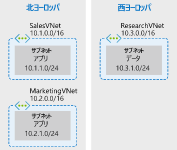

# 仮想ネットワークピアリングを構成してみる

前提

- 3つの仮想ネットワーク
  - Sales@北ヨーロッパ Marketingにアクセス
  - Marketing@北ヨーロッパ Salesにアクセス
  - Research@西ヨーロッパ Marketingにアクセス

以下のような感じ  
  

仮想ネットワーク | リージョン | 仮想ネットワークのアドレス空間 | サブネット | サブネットのアドレス空間
---------|-------|-----------------|-------|-------------
SalesVNet | 北ヨーロッパ | 10.1.0.0/16 | Apps | 10.1.1.0/24
MarketingVNet | 北ヨーロッパ | 10.2.0.0/16 | Apps | 10.2.1.0/24
ResearchVNet | 西ヨーロッパ | 10.3.0.0/16 | Data | 10.3.1.0/24

作業の流れは以下の通り

1. 仮想ネットワークを作成 `az network vnet create`
2. 仮想ネットワークに仮想マシンを作成 `az vm create`
3. 仮想ネットワークピアリング接続を作成 `az network vnet peering create`

## 仮想ネットワークを作成

```sh
az network vnet create \
    --resource-group learn-85718b55-a6b6-4a5f-986c-54824857fc52 \
    --name SalesVNet \
    --address-prefix 10.1.0.0/16 \
    --subnet-name Apps \
    --subnet-prefix 10.1.1.0/24 \
    --location northeurope

az network vnet create \
    --resource-group learn-85718b55-a6b6-4a5f-986c-54824857fc52 \
    --name MarketingVNet \
    --address-prefix 10.2.0.0/16 \
    --subnet-name Apps \
    --subnet-prefix 10.2.1.0/24 \
    --location northeurope

az network vnet create \
    --resource-group learn-85718b55-a6b6-4a5f-986c-54824857fc52 \
    --name ResearchVNet \
    --address-prefix 10.3.0.0/16 \
    --subnet-name Data \
    --subnet-prefix 10.3.1.0/24 \
    --location westeurope
```

結果、以下の様に作成された。

```sh
oh_tomtom@Azure:~$ az network vnet list --output table
Name           ResourceGroup                               Location     NumSubnets    Prefixes     DnsServers    DDOSProtection    VMProtection
-------------  ------------------------------------------  -----------  ------------  -----------  ------------  ----------------  --------------
MarketingVNet  learn-85718b55-a6b6-4a5f-986c-54824857fc52  northeurope  1             10.2.0.0/16                False             False
SalesVNet      learn-85718b55-a6b6-4a5f-986c-54824857fc52  northeurope  1             10.1.0.0/16                False             False
ResearchVNet   learn-85718b55-a6b6-4a5f-986c-54824857fc52  westeurope   1             10.3.0.0/16                False             False
```

## 仮想ネットワークに仮想マシンを作成

```sh
az vm create \
    --resource-group learn-85718b55-a6b6-4a5f-986c-54824857fc52 \
    --no-wait \
    --name SalesVM \
    --location northeurope \
    --vnet-name SalesVNet \
    --subnet Apps \
    --image UbuntuLTS \
    --admin-username azureuser \
    --admin-password <password>

az vm create \
    --resource-group learn-85718b55-a6b6-4a5f-986c-54824857fc52 \
    --no-wait \
    --name MarketingVM \
    --location northeurope \
    --vnet-name MarketingVNet \
    --subnet Apps \
    --image UbuntuLTS \
    --admin-username azureuser \
    --admin-password <password>

az vm create \
    --resource-group learn-85718b55-a6b6-4a5f-986c-54824857fc52 \
    --no-wait \
    --name ResearchVM \
    --location westeurope \
    --vnet-name ResearchVNet \
    --subnet Data \
    --image UbuntuLTS \
    --admin-username azureuser \
    --admin-password <password>
```

確認

```sh
Every 5.0s: az vm list     --resource-group learn-85718b55-a6b6-4a5f-986c-54824857fc52     --show-details...  Wed Jun 24 05:22:29 2020

Name         ProvisioningState    PowerState
-----------  -------------------  ------------
MarketingVM  Succeeded            VM running
SalesVM      Succeeded            VM running
ResearchVM   Succeeded            VM running
```

## 仮想ネットワークピアリング接続を作成

### SalesとMarketingの間にピアリングを構成

Sales → Marketing  
Marketing → Sales  
の双方向で定義が必要。

```sh
az network vnet peering create \
    --name SalesVNet-To-MarketingVNet \
    --remote-vnet MarketingVNet \
    --resource-group learn-85718b55-a6b6-4a5f-986c-54824857fc52 \
    --vnet-name SalesVNet \
    --allow-vnet-access

az network vnet peering create \
    --name MarketingVNet-To-SalesVNet \
    --remote-vnet SalesVNet \
    --resource-group learn-85718b55-a6b6-4a5f-986c-54824857fc52 \
    --vnet-name MarketingVNet \
    --allow-vnet-access
```

### MarketingとEsearchの間のピアリングを構成

同様に、双方向で接続を構成する

```sh
az network vnet peering create \
    --name MarketingVNet-To-ResearchVNet \
    --remote-vnet ResearchVNet \
    --resource-group learn-85718b55-a6b6-4a5f-986c-54824857fc52 \
    --vnet-name MarketingVNet \
    --allow-vnet-access

az network vnet peering create \
    --name ResearchVNet-To-MarketingVNet \
    --remote-vnet MarketingVNet \
    --resource-group learn-85718b55-a6b6-4a5f-986c-54824857fc52 \
    --vnet-name ResearchVNet \
    --allow-vnet-access
```

確認してみる。`az network vnet peering list`

```sh
oh_tomtom@Azure:~$ az network vnet peering list \
>     --resource-group learn-85718b55-a6b6-4a5f-986c-54824857fc52 \
>     --vnet-name SalesVNet \
>     --output table
AllowForwardedTraffic    AllowGatewayTransit    AllowVirtualNetworkAccess    Name                        PeeringState    ProvisioningState    ResourceGroup                               UseRemoteGateways
-----------------------  ---------------------  ---------------------------  --------------------------  --------------  -------------------  ------------------------------------------  -------------------
False                    False                  True                         SalesVNet-To-MarketingVNet  Connected       Succeeded        learn-85718b55-a6b6-4a5f-986c-54824857fc52  False
oh_tomtom@Azure:~$ az network vnet peering list \
>     --resource-group learn-85718b55-a6b6-4a5f-986c-54824857fc52 \
>     --vnet-name ResearchVNet \
>     --output table
AllowForwardedTraffic    AllowGatewayTransit    AllowVirtualNetworkAccess    Name                           PeeringState    ProvisioningState    ResourceGroup                               UseRemoteGateways
-----------------------  ---------------------  ---------------------------  -----------------------------  --------------  -------------------  ------------------------------------------  -------------------
False                    False                  True                         ResearchVNet-To-MarketingVNet  Connected       Succeeded           learn-85718b55-a6b6-4a5f-986c-54824857fc52  False
oh_tomtom@Azure:~$ az network vnet peering list \
>     --resource-group learn-85718b55-a6b6-4a5f-986c-54824857fc52 \
>     --vnet-name MarketingVNet \
>     --output table
AllowForwardedTraffic    AllowGatewayTransit    AllowVirtualNetworkAccess    Name                           PeeringState    ProvisioningState    ResourceGroup                               UseRemoteGateways
-----------------------  ---------------------  ---------------------------  -----------------------------  --------------  -------------------  ------------------------------------------  -------------------
False                    False                  True                         MarketingVNet-To-SalesVNet     Connected       Succeeded           learn-85718b55-a6b6-4a5f-986c-54824857fc52  False
False                    False                  True                         MarketingVNet-To-ResearchVNet  Connected       Succeeded           learn-85718b55-a6b6-4a5f-986c-54824857fc52  False
```

  


有効なルートを確認する

```sh
oh_tomtom@Azure:~$ az network nic show-effective-route-table \
>     --resource-group learn-85718b55-a6b6-4a5f-986c-54824857fc52 \
>     --name SalesVMVMNic \
>     --output table
Source    State    Address Prefix    Next Hop Type    Next Hop IP
--------  -------  ----------------  ---------------  -------------
Default   Active   10.1.0.0/16       VnetLocal
Default   Active   10.2.0.0/16       VNetPeering
Default   Active   0.0.0.0/0         Internet
Default   Active   10.0.0.0/8        None
Default   Active   100.64.0.0/10     None
Default   Active   192.168.0.0/16    None
oh_tomtom@Azure:~$ az network nic show-effective-route-table \
>     --resource-group learn-85718b55-a6b6-4a5f-986c-54824857fc52 \
>     --name MarketingVMVMNic \
>     --output table
Source    State    Address Prefix    Next Hop Type      Next Hop IP
--------  -------  ----------------  -----------------  -------------
Default   Active   10.2.0.0/16       VnetLocal
Default   Active   10.1.0.0/16       VNetPeering
Default   Active   0.0.0.0/0         Internet
Default   Active   10.0.0.0/8        None
Default   Active   100.64.0.0/10     None
Default   Active   192.168.0.0/16    None
Default   Active   10.3.0.0/16       VNetGlobalPeering
oh_tomtom@Azure:~$ az network nic show-effective-route-table \
>     --resource-group learn-85718b55-a6b6-4a5f-986c-54824857fc52 \
>     --name ResearchVMVMNic \
>     --output table
Source    State    Address Prefix    Next Hop Type      Next Hop IP
--------  -------  ----------------  -----------------  -------------
Default   Active   10.3.0.0/16       VnetLocal
Default   Active   0.0.0.0/0         Internet
Default   Active   10.0.0.0/8        None
Default   Active   100.64.0.0/10     None
Default   Active   192.168.0.0/16    None
Default   Active   10.2.0.0/16       VNetGlobalPeering
```

実際に接続して確認してみる。  
VMのIPをリスト `az vm list` コマンド `--query "[*].{Name:name, PrivateIP:privateIps, PublicIP:publicIps}"`添え

```sh
oh_tomtom@Azure:~$ az vm list \
>     --resource-group learn-85718b55-a6b6-4a5f-986c-54824857fc52 \
>     --query "[*].{Name:name, PrivateIP:privateIps, PublicIP:publicIps}" \
>     --show-details \
>     --output table
Name         PrivateIP    PublicIP
-----------  -----------  ------------
MarketingVM  10.2.1.4     23.102.8.XX
SalesVM      10.1.1.4     23.102.11.YY
ResearchVM   10.3.1.4     40.74.63.ZZ
```

Salesにログインした後、
```
oh_tomtom@Azure:~$ ssh -o StrictHostKeyChecking=no azureuser@23.102.11.YY
Warning: Permanently added '23.102.11.35' (ECDSA) to the list of known hosts.
azureuser@23.102.11.35's password:
Welcome to Ubuntu 18.04.4 LTS (GNU/Linux 5.3.0-1028-azure x86_64)

 * Documentation:  https://help.ubuntu.com
 * Management:     https://landscape.canonical.com
 * Support:        https://ubuntu.com/advantage

  System information as of Wed Jun 24 05:44:29 UTC 2020

  System load:  0.0               Processes:           116
  Usage of /:   7.2% of 28.90GB   Users logged in:     0
  Memory usage: 12%               IP address for eth0: 10.1.1.4
  Swap usage:   0%

9 packages can be updated.
2 updates are security updates.


The programs included with the Ubuntu system are free software;
the exact distribution terms for each program are described in the
individual files in /usr/share/doc/*/copyright.

Ubuntu comes with ABSOLUTELY NO WARRANTY, to the extent permitted by
applicable law.

To run a command as administrator (user "root"), use "sudo <command>".
See "man sudo_root" for details.

接続OK

azureuser@SalesVM:~$ ssh -o StrictHostKeyChecking=no azureuser@10.2.1.4
Warning: Permanently added '10.2.1.4' (ECDSA) to the list of known hosts.
azureuser@10.2.1.4's password:
Welcome to Ubuntu 18.04.4 LTS (GNU/Linux 5.3.0-1028-azure x86_64)

 * Documentation:  https://help.ubuntu.com
 * Management:     https://landscape.canonical.com
 * Support:        https://ubuntu.com/advantage

  System information as of Wed Jun 24 05:45:43 UTC 2020

  System load:  0.0               Processes:           122
  Usage of /:   7.1% of 28.90GB   Users logged in:     0
  Memory usage: 13%               IP address for eth0: 10.2.1.4
  Swap usage:   0%

9 packages can be updated.
2 updates are security updates.


The programs included with the Ubuntu system are free software;
the exact distribution terms for each program are described in the
individual files in /usr/share/doc/*/copyright.

Ubuntu comes with ABSOLUTELY NO WARRANTY, to the extent permitted by
applicable law.

To run a command as administrator (user "root"), use "sudo <command>".
See "man sudo_root" for details.

azureuser@MarketingVM:~$
azureuser@MarketingVM:~$ exit
logout
Connection to 10.2.1.4 closed.
azureuser@SalesVM:~$ ssh -o StrictHostKeyChecking=no azureuser@10.3.1.4
ssh: connect to host 10.3.1.4 port 22: Connection timed out

タイムアウトした。
pingでも確認

azureuser@SalesVM:~$ ping 10.2.1.4
PING 10.2.1.4 (10.2.1.4) 56(84) bytes of data.
64 bytes from 10.2.1.4: icmp_seq=1 ttl=64 time=0.624 ms
64 bytes from 10.2.1.4: icmp_seq=2 ttl=64 time=0.587 ms
64 bytes from 10.2.1.4: icmp_seq=3 ttl=64 time=0.574 ms
^C
--- 10.2.1.4 ping statistics ---
3 packets transmitted, 3 received, 0% packet loss, time 2055ms
rtt min/avg/max/mdev = 0.574/0.595/0.624/0.021 ms

OK

azureuser@SalesVM:~$ ping 10.3.1.4
PING 10.3.1.4 (10.3.1.4) 56(84) bytes of data.
^C
--- 10.3.1.4 ping statistics ---
6 packets transmitted, 0 received, 100% packet loss, time 5096ms

NG

```

その他の組み合わせも同様に確認し、想定通りになることを確認
