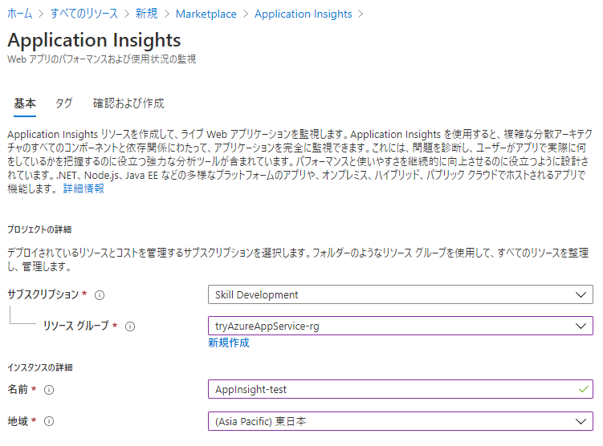
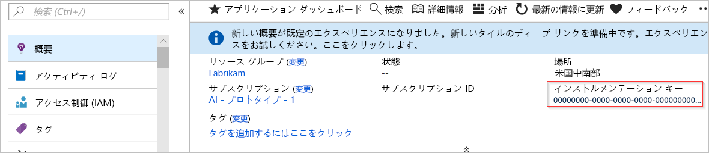
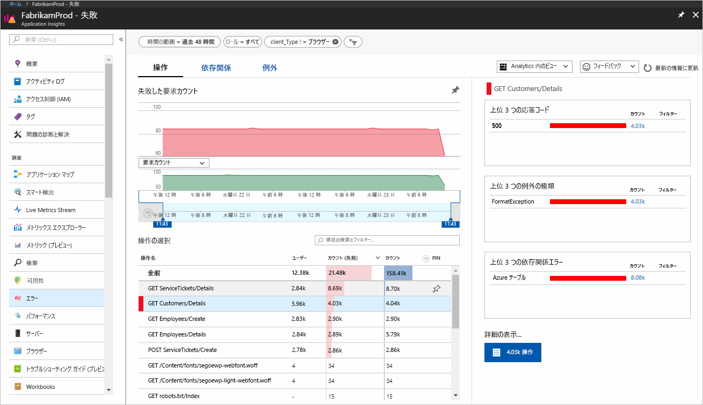
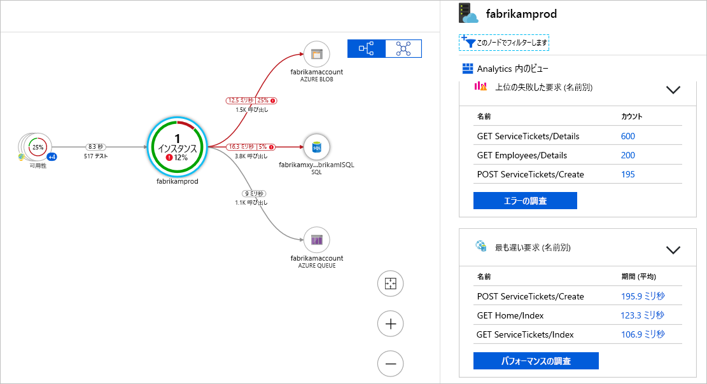
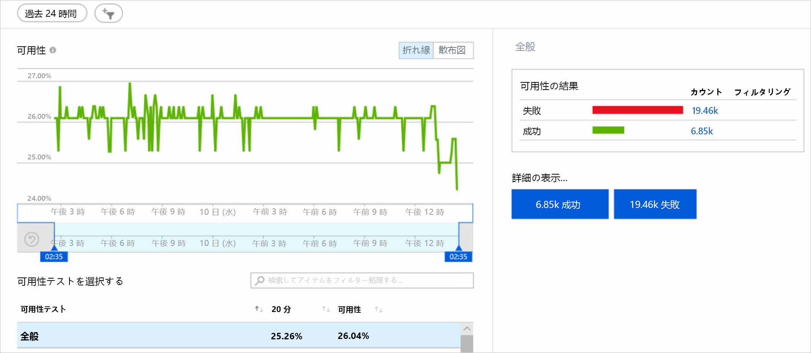
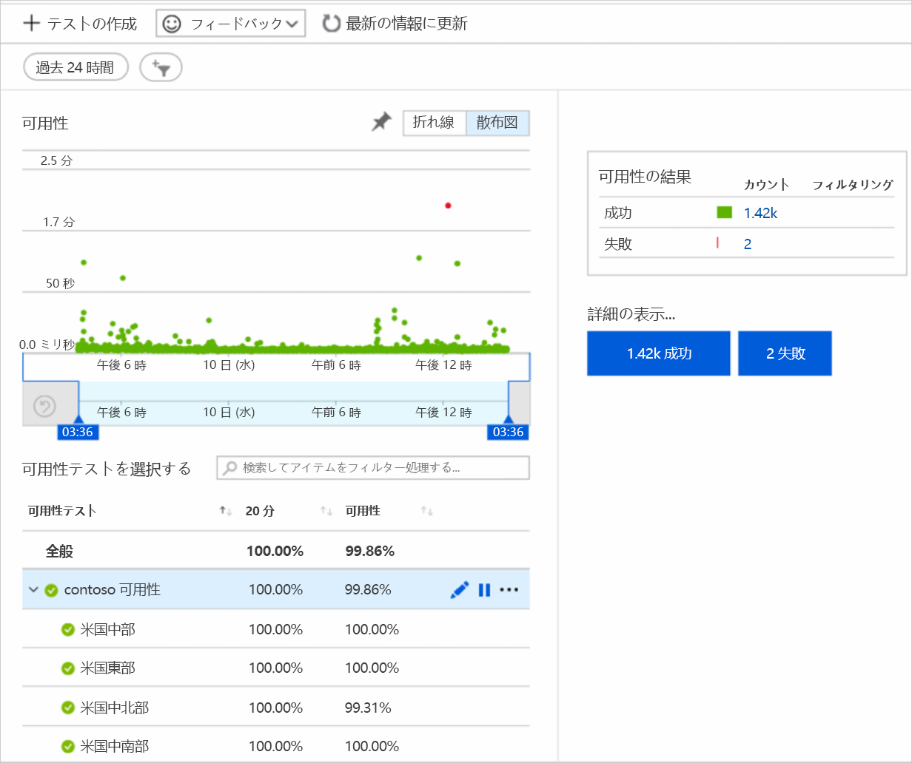
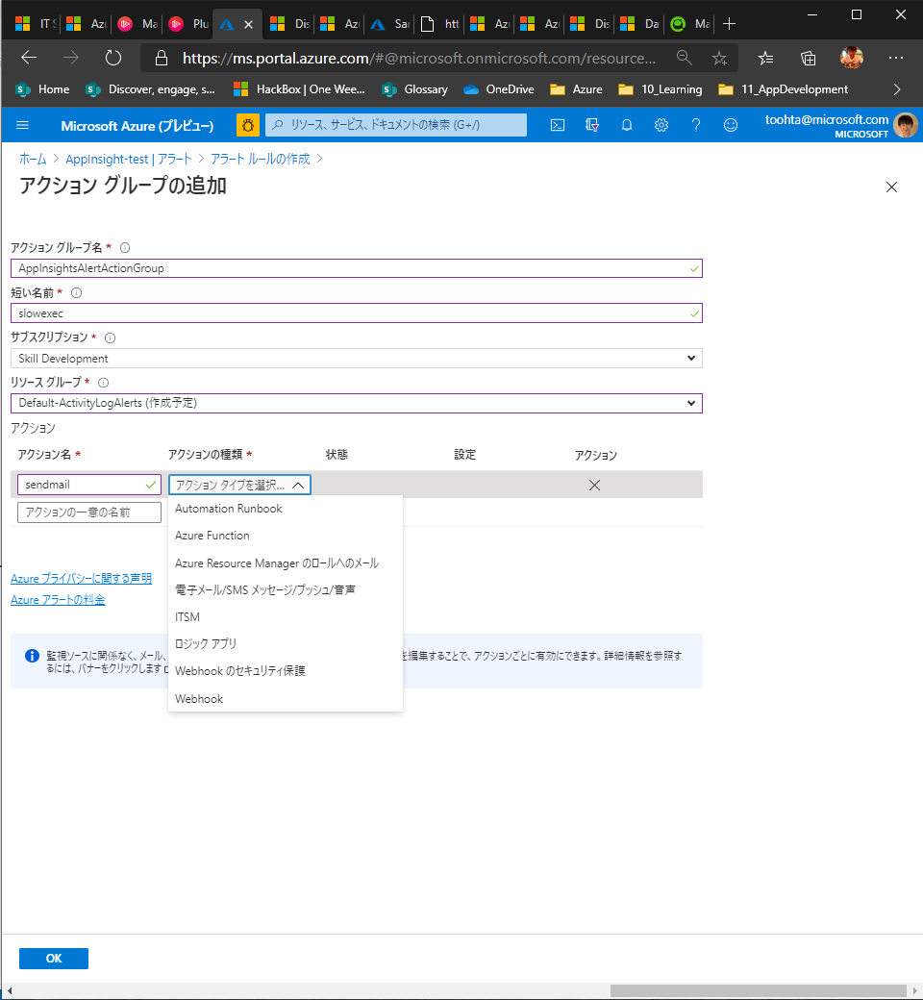

# Azure Application InsightsでWebアプリを分析

## 概要

以下のようなケースで利用する。

- アプリケーションの正常性に影響を与える課題と問題を分析し、それに対処する必要がある
- アプリケーションの開発ライフサイクルを改善する必要がある
- ユーザーのアクティビティを分析して、より適切に理解する必要がある

  

## App Insightsをアプリケーションと統合する

- Azure PortalでApp Insightsリソースを設定する
- アプリケーションにinstrumentation package をインストールする
  - パッケージによってアプリが監視されてLog Analyticsワークスペースにログデータが送信される
  - インストルメンテーションキーが必要
  -   
- APPINSIGHTS_INSTRUMENTATIONKEY 環境変数を使用してキーを保持

## アプリケーションへのinstrumentation

node.jsの場合

ライブラリを組み込み

```sh
npm install applicationinsights --save
```

コードで読み込み

```sh
const appInsights = require("applicationinsights");
appInsights.setup("<your-instrumentation_key>");
appInsights.start();
```

メトリックや統計情報が確認できる
  

アプリケーションマップで遅いリクエストを確認できる
  

## 継続的な監視

- Application Insights からは、エラーや、アプリケーションの利用不可などの問題に関するアラートを送信することが可能
- **可用性テスト**を作成して、アプリケーションの正常性を継続的に監視
  - 可用性テストを使用すると、さまざまな地域からアプリケーションの正常性を確認
  - 異なる地域からのアクセス結果が確認できる
- メールまたはテキスト メッセージ、Runbook と Webhook を使用して、自動化された方法でアラートに対応

  

  

### 選択可能な アクション

アクションは結構たくさん選べる

  

## リリース パイプラインを継続的に監視する

- Azureパイプラインと連携
  - [継続的監視を使用した Azure App Service の配置] テンプレートを使用してパイプラインに適用
- Application Insightからのアラートでビルドを停止したり、リリース前にアラートを確認したりすることができる。

