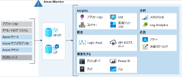
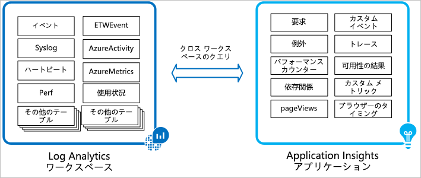

# Azure Monitorで監視を統合する

## 概要

### こんな時に利用

- クラウドとオンプレミスの両方からログ データを収集し、分析し、操作するのに役立つ 1 つのソリューションが必要である。
- Azure Application Insights や Azure Security Center などのサービスを使用している。 
  - これらのサービスでは、収集されたデータを Azure Monitor 用のワークスペースに格納します。 これで、Azure Monitor Log Analytics を使用して、対話形式でデータのクエリを実行できます。

### 利点

  

- Azure Monitor では、さまざまなソースからのメトリックとログ データを一元化して結合
- ソースから収集されたデータをさまざまなツールを使用して、データの分析、アラートへの対応、および視覚化などが可能
- サービスから収集されたログに対して、1 つのクエリを実行することも可能。これによって、複数のソースから収集されたログ データを分析し、すべてのデータを総合的に把握することができるようになる

## 統合

### SecurityCenterとの統合

- Azure Security Center では、Log Analytics Agentから仮想マシンなどのリソースデータを収集、分析に利用できるLog Analyticsワークスペースに格納される
- ワークスペースは、複数のサブスクリプションで使用可能。サブスクリプションをまたがってデータを収集してまとめて分析可能

### Application Insightsとの統合

- Application Insightsデータも、Log Analyticsに格納される
- ログは、Kusto Query Language（KQL）でクエリ可能
- 例えば、Security CenterとApp Insightsのワークスペースを跨ったクエリも可能
  -   

```sh
  union Update, workspace("contosofinance-it").Update, workspace("c65g7445-914x-4h7j-6nbv-w876499056").Update
| where TimeGenerated >= ago(24h)
| where UpdateState == "Needed"
| summarize dcount(Computer) by Classification
```
