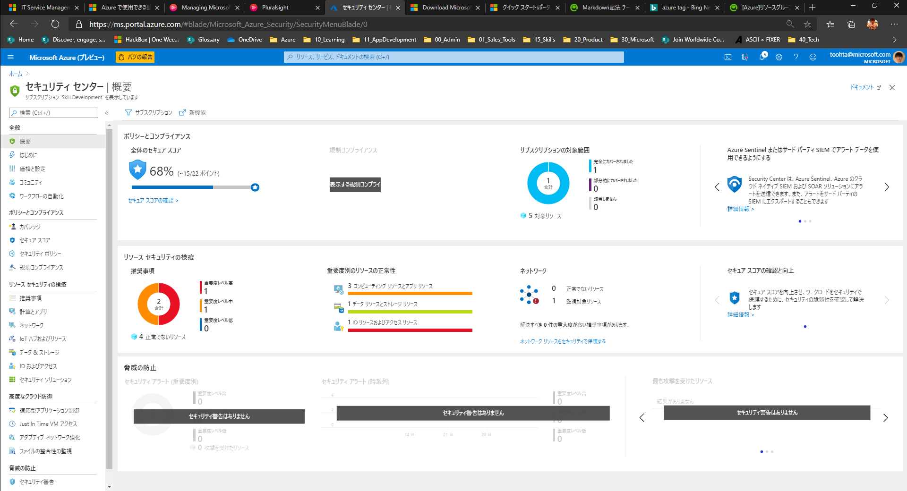
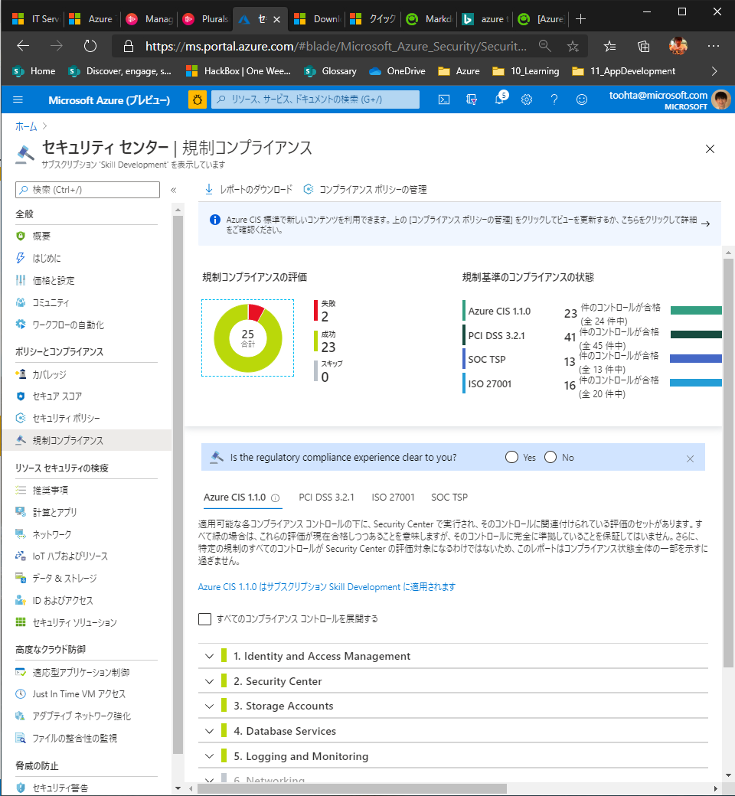
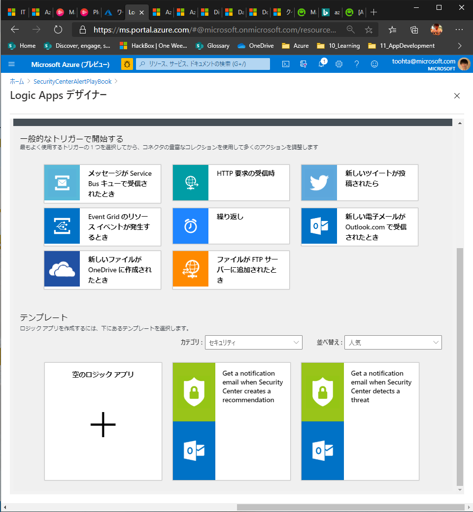
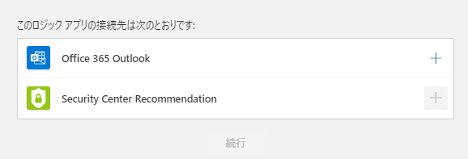
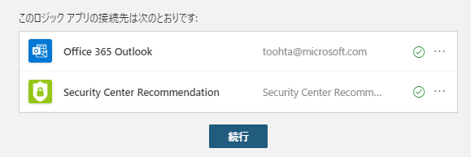
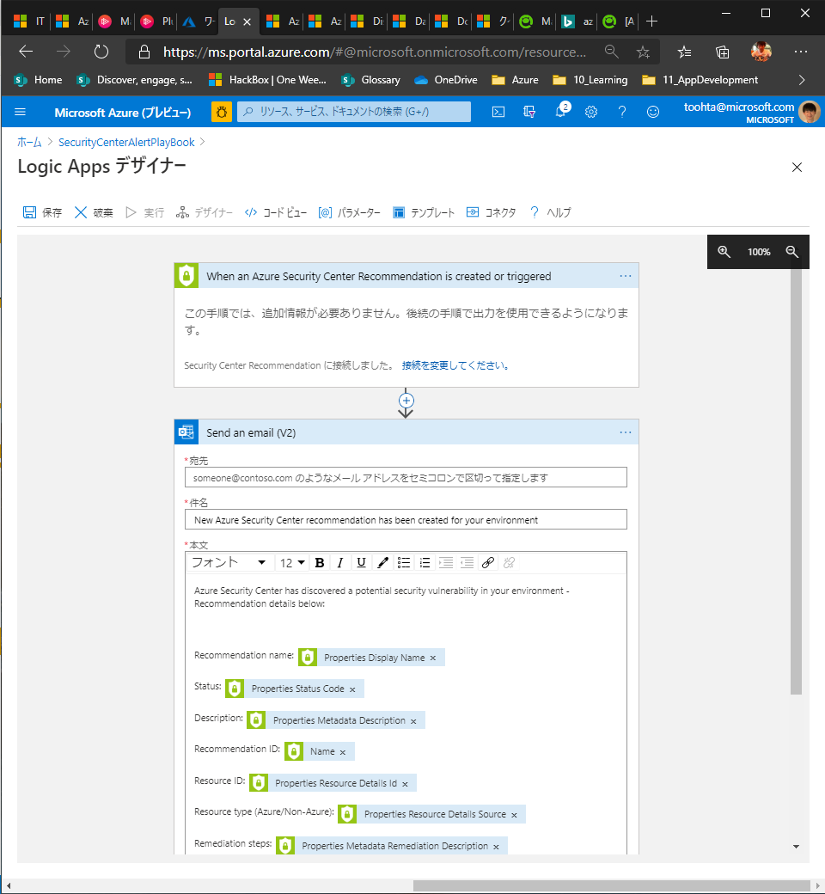
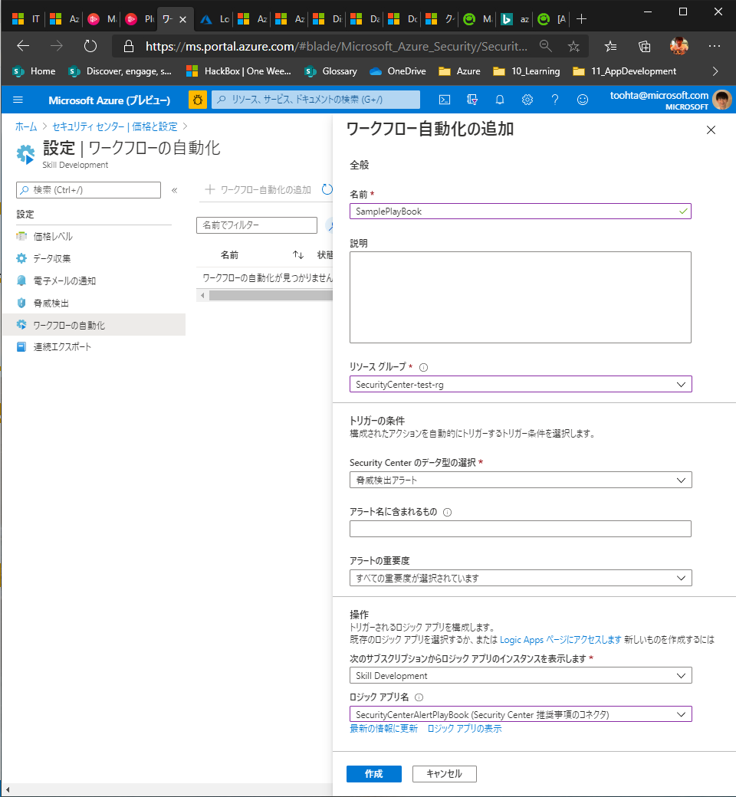

# Azure Security Cnterで、セキュリティチェック & インシデントの監視

- 諸々の推奨事項を提示してくれる。
- 詳細なデータの取得のためには、Monitoring Agentの導入が必要

ダッシュボードはこんな感じ
  

更に、各種セキュリティコンプライアンスの順守度と修正提案もしてくれる  
  

## その他便利機能

- **Just-In-Time (JIT) 仮想マシン アクセス**を使用して仮想マシンを保護
  - JIT は、仮想マシンへの永続的なアクセスをブロックする機能です。 仮想マシンには、構成した監査済みアクセスに基づいてのみアクセス
- **適応型アプリケーション制御**を使用して、仮想マシンで実行できるアプリケーションを制御
  - バックグラウンドで、機械学習を使用して、仮想マシンで実行されているプロセスを確認します。 仮想マシンを保持するリソース グループごとに例外規則が作成され、推奨事項が示されます。
- プレイブックを構成することで、アラート検出時に自動化された手順を実行可能。プレイブックはロジックアプリで構成する。

  

  

  

  

  

