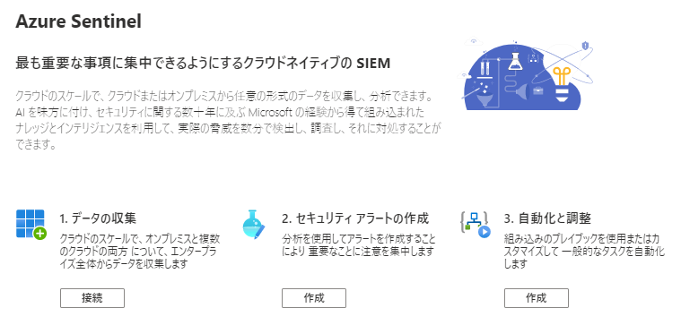
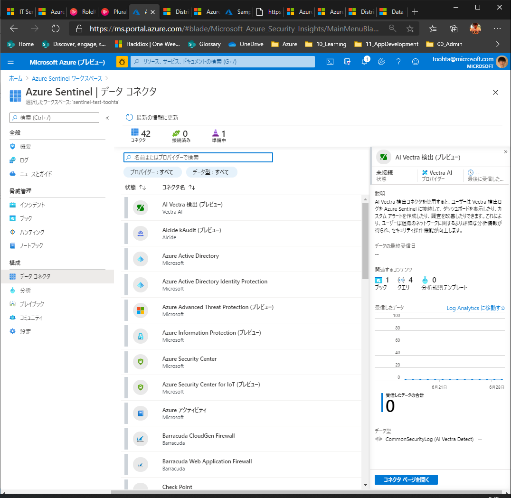
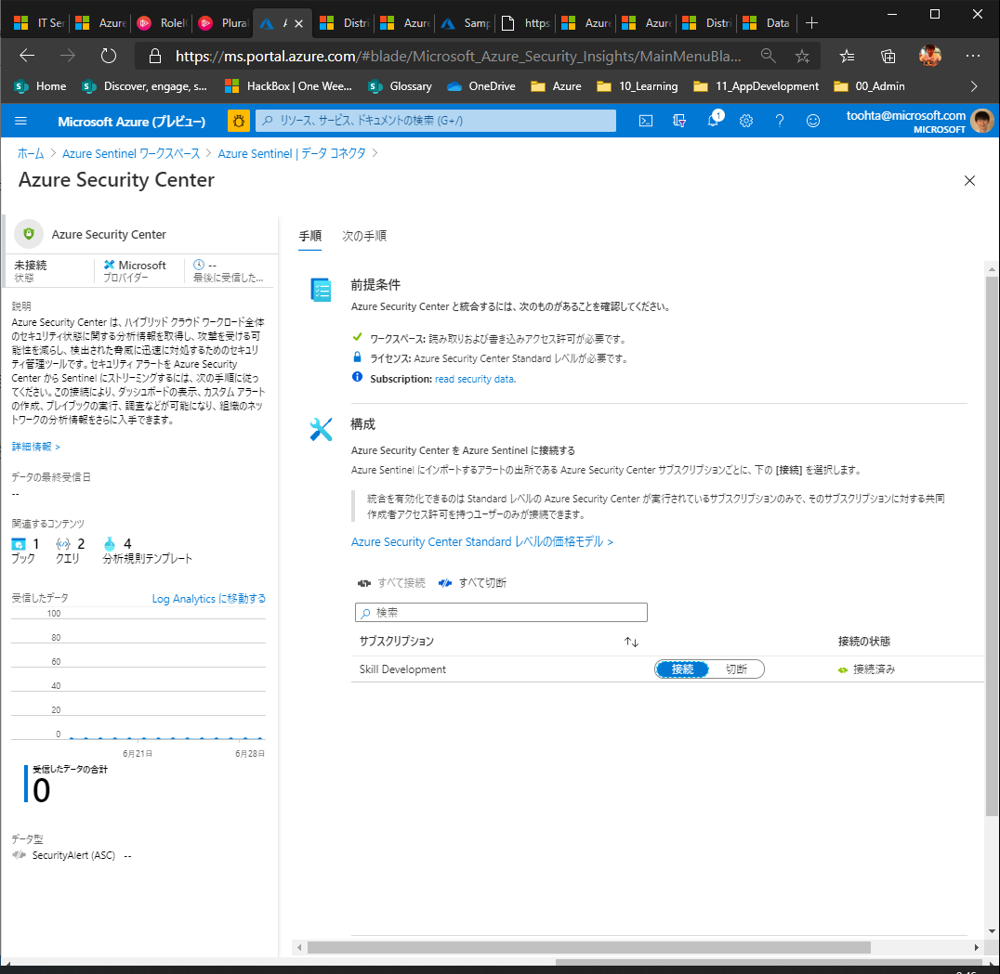
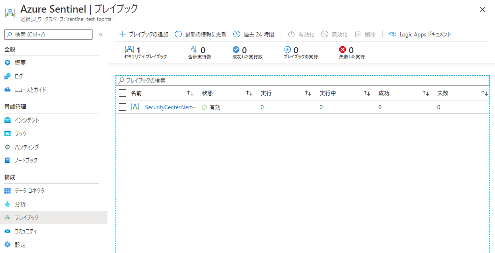
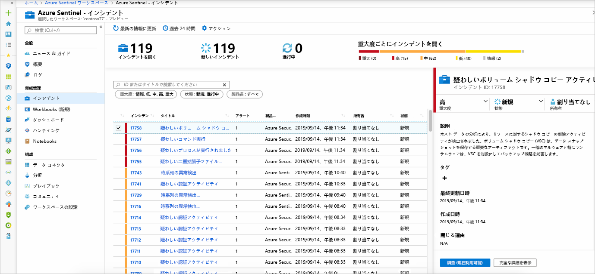
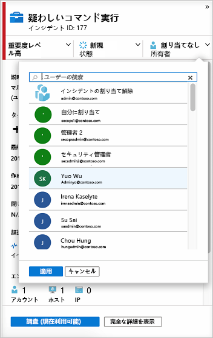
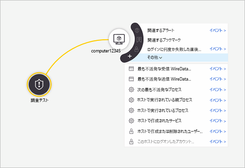

# Azure Sentinelを使用してセキュリティ分析

## 概要

こんな時に使えるソリューション

- クラウドやオンプレミスの複数の場所に存在する可能性がある、組織全体の詳細なセキュリティ脅威の監視を行う必要がある。
- 複雑で多様なツールに依存しないようにする必要がある。
- 専門家によって構築されたエンタープライズレベルの AI を使用して、組織全体の脅威を特定し、処理する必要がある。

## 利用手順

1. Azure Sentinelリソースを作成
   1. **Log Analyticsワークスペースを作成してSentinelに追加**
   2.   
2. データソースに接続
   1.   
   2.   
3. データの統合が行われる。
   1. SecurityCenterで設定したプレイブックなども統合されている
   2.   
4. インシデントを確認して、詳細化分析を行っていく
   1.   
   2. インシデントを担当者に割り当て
      1.   
   3. 詳細を詰めていく
      1.   
